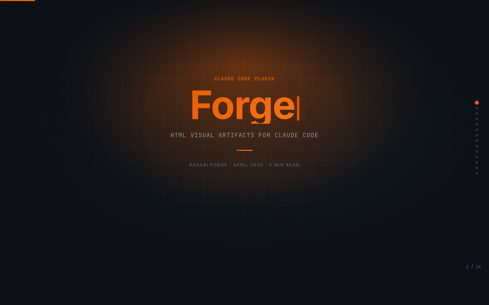
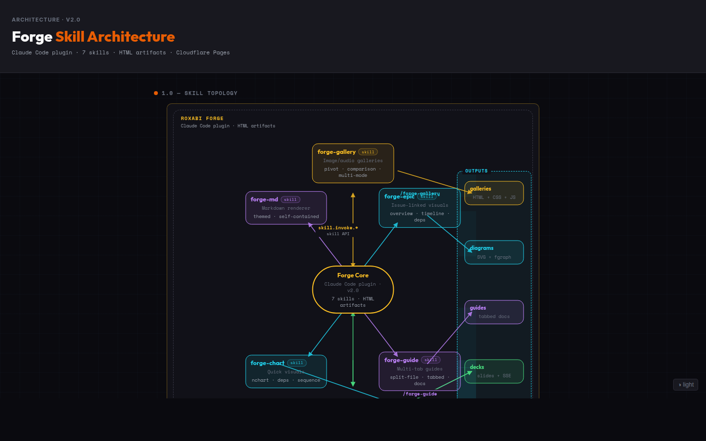
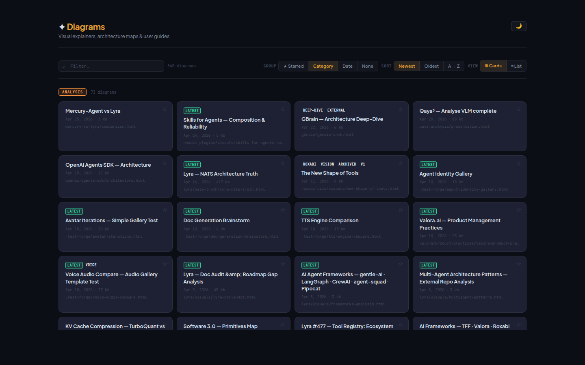
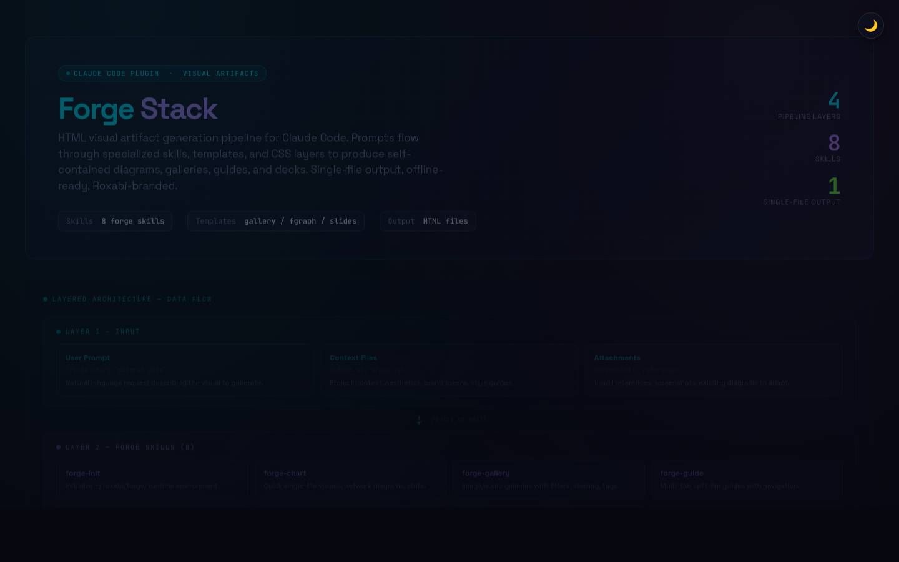
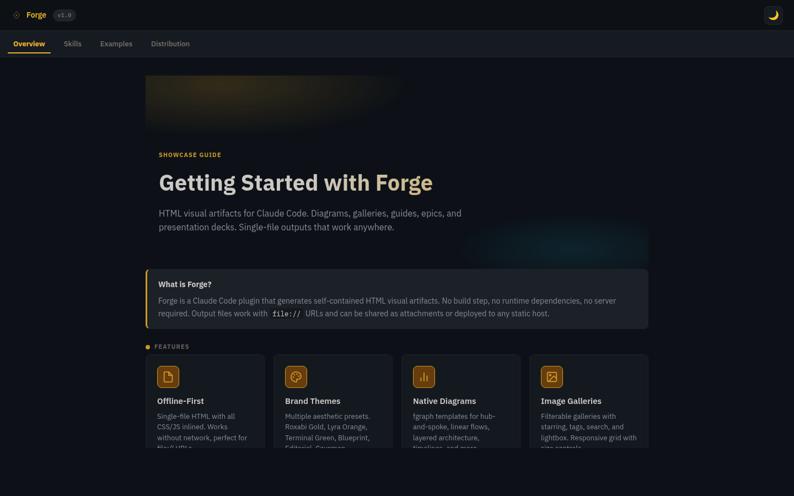
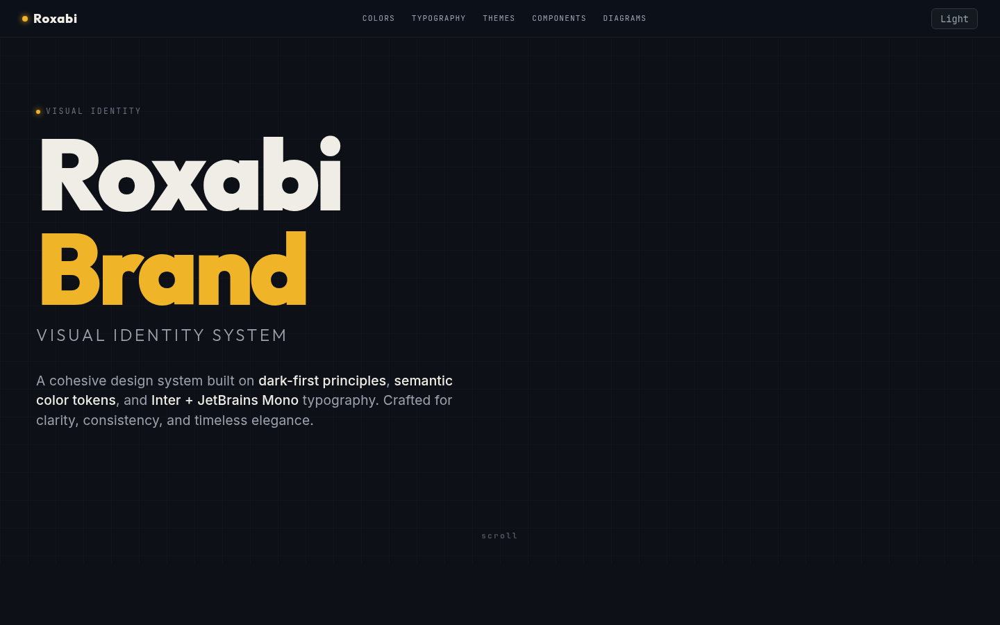
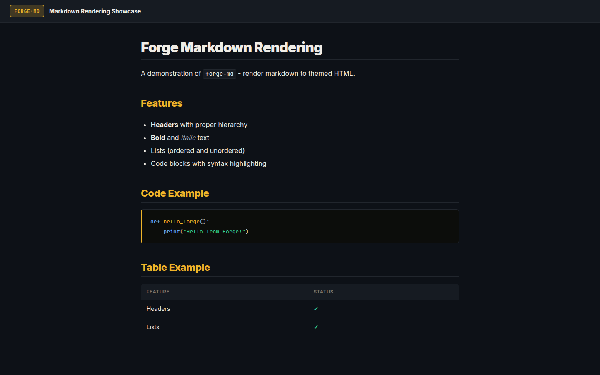
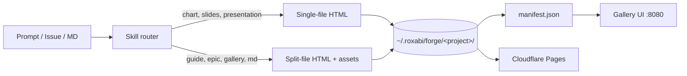

<div align="center">

# 🔥 Roxabi Forge

**HTML visual artifacts for Claude Code — diagrams, galleries, guides, decks, epics.**

[](LICENSE)
[](https://github.com/Roxabi/roxabi-forge)
[](.claude-plugin/plugin.json)
[](https://forge.roxabi.com)

A brand-aware, manifest-indexed HTML pipeline. Eight skills · self-contained outputs · `file://`-safe · one-command deploy.

</div>

---

## Why

LLMs write a lot of words. Sometimes you need a **picture**: an architecture diagram, a side-by-side comparison, a pitch deck, a tabbed guide, a one-pager that lives at a URL. Forge turns "explain this" into a self-contained HTML artifact you can scroll, share, and ship.

For Claude Code users who want **publication-grade visuals** without leaving the terminal — no Figma, no Notion export, no slide tool. Just a skill trigger and an HTML file.

## Quick Start

```bash
# 1. Add the marketplace + install the plugin
claude plugin marketplace add Roxabi/roxabi-forge
claude plugin install forge

# 2. Initialize the runtime (~/.roxabi/forge/)
"init forge"

# 3. Create your first artifact
"draw the architecture of this repo"      # → forge-chart
"create deck from #42"                    # → forge-slides
"showcase these images side by side"      # → forge-gallery
```

Output lands in `~/.roxabi/forge/<project>/visuals/`. Open in a browser, or `make forge deploy` to push to Cloudflare Pages.

## Showcase

<table>
<tr>
<td width="50%">

**`forge-slides`** — magazine-quality scroll-snap deck



</td>
<td width="50%">

**`forge-epic`** — issue-linked architecture analysis



</td>
</tr>
<tr>
<td>

**`forge-gallery`** — manifest-indexed visual gallery



</td>
<td>

**`forge-chart`** — single-file native fgraph diagram



</td>
</tr>
<tr>
<td>

**`forge-guide`** — split-file multi-tab document



</td>
<td>

**`forge-presentation`** — long-form scroll presentation



</td>
</tr>
<tr>
<td colspan="2">

**`forge-md`** — themed self-contained HTML from existing markdown



</td>
</tr>
</table>

> [!TIP]
> All seven showcases live as canonical HTML references in [`plugins/forge/references/showcases/`](plugins/forge/references/showcases/). Use them as style + structure guides when authoring new outputs.

## How it works



1. **Skill router** — eight skills, each with a fixed output contract and inlined aesthetics from `references/aesthetics/`.
2. **Brand-aware** — reads `~/.roxabi/forge/<project>/brand/forge.yml` to lock palette + typography to the project's brand.
3. **Manifest-indexed** — every HTML file embeds `diagram:*` meta tags; `serve.py` aggregates them into `manifest.json` for the live gallery at `http://localhost:8080/`.
4. **Self-contained outputs** — single-file artifacts work over `file://`; multi-tab docs ship with a `_shared/` runtime cache.
5. **Cloudflare Pages ready** — `make -C ~/.roxabi/forge deploy` builds + pushes via Wrangler.

## Skills

### Visualize

| Skill | Trigger | Output |
|---|---|---|
| **`forge-chart`** | `"draw"`, `"diagram"`, `"visualize"`, `"quick visual"` | Single-file native fgraph (hub-spoke, gantt, pie, ER, sequence, state, dep-graph), CSS Grid explainer — `file://`-safe |
| **`forge-epic`** | `"visualize #N"`, `"epic preview"`, `"illustrate issue"` | Issue-linked analysis: overview, scope breakdown, dependency graph, acceptance criteria |
| **`forge-gallery`** | `"gallery"`, `"showcase"`, `"compare visually"`, `"sprite gallery"` | Image / audio gallery with pivot grouping, dynamic filters, search, lightbox, multi-mode datasets |

### Document

| Skill | Trigger | Output |
|---|---|---|
| **`forge-guide`** | `"write a guide"`, `"multi-tab doc"`, `"recap"`, `"architecture doc"` | Split-file multi-tab HTML document (shell + CSS + JS + tab fragments) |
| **`forge-md`** | `"render md"`, `"md to html"`, `"tabbed docs"` | Themed self-contained HTML from existing markdown — single-file or multi-tab |

### Present

| Skill | Trigger | Output |
|---|---|---|
| **`forge-presentation`** | `"create presentation"`, `"scroll presentation"`, `"visual article"` | Single-file long-form scroll presentation — hero + numbered sections, reveal animations |
| **`forge-slides`** | `"create deck"`, `"slide deck"`, `"pitch deck"`, `"slides from #N"` | Magazine-quality scroll-snap deck — 10 slide types × 6 aesthetic presets, keyboard + touch nav |

### Setup

| Skill | Trigger | What it does |
|---|---|---|
| **`forge-init`** | `"init forge"`, `"setup forge"` | Bootstrap `~/.roxabi/forge/` with `serve.py`, shared assets, directory layout |

→ See [`plugins/forge/README.md`](plugins/forge/README.md) for per-skill details, gallery templates, and the BATCHES + dynamic-filter patterns.

## Runtime

```bash
# From the supervisor hub (~/projects/)
make forge start     # start dev server (:8080, SSE live-reload)
make forge logs      # tail stdout
make forge stop      # stop server

# Sync repo → ~/.roxabi/forge/
make -C plugins/forge deploy

# Build + push to Cloudflare Pages
make -C ~/.roxabi/forge deploy
```

| Output type | Path |
|---|---|
| Chart / epic / guide / presentation / slides (exploration) | `~/.roxabi/forge/<project>/visuals/` |
| Guide (final / canonical) | `~/projects/<project>/docs/visuals/` |
| Gallery | `~/.roxabi/forge/<project>/` |
| Cross-project chart | `~/.roxabi/forge/_shared/diagrams/` |

## Configuration

| File | Purpose |
|---|---|
| `~/.roxabi/forge/.env` | `CLOUDFLARE_ACCOUNT_ID`, `CLOUDFLARE_API_TOKEN`, `DEPLOY_HOST` |
| `~/.roxabi/forge/<project>/brand/forge.yml` | Per-project brand: palette, typography, aesthetic preset |
| `plugins/forge/references/aesthetics/` | Shared aesthetic presets (`lyra-v2`, `cool-dark`, …) |

> [!IMPORTANT]
> Cloudflare Pages caps individual files at **25 MB**. The build excludes `*.mp4` and any file >25 MB from `_dist/`. Host large media in R2 / S3 and link in.

## Repository layout

```
roxabi-forge/
├── .claude-plugin/         # marketplace + plugin manifests (generated)
├── plugins/forge/
│   ├── skills/             # 8 skills (forge-init, -chart, -epic, -gallery, -guide, -md, -presentation, -slides)
│   ├── references/         # templates, aesthetics, showcases, slide engine
│   ├── runtime/            # Makefile + .env.example for ~/.roxabi/forge/
│   └── supervisor/         # supervisord config
├── scripts/                # build.sh, gen-manifest.py, render-md*.py, …
├── docs/                   # contributing, architecture, processes, guides
├── sync-plugins.sh         # sync source → local + remote plugin caches
└── CLAUDE.md               # AI agent instructions
```

## Contributing

See [`docs/contributing.md`](docs/contributing.md). PRs against `staging`, conventional commits, never `--force` / `--hard` / `--amend`.

## License

[MIT](LICENSE) © Roxabi
