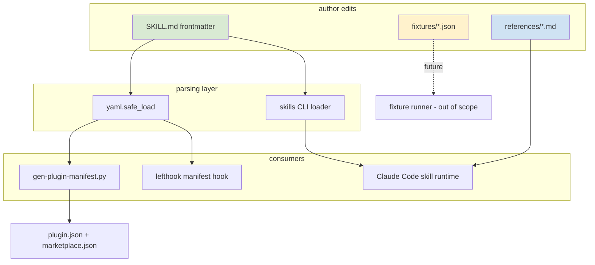
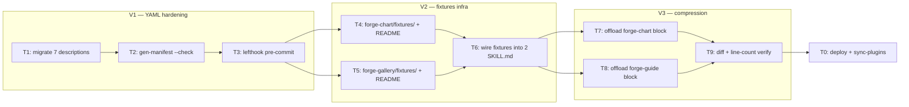

## Summary

Three sequential slices in one PR: migrate all 7 SKILL.md `description:` fields to `>-` block scalar, add `fixtures/` infrastructure (no runner yet) for `forge-chart` + `forge-gallery`, and offload ≥ 1 reference table per skill from `forge-chart` + `forge-guide` to hit ≤ 25% line reduction. No runtime behavior changes.

## Architecture

### Data flow



### File × task map



## Bootstrap Context

**Pattern references:**
- YAML `>-` canonical fix → `fireworks-tech-graph` PR #2 (Luo-hongyi) — noted in `artifacts/analyses/2026-04-12-competitor-skills-analysis.md`.
- Existing `Read references/<name>.md` pattern → every forge skill already uses `**Read before generating:**` block citing `${CLAUDE_PLUGIN_ROOT}/references/...` — model T7/T8 load directives on this style.
- Manifest parser → `scripts/gen-plugin-manifest.py` uses `yaml.safe_load`, reads `name` + `summary` only. `description` round-trips via `>-` losslessly.

**Files of note:**
- `plugins/forge/skills/{7 skills}/SKILL.md` — all use `description: '…'` inline form today.
- `plugins/forge/references/` — plugin-scoped (not per-skill). Per-skill `references/` dirs will be **new** with this issue for `forge-chart` and `forge-guide`.

## Agents

F-lite, solo session, single domain (docs/skill content). No subagent fanout.

| Agent | Tasks | Files |
|---|---|---|
| direct (no subagent) | all | 7 × SKILL.md, 2 × fixtures/, 2 × references/ |

## Consistency Report

| Success criterion | Traced to |
|---|---|
| SC-1 all 7 use `>-` | T1 |
| SC-2 yaml round-trip identical | T2 |
| SC-3 `gen-plugin-manifest.py --check` exits 0 | T2 |
| SC-4 lefthook passes | T3 |
| SC-5 no inline quoted description remains | T1 |
| SC-6 forge-chart/fixtures/ ≥ 3 fixtures | T4 |
| SC-7 forge-gallery/fixtures/ ≥ 4 fixtures | T5 |
| SC-8 fixture schema keys present | T4, T5 |
| SC-9 fixtures/README.md per skill | T4, T5 |
| SC-10 SKILL.md fixture reference line | T6 |
| SC-11 forge-chart/SKILL.md ≤ 365 lines | T9 |
| SC-12 forge-guide/SKILL.md ≤ 361 lines | T9 |
| SC-13 offload diff content-preserving | T9 |
| SC-14 `Read …` directive in skill body | T7, T8 |
| SC-15 deploy + sync succeed | T0 |

Covered: 15/15. Uncovered: 0. Untraced tasks: 0.

## Micro-Tasks

### V1 — YAML hardening

**T1. Migrate 7 SKILL.md frontmatter `description:` fields to `>-` block scalar** · difficulty 2 · ~10 min

Files: `plugins/forge/skills/{forge-chart,forge-epic,forge-gallery,forge-guide,forge-init,forge-md,forge-slides}/SKILL.md`

Shape:
```yaml
description: >-
  Create a quick self-contained single-file HTML visual — Mermaid flowchart,
  dependency tree, sequence diagram, or CSS layout. No server needed, works
  with file://. Triggers: "draw" | "diagram" | "visualize" | "sketch" | "map"
  | "show the flow" | "quick visual".
```

Verify:
```bash
! grep -rE "^description: ['\"]" plugins/forge/skills/*/SKILL.md
```

Expected: zero matches.

Spec trace: SC-1, SC-5, N1. Slice: V1. Phase: GREEN. Parallel-safe: N (single task spans 7 files).

---

**T2. [RED-GATE] Verify YAML round-trip + manifest sync** · difficulty 1 · ~2 min

Verify:
```bash
scripts/gen-plugin-manifest.py --check
```

Expected: exits 0 with `✓ manifests in sync`. If it proposes changes, the `>-` migration altered parsed values — investigate.

Spec trace: SC-2, SC-3, N2. Slice: V1. Phase: RED-GATE. Parallel-safe: N. Blocked by: T1.

---

**T3. [RED-GATE] Verify pre-commit hooks green** · difficulty 1 · ~2 min

Verify:
```bash
git add plugins/forge/skills/*/SKILL.md && lefthook run pre-commit
```

Expected: all hooks pass (trufflehog, manifest, lint — whichever fire on SKILL.md).

Spec trace: SC-4, N3. Slice: V1. Phase: RED-GATE. Parallel-safe: N. Blocked by: T2.

---

### V2 — fixture infrastructure

**T4. Create forge-chart/fixtures/ + 3 fixtures + README** · difficulty 2 · ~8 min

Files (new):
- `plugins/forge/skills/forge-chart/fixtures/mermaid-flowchart.json`
- `plugins/forge/skills/forge-chart/fixtures/fgraph-radial-hub.json`
- `plugins/forge/skills/forge-chart/fixtures/plain-css-layout.json`
- `plugins/forge/skills/forge-chart/fixtures/README.md`

Each JSON shape:
```json
{
  "skill": "forge-chart",
  "variant": "mermaid-flowchart",
  "input": { "prompt": "…", "slug": "…", "project": "…" },
  "expected_output_hash": null,
  "notes": "…"
}
```

README must state: fixture purpose, schema keys, hash algorithm (SHA-256 of rendered HTML, whitespace-normalized), and that no validation runs this issue.

Verify:
```bash
ls plugins/forge/skills/forge-chart/fixtures/*.json | wc -l
python3 -c "import json; [json.load(open(f)) for f in __import__('glob').glob('plugins/forge/skills/forge-chart/fixtures/*.json')]"
test -f plugins/forge/skills/forge-chart/fixtures/README.md
```

Expected: `≥ 3`, no JSON errors, README exists.

Spec trace: SC-6, SC-8, SC-9, N4, N7. Slice: V2. Phase: GREEN. Parallel-safe: Y (with T5). Blocked by: T3.

---

**T5. [P] Create forge-gallery/fixtures/ + 4 fixtures + README** · difficulty 2 · ~10 min

Files (new):
- `plugins/forge/skills/forge-gallery/fixtures/pivot.json`
- `plugins/forge/skills/forge-gallery/fixtures/simple.json`
- `plugins/forge/skills/forge-gallery/fixtures/comparison.json`
- `plugins/forge/skills/forge-gallery/fixtures/audio.json`
- `plugins/forge/skills/forge-gallery/fixtures/README.md`

Shape: same schema as T4.

Verify:
```bash
ls plugins/forge/skills/forge-gallery/fixtures/*.json | wc -l
python3 -c "import json; [json.load(open(f)) for f in __import__('glob').glob('plugins/forge/skills/forge-gallery/fixtures/*.json')]"
test -f plugins/forge/skills/forge-gallery/fixtures/README.md
```

Expected: `≥ 4`, no JSON errors, README exists.

Spec trace: SC-7, SC-8, SC-9, N5, N7. Slice: V2. Phase: GREEN. Parallel-safe: Y (with T4). Blocked by: T3.

---

**T6. Wire `Fixtures: see fixtures/README.md` line into 2 SKILL.md** · difficulty 1 · ~3 min

Files: `plugins/forge/skills/{forge-chart,forge-gallery}/SKILL.md`

Shape: add a one-line reference under the `**Read before generating:**` block, e.g.:
```
${CLAUDE_PLUGIN_ROOT}/skills/forge-chart/fixtures/README.md — fixture format + intended regression inputs (no runner yet)
```

Verify:
```bash
grep -l "fixtures/README.md" plugins/forge/skills/forge-chart/SKILL.md plugins/forge/skills/forge-gallery/SKILL.md | wc -l
```

Expected: `2`.

Spec trace: SC-10, N6. Slice: V2. Phase: GREEN. Parallel-safe: N. Blocked by: T4, T5.

---

### V3 — compression

**T7. Offload ≥ 1 reference block from forge-chart/SKILL.md** · difficulty 3 · ~15 min

Files:
- `plugins/forge/skills/forge-chart/SKILL.md` (modify — remove block, insert `Read …` directive)
- `plugins/forge/skills/forge-chart/references/<name>.md` (new — offloaded verbatim)

Candidate blocks (487 lines): look for long decision matrices / tables (e.g. "style×diagram matrix", graph-template decision rules) that are reference data rather than decision flow.

Shape of replacement in SKILL.md:
```
Read ${CLAUDE_PLUGIN_ROOT}/skills/forge-chart/references/<name>.md before <action described in surrounding section>.
```

Spec trace: SC-11, SC-14, N8, N10. Slice: V3. Phase: REFACTOR. Parallel-safe: Y (with T8). Blocked by: T6.

---

**T8. [P] Offload ≥ 1 reference block from forge-guide/SKILL.md** · difficulty 3 · ~15 min

Same pattern as T7, on `forge-guide` (482 lines).

Spec trace: SC-12, SC-14, N9, N10. Slice: V3. Phase: REFACTOR. Parallel-safe: Y (with T7). Blocked by: T6.

---

**T9. [RED-GATE] Verify compression targets + content preservation** · difficulty 2 · ~4 min

Verify:
```bash
# line-count gates
test $(wc -l < plugins/forge/skills/forge-chart/SKILL.md) -le 365
test $(wc -l < plugins/forge/skills/forge-guide/SKILL.md) -le 361

# diff offloaded block vs reference — zero content-bearing diff (whitespace excepted)
diff -uw <(git show HEAD:plugins/forge/skills/forge-chart/SKILL.md | sed -n '<OLD_START>,<OLD_END>p') plugins/forge/skills/forge-chart/references/<name>.md
# repeat for forge-guide

# Read directive in place
grep -E "^Read \\\$\\{CLAUDE_PLUGIN_ROOT\\}/skills/forge-(chart|guide)/references/" plugins/forge/skills/forge-chart/SKILL.md plugins/forge/skills/forge-guide/SKILL.md
```

Expected: line counts pass, diff shows zero content changes (whitespace normalization excepted), directive present in both skills.

Spec trace: SC-11, SC-12, SC-13, SC-14. Slice: V3. Phase: RED-GATE. Parallel-safe: N. Blocked by: T7, T8.

---

### Cross-slice

**T0. Deploy + sync verification** · difficulty 1 · ~3 min

Verify:
```bash
make -C plugins/forge deploy
./sync-plugins.sh --local
```

Expected: both succeed with no YAML/load errors.

Spec trace: SC-15. Slice: cross. Phase: RED-GATE. Parallel-safe: N. Blocked by: T9.

---

## Commits (3 — one per slice)

| # | Title | Tasks |
|---|---|---|
| 1 | `refactor(forge): migrate all 7 SKILL.md descriptions to '>-' block scalar` | T1 (+ T2, T3 verify) |
| 2 | `feat(forge): add fixtures/ infra for forge-chart + forge-gallery` | T4, T5, T6 |
| 3 | `refactor(forge): offload reference blocks from forge-chart + forge-guide SKILL.md` | T7, T8 (+ T9, T0 verify) |

## Task IDs

<!-- Generated by /plan. Used by /implement to resume tasks on session restart. -->
- T1: 12 — Migrate 7 SKILL.md description fields to `>-` block scalar
- T2: 13 — [RED-GATE] Verify YAML round-trip + manifest sync
- T3: 14 — [RED-GATE] Verify pre-commit hooks green on V1
- T4: 15 — Create forge-chart/fixtures/ + 3 fixtures + README
- T5: 16 — [P] Create forge-gallery/fixtures/ + 4 fixtures + README
- T6: 17 — Wire fixtures reference into forge-chart + forge-gallery SKILL.md
- T7: 18 — Offload ≥ 1 reference block from forge-chart/SKILL.md
- T8: 19 — [P] Offload ≥ 1 reference block from forge-guide/SKILL.md
- T9: 20 — [RED-GATE] Verify compression targets + content preservation
- T0: 21 — [RED-GATE] Deploy + sync-plugins verification
