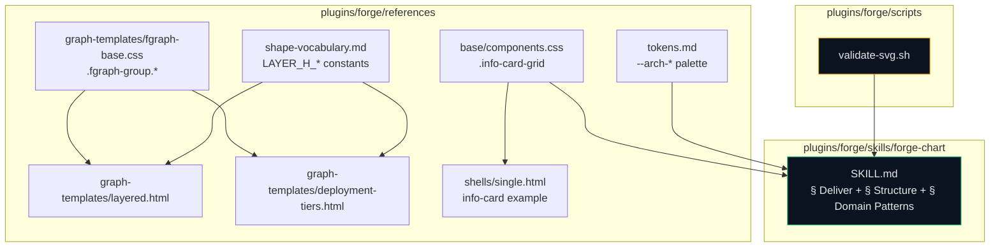
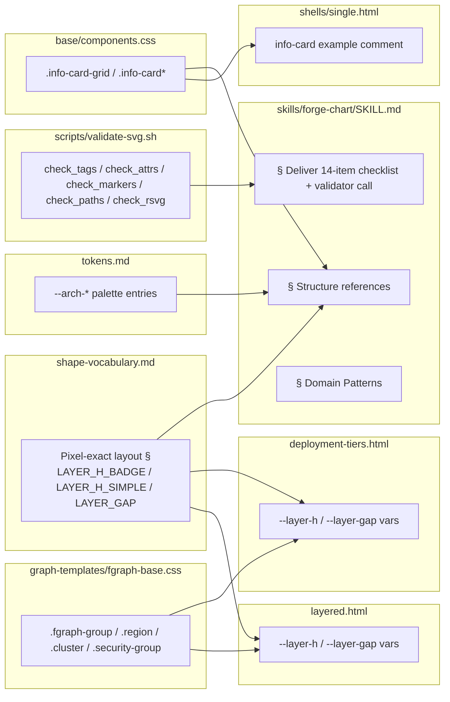

## Summary

Land seven additive, sourced lifts across `plugins/forge/` (references library → SVG validator → `forge-chart` SKILL.md wiring) in 14 micro-tasks, 3 RED-GATE sentinels, and a final manifest/sync check. No new runtime dependencies. No breaking changes.

## Architecture

### Data flow

### File × Function map

## Bootstrap Context

- Frame: `artifacts/frames/12-tier-1-audit-lift-frame.mdx`
- Spec: `artifacts/specs/12-tier-1-audit-lift-spec.mdx`
- Sources (external repos cited in issue #12):
  - gmdiagram — 14-item Quality Checklist + pixel-exact layout constants
  - architecture-diagram-generator — semantic palette + summary info-cards + boundary groups
  - fireworks-tech-graph — `validate-svg.sh` + AI domain patterns primer
- Pattern precedent: closed #5 Tier-1 lift; #10 hardened SKILL.md frontmatter.
- Out of scope: new diagram types (future Issue B), PNG/PDF export (Issue C), audit template (deferred), auto-layout/JSON IR (closed #7 DEFER).

## Agents

| Agent | Tasks | Files |
|-------|-------|-------|
| doc-writer | 7 | `tokens.md`, `shape-vocabulary.md`, `skills/forge-chart/SKILL.md` |
| frontend-dev | 5 | `base/components.css`, `graph-templates/fgraph-base.css`, `graph-templates/layered.html`, `graph-templates/deployment-tiers.html`, `shells/single.html` |
| devops | 3 | `scripts/validate-svg.sh`, manifest + sync check |
| tester | 3 | RED-GATE sentinels per slice |

## Consistency Report

- Covered: 12/12 acceptance criteria
- Uncovered: none
- Untraced: none
- Exemptions: 1 (T14 — manifest/sync quality gate)

Mapping:

| SC | Task(s) |
|----|---------|
| SC-1 tokens palette | T1 |
| SC-2 info-card primitive + example | T2, T9 |
| SC-3 fgraph boundary groups | T3 |
| SC-4 layout constants | T4 |
| SC-5 layered/deploy-tiers use vars | T5, T6 |
| SC-6 14-item Deliver checklist | T10 |
| SC-7 validator wired in Deliver | T13 |
| SC-8 Structure § references | T12 |
| SC-9 Domain Patterns § | T11 |
| SC-10 validator script exists + behavior | T7, T8 |
| SC-11 manifest check passes | T14 (exempt) |
| SC-12 sync-plugins succeeds | T14 (exempt) |

## Micro-Tasks

### Slice V1: References library

#### T1: Add `--arch-*` palette to `tokens.md` [P] → doc-writer
- **File:** `plugins/forge/references/tokens.md`
- **Snippet:** 6 CSS variables + doc table (name, use, hex). `--arch-frontend:#06b6d4`, `backend:#10b981`, `database:#8b5cf6`, `cloud:#f59e0b`, `security:#f43f5e`, `external:#64748b`.
- **Verify:** `grep -q '\-\-arch-frontend' plugins/forge/references/tokens.md && grep -q '\-\-arch-external' plugins/forge/references/tokens.md`
- **Expected:** both greps return 0
- **Time:** 4 min | **Difficulty:** 1
- **Traces:** SC-1, N1 | **Phase:** GREEN

#### T2: Add `.info-card*` CSS to `components.css` [P] → frontend-dev
- **File:** `plugins/forge/references/base/components.css`
- **Snippet:** `.info-card-grid{display:grid;grid-template-columns:repeat(3,1fr);gap:var(--sp-4)}` + `.info-card`, `.info-card__dot`, `.info-card__title`, `.info-card__list`.
- **Verify:** `grep -q '\.info-card-grid' plugins/forge/references/base/components.css && grep -q '\.info-card__dot' plugins/forge/references/base/components.css`
- **Expected:** both return 0
- **Time:** 5 min | **Difficulty:** 2
- **Traces:** SC-2, N2 | **Phase:** GREEN

#### T3: Add `.fgraph-group.*` boundary selectors to `fgraph-base.css` [P] → frontend-dev
- **File:** `plugins/forge/references/graph-templates/fgraph-base.css`
- **Snippet:** `.fgraph-group` base + `.region`, `.cluster`, `.security-group` tone variants (dashed frame, distinct stroke colors) + `.fgraph-group__label`.
- **Verify:** `grep -q '\.fgraph-group\.region' plugins/forge/references/graph-templates/fgraph-base.css && grep -q '\.fgraph-group__label' plugins/forge/references/graph-templates/fgraph-base.css`
- **Expected:** both return 0
- **Time:** 6 min | **Difficulty:** 2
- **Traces:** SC-3, N4 | **Phase:** GREEN

#### T4: Add "Pixel-exact layout" § to `shape-vocabulary.md` [P] → doc-writer
- **File:** `plugins/forge/references/shape-vocabulary.md`
- **Snippet:** new section with `LAYER_H_BADGE=116px`, `LAYER_H_SIMPLE=101px`, `LAYER_GAP=50px` + rationale (source: gmdiagram).
- **Verify:** `grep -q 'LAYER_H_BADGE' plugins/forge/references/shape-vocabulary.md && grep -q 'LAYER_GAP' plugins/forge/references/shape-vocabulary.md`
- **Expected:** both return 0
- **Time:** 4 min | **Difficulty:** 1
- **Traces:** SC-4, N5 | **Phase:** GREEN

#### T5: Swap magic numbers for `--layer-h` / `--layer-gap` in `layered.html` [P after T4] → frontend-dev
- **File:** `plugins/forge/references/graph-templates/layered.html`
- **Snippet:** `:root{--layer-h:116px;--layer-gap:50px}` + replace hard-coded heights/gaps with var refs.
- **Verify:** `grep -q '\-\-layer-h' plugins/forge/references/graph-templates/layered.html && ! grep -qE '(height|margin): ?116px' plugins/forge/references/graph-templates/layered.html`
- **Expected:** var present, no raw 116px height
- **Time:** 5 min | **Difficulty:** 2
- **Traces:** SC-5, N6 | **Phase:** GREEN

#### T6: Same pattern in `deployment-tiers.html` [P after T4] → frontend-dev
- **File:** `plugins/forge/references/graph-templates/deployment-tiers.html`
- **Snippet:** identical pattern to T5.
- **Verify:** `grep -q '\-\-layer-h' plugins/forge/references/graph-templates/deployment-tiers.html`
- **Expected:** return 0
- **Time:** 4 min | **Difficulty:** 2
- **Traces:** SC-5, N7 | **Phase:** GREEN

#### RED-GATE V1 → tester
- **Files:** all 6 above
- **Verify:** bundle greps from T1–T6 executed sequentially; all pass.
- **Phase:** RED-GATE

### Slice V2: SVG validator

#### T7: Create `validate-svg.sh` → devops
- **File:** `plugins/forge/scripts/validate-svg.sh`
- **Snippet:** bash script; checks tag balance (via `xmllint --noout` when available), attribute quotes (regex), marker refs (`url(#...)` resolves to `<marker id=...>`), path data (min points), rsvg-convert smoke render. Graceful fallback: missing `xmllint` / `rsvg-convert` → print "skipped: tool missing" and continue.
- **Verify:** `test -f plugins/forge/scripts/validate-svg.sh && bash -n plugins/forge/scripts/validate-svg.sh`
- **Expected:** file exists, syntax OK
- **Time:** 10 min | **Difficulty:** 3
- **Traces:** SC-10, N11 | **Phase:** GREEN

#### T8: `chmod +x` + smoke test on good/bad/tool-missing paths → devops
- **File:** `plugins/forge/scripts/validate-svg.sh` (perms) + inline test fixtures
- **Snippet:** `chmod +x`; run against an in-tree good SVG (exit 0), an in-tree bad SVG (exit 1), and with `PATH=` stub to force tool-missing (exit 0 w/ note).
- **Verify:** `test -x plugins/forge/scripts/validate-svg.sh`
- **Expected:** executable bit set, smoke run behaves per spec
- **Time:** 6 min | **Difficulty:** 2
- **Traces:** SC-10 | **Phase:** GREEN

#### RED-GATE V2 → tester
- **Verify:** run validator against a curated good + bad SVG from `plugins/forge/references/graph-templates/`. Confirm exit codes.
- **Phase:** RED-GATE

### Slice V3: forge-chart SKILL.md wiring

#### T9: Add info-card example comment to `shells/single.html` [P] → frontend-dev
- **File:** `plugins/forge/references/shells/single.html`
- **Snippet:** HTML comment block showing 3-card example using `.info-card-grid`.
- **Verify:** `grep -q 'info-card-grid' plugins/forge/references/shells/single.html`
- **Expected:** return 0
- **Time:** 3 min | **Difficulty:** 1
- **Traces:** SC-2, N3 | **Phase:** GREEN

#### T10: Append 14-item Deliver checklist to `forge-chart/SKILL.md` → doc-writer
- **File:** `plugins/forge/skills/forge-chart/SKILL.md`
- **Snippet:** `## Deliver` section (or subsection) with 14 `- [ ]` pre-flight items: foreignObject xmlns, layer gaps, CSS class enforcement, viewBox fit, text escaping, connection routing, legend/title accuracy, color contrast, marker refs, tag balance, path data, no inline scripts, file size, ASCII fallback note.
- **Verify:** `grep -cE '^- \[ \]' plugins/forge/skills/forge-chart/SKILL.md` returns ≥ 14 within Deliver section; `grep -q '## Deliver' plugins/forge/skills/forge-chart/SKILL.md`
- **Expected:** checklist present
- **Time:** 7 min | **Difficulty:** 2
- **Traces:** SC-6, N8 | **Phase:** GREEN

#### T11: Add `## Domain Patterns` § to `forge-chart/SKILL.md` → doc-writer (after T10)
- **File:** same
- **Snippet:** new heading with 6 AI domain patterns (RAG, Agentic Search, Mem0, Multi-Agent, Tool Call, 5-layer Agent Architecture), memory-tier guidance, arrow semantics (data / control / memory / feedback).
- **Verify:** `grep -q '## Domain Patterns' plugins/forge/skills/forge-chart/SKILL.md && grep -qE '(RAG|Agentic|Mem0|Multi-Agent|Tool Call)' plugins/forge/skills/forge-chart/SKILL.md`
- **Expected:** section present with named patterns
- **Time:** 8 min | **Difficulty:** 3
- **Traces:** SC-9, N9 | **Phase:** GREEN

#### T12: Update `§ Structure` to reference info-card + palette + layout constants → doc-writer (after T11)
- **File:** same
- **Snippet:** extend existing `## Structure` with a one-paragraph pointer at `references/base/components.css` (info-card), `references/tokens.md` (arch palette), and `references/shape-vocabulary.md` (layout constants).
- **Verify:** `grep -A 40 '## Structure' plugins/forge/skills/forge-chart/SKILL.md | grep -qE '(info-card|--arch-|shape-vocabulary)'`
- **Expected:** references present
- **Time:** 5 min | **Difficulty:** 2
- **Traces:** SC-8, N10 | **Phase:** GREEN

#### T13: Wire validator call at end of `§ Deliver` → doc-writer (after T10)
- **File:** same
- **Snippet:** append a final item `bash ${CLAUDE_PLUGIN_ROOT}/scripts/validate-svg.sh <output>` with one-line guidance.
- **Verify:** `grep -q 'validate-svg.sh' plugins/forge/skills/forge-chart/SKILL.md`
- **Expected:** return 0
- **Time:** 3 min | **Difficulty:** 1
- **Traces:** SC-7, N12 | **Phase:** GREEN

#### RED-GATE V3 → tester
- **Verify:** grep Deliver checklist count, Domain Patterns heading, Structure cross-references, validator call line.
- **Phase:** RED-GATE

### Finalize

#### T14: Regenerate manifests + local sync → devops
- **Files:** `.claude-plugin/plugin.json`, `.claude-plugin/marketplace.json` (if drift), deployed cache
- **Snippet:** `python3 scripts/gen-plugin-manifest.py --check && ./sync-plugins.sh --local`
- **Verify:** both commands exit 0
- **Expected:** no drift, local sync succeeds
- **Time:** 2 min | **Difficulty:** 1
- **Traces:** SC-11, SC-12 (exempt: quality gate) | **Phase:** REFACTOR

## Task IDs

<!-- Generated by /plan. Used by /implement to resume tasks on session restart. -->
- T1: 10 — Add --arch-* palette to tokens.md
- T2: 11 — Add .info-card* CSS to components.css
- T3: 12 — Add .fgraph-group.* boundary selectors
- T4: 13 — Add Pixel-exact layout § to shape-vocabulary.md
- T5: 14 — Swap magic numbers for --layer-h/--layer-gap in layered.html
- T6: 15 — Swap magic numbers for --layer-h/--layer-gap in deployment-tiers.html
- RED-GATE V1: 16 — References library verified
- T7: 17 — Create plugins/forge/scripts/validate-svg.sh
- T8: 18 — chmod +x + smoke test validate-svg.sh
- RED-GATE V2: 19 — Validator verified
- T9: 20 — Add info-card example comment to shells/single.html
- T10: 21 — Append 14-item Deliver checklist to forge-chart/SKILL.md
- T11: 22 — Add Domain Patterns § to forge-chart/SKILL.md
- T12: 23 — Update § Structure to reference info-card + palette + layout constants
- T13: 24 — Wire validator call at end of § Deliver
- RED-GATE V3: 25 — SKILL.md wiring verified
- T14: 26 — Regenerate manifests + local sync
