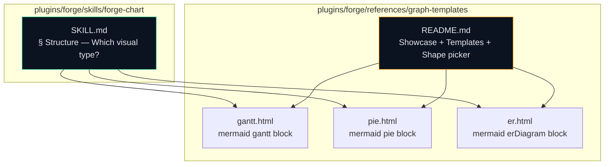
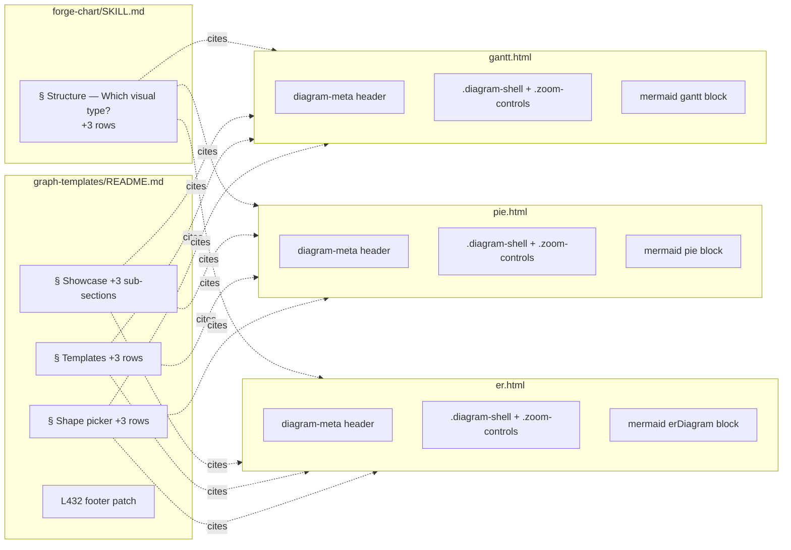

## Summary

Land three Mermaid-backed diagram templates (Gantt, pie, ER) plus the
`forge-chart/SKILL.md` Visual Type Selection rows and
`graph-templates/README.md` Showcase / Templates / Shape picker entries
(with a stale-footer patch), in 8 micro-tasks + 3 RED-GATE sentinels. No
new dependencies, no existing templates modified, additive only.

## Architecture

### Data flow

### File × Function map

## Bootstrap Context

- Frame: `artifacts/frames/13-diagram-types-p1-frame.mdx`
- Spec: `artifacts/specs/13-diagram-types-p1-spec.mdx`
- Source analysis: `artifacts/analyses/2026-04-14-gmdiagram-delta-analysis.md` § D3
- Pattern precedent: #12 Tier-1 audit lift (same additive `references/` + SKILL.md reference update shape).
- Existing templates to mimic header + shell style: `plugins/forge/references/graph-templates/linear-flow.html`, `radial-hub.html`.
- `forge-chart/SKILL.md § Structure — Which visual type?` table at ~L77 (Mermaid cluster ends with `stateDiagram-v2` at L82).
- `graph-templates/README.md`: Showcase starts L11, Templates table L220, Shape picker L416, stale footer L432.
- Out of scope: P2/P3 inline-SVG types (UML class, radar, funnel, bubble, scatter) — follow-up issue.

## Agents

| Agent | Tasks | Files |
|-------|-------|-------|
| frontend-dev | 3 | `gantt.html`, `pie.html`, `er.html` |
| doc-writer | 4 | `forge-chart/SKILL.md`, `graph-templates/README.md` (Showcase + Templates + Shape picker + footer) |
| tester | 3 | RED-GATE sentinels per slice |
| devops | 1 | manifest regen + local sync |

## Consistency Report

- Covered: 13/13 success criteria
- Uncovered: none
- Untraced: none
- Exemptions: 1 (T8 — manifest/sync quality gate)

Mapping:

| SC | Task(s) |
|----|---------|
| SC-1 gantt.html structural | T1 |
| SC-2 pie.html structural | T2 |
| SC-3 er.html structural | T3 |
| SC-4 diagram-meta keys (title/date/category/color) | T1, T2, T3 |
| SC-5 `.diagram-shell` + zoom controls (no bare `<pre class="mermaid">`) | T1, T2, T3 |
| SC-6 SKILL.md Visual Type Selection +3 rows | T4 |
| SC-7 README Showcase +3 sub-sections | T5 |
| SC-8 README Templates +3 rows | T6 |
| SC-9 README Shape picker +3 rows | T7 |
| SC-10 README L432 footer scoped to fgraph | T7 |
| SC-11 No other files modified | RED-GATE V3 |
| SC-12 `gen-plugin-manifest.py --check` passes | T8 (exempt) |
| SC-13 `./sync-plugins.sh --local` succeeds | T8 (exempt) |

## Micro-Tasks

### Slice V1: Three Mermaid templates

#### T1: Create `gantt.html` [P] → frontend-dev
- **File:** `plugins/forge/references/graph-templates/gantt.html`
- **Snippet:** single-file HTML. `<head>`: `<title>{{TITLE}}</title>`, diagram-meta HTML comment with keys `title`, `date`, `category`, `color`, mermaid CDN `<script src="https://cdn.jsdelivr.net/npm/mermaid@…/dist/mermaid.min.js">`. `<body>`: `
` + `
` with zoom buttons + `<pre class="mermaid">` containing a `gantt` block with `dateFormat`, `title {{TITLE}}`, ≥ 2 `section` headings and ≥ 5 task rows (e.g. `Task A :a1, 2026-04-14, 3d`). Mimic header style of `linear-flow.html`.
- **Verify:** `grep -c 'cdn.jsdelivr.net/npm/mermaid' plugins/forge/references/graph-templates/gantt.html` ≥ 1 AND `grep -c 'diagram-shell' plugins/forge/references/graph-templates/gantt.html` ≥ 1 AND `grep -cE '^\s*section ' plugins/forge/references/graph-templates/gantt.html` ≥ 2 AND `grep -c 'diagram-meta' plugins/forge/references/graph-templates/gantt.html` ≥ 1.
- **Expected:** all counts meet thresholds.
- **Time:** 8 min | **Difficulty:** 2
- **Traces:** SC-1, SC-4, SC-5, N1 | **Phase:** GREEN

#### T2: Create `pie.html` [P] → frontend-dev
- **File:** `plugins/forge/references/graph-templates/pie.html`
- **Snippet:** same shell as T1; `<pre class="mermaid">` contains a `pie` block with `title {{TITLE}}` and ≥ 3 slice lines of the form `"{{SLICE_N_LABEL}}" : {{SLICE_N_VALUE}}` (numeric values).
- **Verify:** `grep -c 'cdn.jsdelivr.net/npm/mermaid' pie.html` ≥ 1 AND `grep -c 'diagram-shell' pie.html` ≥ 1 AND `grep -cE '^\s*"[^"]+"\s*:\s*[0-9]' pie.html` ≥ 3 AND `grep -c 'diagram-meta' pie.html` ≥ 1.
- **Expected:** all counts meet thresholds.
- **Time:** 5 min | **Difficulty:** 1
- **Traces:** SC-2, SC-4, SC-5, N2 | **Phase:** GREEN

#### T3: Create `er.html` [P] → frontend-dev
- **File:** `plugins/forge/references/graph-templates/er.html`
- **Snippet:** same shell; `<pre class="mermaid">` contains an `erDiagram` block with ≥ 3 entity declarations (`USER { string id … }`) and ≥ 2 relationship lines using Mermaid cardinality (`||--o{`, `||--||`, `}o--o{`, etc.).
- **Verify:** `grep -c 'cdn.jsdelivr.net/npm/mermaid' er.html` ≥ 1 AND `grep -c 'diagram-shell' er.html` ≥ 1 AND `grep -cE '\|\|--(o\{|\|\|)|\}o--o\{' er.html` ≥ 2 AND `grep -c 'diagram-meta' er.html` ≥ 1.
- **Expected:** all counts meet thresholds.
- **Time:** 6 min | **Difficulty:** 2
- **Traces:** SC-3, SC-4, SC-5, N3 | **Phase:** GREEN

#### RED-GATE V1 → tester
- **Files:** `gantt.html`, `pie.html`, `er.html`
- **Verify:** run the per-template verify bundles from T1–T3 sequentially; all must pass. Additionally confirm `grep -l '<pre class="mermaid">' plugins/forge/references/graph-templates/{gantt,pie,er}.html | wc -l` = 3 but `grep -L 'diagram-shell' plugins/forge/references/graph-templates/{gantt,pie,er}.html` prints nothing (each has both — shell wraps the mermaid block, no bare use).
- **Phase:** RED-GATE

### Slice V2: `forge-chart/SKILL.md` Visual Type Selection

#### T4: Add 3 rows to Visual Type Selection table → doc-writer
- **File:** `plugins/forge/skills/forge-chart/SKILL.md`
- **Snippet:** after the `State machine | Mermaid \`stateDiagram-v2\`` row (~L82), insert three new rows in the same table:
  - `| Timeline / schedule | Mermaid \`gantt\` | Dates + tasks + sections, auto-layout |`
  - `| Proportion / share | Mermaid \`pie\` | One-line slices, auto-labelled |`
  - `| Entity-relationship schema | Mermaid \`erDiagram\` | Entity boxes + crow's-foot cardinality |`
- **Verify:** `grep -cE '^\| (Timeline / schedule|Proportion / share|Entity-relationship schema) ' plugins/forge/skills/forge-chart/SKILL.md` = 3 AND `awk '/## Structure — Which visual type/,/^## /' plugins/forge/skills/forge-chart/SKILL.md | grep -cE '(gantt|pie|erDiagram)'` ≥ 3 (rows live inside the right section).
- **Expected:** 3 matches; all inside the correct section.
- **Time:** 4 min | **Difficulty:** 1
- **Traces:** SC-6, N4 | **Phase:** GREEN

#### RED-GATE V2 → tester
- **Verify:** T4's verify bundle plus `diff` sanity — no other SKILL.md sections changed (`git diff --stat plugins/forge/skills/forge-chart/SKILL.md` shows +3/-0 insertions only).
- **Phase:** RED-GATE

### Slice V3: README discovery surface + footer patch

#### T5: Add 3 Showcase sub-sections to README → doc-writer
- **File:** `plugins/forge/references/graph-templates/README.md`
- **Snippet:** append three new `### Gantt`, `### Pie`, `### ER` sub-sections into the existing `## Showcase` area, each with 1-paragraph description + example use case + pointer to the matching template filename. Insert at the end of the Showcase block (after `### Deployment Tiers`).
- **Verify:** `grep -cE '^### (Gantt|Pie|ER)$' plugins/forge/references/graph-templates/README.md` = 3 AND each sub-section references its template filename (`grep -cE '(gantt\.html|pie\.html|er\.html)' README.md` ≥ 3).
- **Expected:** 3 matches; file refs present.
- **Time:** 8 min | **Difficulty:** 2
- **Traces:** SC-7, N5 | **Phase:** GREEN

#### T6: Add 3 rows to Templates table → doc-writer (after T5)
- **File:** same
- **Snippet:** append to the Templates table (~L222) three rows with columns Template / When to use / Size / Key features filled for `gantt.html`, `pie.html`, `er.html`.
- **Verify:** `awk '/^## Templates/,/^## /' plugins/forge/references/graph-templates/README.md | grep -cE '\`(gantt|pie|er)\.html\`'` = 3.
- **Expected:** 3 rows in Templates table.
- **Time:** 5 min | **Difficulty:** 1
- **Traces:** SC-8, N6 | **Phase:** GREEN

#### T7: Add 3 Shape-picker rows + patch L432 footer → doc-writer (after T6)
- **File:** same
- **Snippet:** (a) append to Shape picker table (~L416) three rows mapping diagram shape → template filename (e.g. `| Timeline with sections and task bars | \`gantt.html\` | schedule/roadmap |`, `| Single-metric proportion breakdown | \`pie.html\` | share/composition |`, `| Entity-relationship schema | \`er.html\` | DB/doc schema |`). (b) Replace the L432-ish footer "All three templates share the same `fgraph-base.css` primitives." with a scoped form such as "The seven fgraph templates (radial-hub / linear-flow / dual-cluster / radial-ring / layered / machine-clusters / deployment-tiers) share the same `fgraph-base.css` primitives — the Mermaid templates (gantt / pie / er) are self-rendering and share only the mermaid CDN."
- **Verify:** `awk '/^## Shape picker/,/^## /' plugins/forge/references/graph-templates/README.md | grep -cE '\`(gantt|pie|er)\.html\`'` = 3 AND `grep -c 'All three templates share' plugins/forge/references/graph-templates/README.md` = 0 AND `grep -c 'seven fgraph templates' plugins/forge/references/graph-templates/README.md` ≥ 1.
- **Expected:** Shape-picker has 3 new rows; stale footer replaced by scoped form.
- **Time:** 6 min | **Difficulty:** 2
- **Traces:** SC-9, SC-10, N7, N8 | **Phase:** GREEN

#### RED-GATE V3 → tester
- **Verify:** T5+T6+T7 verify bundles run clean. Additionally confirm no collateral files changed: `git diff --name-only main -- plugins/forge/` matches exactly this set: `plugins/forge/skills/forge-chart/SKILL.md`, `plugins/forge/references/graph-templates/README.md`, `plugins/forge/references/graph-templates/gantt.html`, `pie.html`, `er.html` (SC-11).
- **Phase:** RED-GATE

### Finalize

#### T8: Regenerate manifests + local sync → devops
- **Files:** `.claude-plugin/plugin.json`, `.claude-plugin/marketplace.json` (if drift), deployed cache
- **Snippet:** `python3 scripts/gen-plugin-manifest.py --check && ./sync-plugins.sh --local`
- **Verify:** both commands exit 0.
- **Expected:** no frontmatter drift, local sync succeeds.
- **Time:** 2 min | **Difficulty:** 1
- **Traces:** SC-12, SC-13 (exempt: quality gate) | **Phase:** REFACTOR

## Task IDs

<!-- Generated by /plan. Used by /implement to resume tasks on session restart. -->
- T1: 11 — Create gantt.html template
- T2: 12 — Create pie.html template
- T3: 13 — Create er.html template
- RED-GATE V1: 14 — verify three templates
- T4: 15 — Add 3 rows to SKILL.md Visual Type Selection
- RED-GATE V2: 16 — verify SKILL.md wiring
- T5: 17 — Add 3 Showcase sub-sections to README
- T6: 18 — Add 3 rows to Templates table
- T7: 19 — Shape-picker rows + footer patch
- RED-GATE V3: 20 — verify README surface + SC-11
- T8: 21 — Regenerate manifests + local sync
