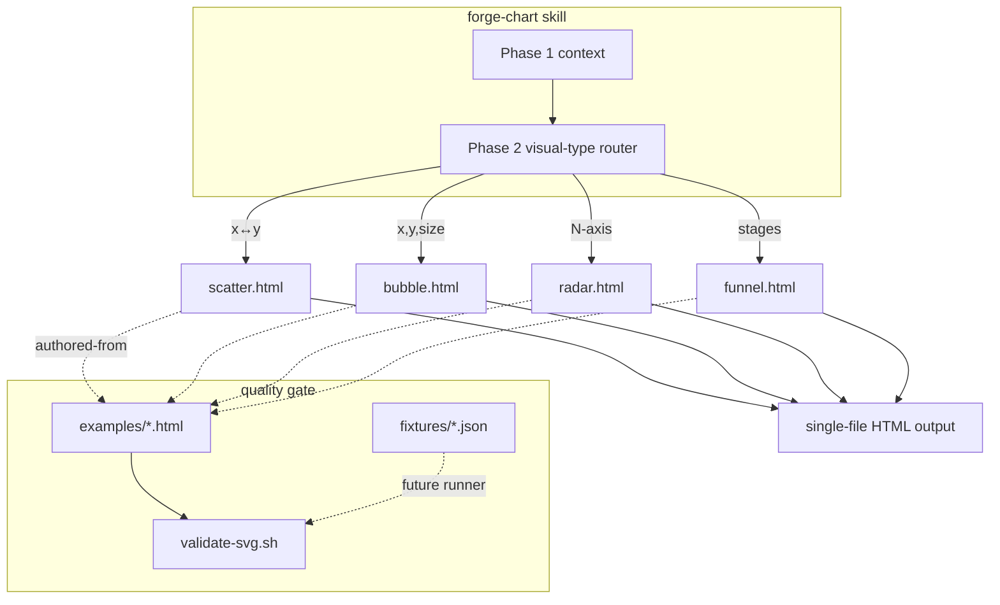
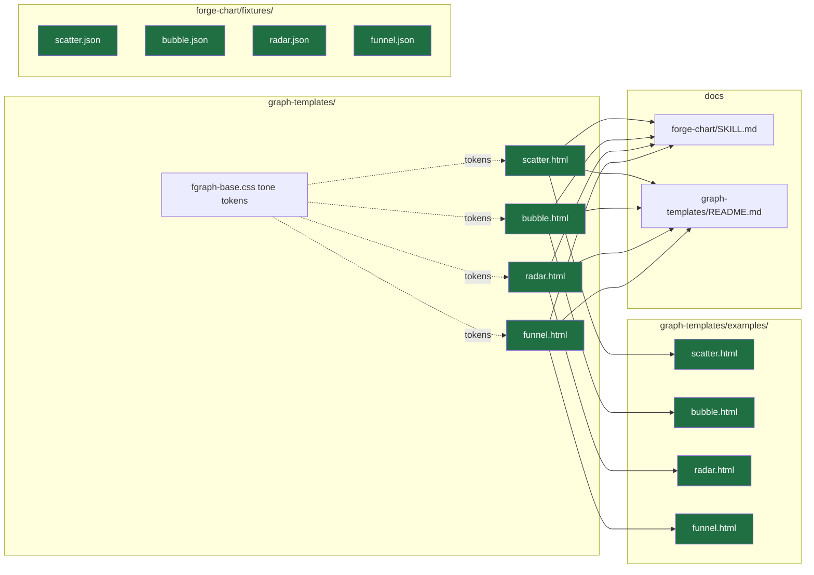

## Summary

Add 4 native inline-SVG data-chart templates (`scatter`, `bubble`, `radar`, `funnel`) to
`graph-templates/`, each with a placeholder-free golden example, a fixture descriptor, and
wiring into `forge-chart/SKILL.md` + `graph-templates/README.md`. Zero JS runtime, `file://`-safe,
uniform-aspect `0..100` SVG space. Validated by `validate-svg.sh`.

## Architecture

## Agents

| Agent instance | Tasks | Files | Subject |
|---|---|---|---|
| frontend-dev-A | T1–T4 | scatter.html, bubble.html + their examples | cartesian-charts |
| frontend-dev-B | T5–T8 | radar.html, funnel.html + their examples | radar, funnel |
| tester-A | T9–T10 | fixtures/*.json, validate-svg.sh run | fixtures+validation |
| doc-writer-A | T11–T12 | forge-chart/SKILL.md, graph-templates/README.md | docs |

## Wave Structure

2 waves, max 2 parallel agents. Elapsed ~½ the sequential path.

| Wave | Trigger | Agents | Tasks |
|------|---------|--------|-------|
| 1 | start | 2 ∥ | frontend-dev-A: T1→T2→T3→T4 · frontend-dev-B: T5→T6→T7→T8 |
| 2 | Wave 1 done (templates+examples exist) | 2 ∥ | tester-A: T9→T10 · doc-writer-A: T11→T12 |

### Budget — per task

| Task | Items | Class | Est. ops | Split? |
|------|-------|-------|----------|--------|
| T1 scatter.html | 1 | judgmental | 6 | — |
| T2 scatter example | 1 | judgmental | 5 | — |
| T3 bubble.html | 1 | judgmental | 6 | — |
| T4 bubble example | 1 | judgmental | 5 | — |
| T5 radar.html | 1 | judgmental | 6 | — |
| T6 radar example | 1 | judgmental | 5 | — |
| T7 funnel.html | 1 | judgmental | 5 | — |
| T8 funnel example | 1 | judgmental | 5 | — |
| T9 4 fixtures | 4 | bounded | 6 | — |
| T10 validate all | 8+ | bounded | 4 | — |
| T11 SKILL.md wiring | 3 edits | judgmental | 6 | — |
| T12 README wiring | 3 sections | judgmental | 6 | — |

**Total estimated ops: ~65** (across 2 waves; ≤ ~33 per wave).

### Budget — per agent instance

| Instance | Tasks | Σ ops | Subjects | Split? |
|----------|-------|-------|----------|--------|
| frontend-dev-A | T1,T2,T3,T4 | 22 | cartesian-charts (1) | — |
| frontend-dev-B | T5,T6,T7,T8 | 21 | radar, funnel (2) | — |
| tester-A | T9,T10 | 10 | fixtures+validation (1) | — |
| doc-writer-A | T11,T12 | 12 | docs (1) | — |

No task >50 ops; no instance >4 tasks / >2 subjects / >50 ops → no splits required.

## Consistency Report

8 / 8 success criteria traced. 0 uncovered. 0 untraced tasks.

| SC | Criterion | Tasks |
|----|-----------|-------|
| SC1 | routing wired (SKILL Structure + Phase 2) | T11 |
| SC2 | 4 templates exist, file://-safe, zero runtime | T1, T3, T5, T7 |
| SC3 | uniform aspect + non-scaling-stroke + text-in-svg + a11y | T1, T3, T5, T7 (verify T10) |
| SC4 | bubble formula, radar vertices, funnel labels | T3, T5, T7 |
| SC5 | placeholder-free golden examples | T2, T4, T6, T8 |
| SC6 | fixtures + SVG validator clean | T9, T10 |
| SC7 | README Showcase + Templates + Shape picker | T12 |
| SC8 | no regression on existing 15 examples | T10 |

## Micro-Tasks

Shared authoring rules (every template task): `0..100` viewBox with **uniform aspect**
(`xMidYMid meet`, not `preserveAspectRatio="none"`); all strokes `vector-effect: non-scaling-stroke`;
**all text inside `<svg>`** in user units; SVG root `role="img"` + `<title>` + `aria-label`;
series colours from `fgraph-base.css` tone tokens (`--amber/--cyan/...`) with 6-digit-hex override;
compact inlined `<style>` (no dependency on full fgraph-base.css). Read `graph-templates/pie.html`
as the precedent skeleton + `graph-templates/examples/pie.html` as the visual format anchor before authoring.

### Slice 1 — Cartesian foundation (scatter + bubble) · frontend-dev-A

**T1** — Author `plugins/forge/references/graph-templates/scatter.html` [P]
- Square value-axis plot: X/Y axes + gridlines, pre-computed nice-number ticks with a **validity-guard comment** (`ticks[0] ≤ min`, `ticks[last] ≥ max`), data points (per-series `pointShape`/`pointSize`), legend. Placeholder tokens for data.
- Verify: `bash plugins/forge/scripts/validate-svg.sh plugins/forge/references/graph-templates/scatter.html` → exit 0; `grep -q 'non-scaling-stroke' scatter.html && grep -q 'role="img"' scatter.html`
- Spec trace: SC2, SC3 · Slice V1 · Phase GREEN · Difficulty 3

**T2** — Author `…/graph-templates/examples/scatter.html` (placeholder-free) [blockedBy T1]
- Realistic 2-series scatter, no `{{…}}`/PLACEHOLDER tokens.
- Verify: `validate-svg.sh examples/scatter.html` exit 0; `! grep -qE '\{\{|PLACEHOLDER' examples/scatter.html`
- Spec trace: SC5 · V1 · GREEN · Diff 2

**T3** — Author `…/graph-templates/bubble.html` [blockedBy T1]
- Extends scatter plot foundation; area-proportional radius `r = minRadius+(maxRadius−minRadius)·√(size/maxSize)` clamped to `[minRadius,maxRadius]` (comment discloses clamp overrides area-proportionality); `size≤0 → minRadius`.
- Verify: `validate-svg.sh bubble.html` exit 0; `grep -q 'sqrt\|√\|minRadius' bubble.html`
- Spec trace: SC2, SC3, SC4 · V1 · GREEN · Diff 3

**T4** — Author `…/examples/bubble.html` (placeholder-free) [blockedBy T3]
- Verify: `validate-svg.sh examples/bubble.html` exit 0; no placeholder tokens.
- Spec trace: SC5 · V1 · GREEN · Diff 2

### Slice 2 — Radar · frontend-dev-B

**T5** — Author `…/graph-templates/radar.html` [P]
- Radial axes from centre, `scaleLevels` concentric polygon rings, filled series polygons (`fillOpacity`), axis labels outside perimeter but inside `<svg>`; data length == axes length; 2-axis degenerate still draws grid.
- Verify: `validate-svg.sh radar.html` exit 0; `grep -q 'non-scaling-stroke' radar.html && grep -q 'role="img"' radar.html`
- Spec trace: SC2, SC3, SC4 · V2 · GREEN · Diff 4

**T6** — Author `…/examples/radar.html` (5-axis, 2-series, placeholder-free) [blockedBy T5]
- Verify: `validate-svg.sh examples/radar.html` exit 0; no placeholder tokens.
- Spec trace: SC5 · V2 · GREEN · Diff 2

### Slice 3 — Funnel · frontend-dev-B

**T7** — Author `…/graph-templates/funnel.html` [P]
- Descending stages, `variant` trapezoid|rounded, width ∝ value, conversion-rate labels when `showConversionRate`; 1-stage degenerate = single trapezoid no arrow.
- Verify: `validate-svg.sh funnel.html` exit 0; `grep -q 'non-scaling-stroke' funnel.html && grep -q 'role="img"' funnel.html`
- Spec trace: SC2, SC3, SC4 · V3 · GREEN · Diff 2

**T8** — Author `…/examples/funnel.html` (4-stage + conversion %, placeholder-free) [blockedBy T7]
- Verify: `validate-svg.sh examples/funnel.html` exit 0; no placeholder tokens.
- Spec trace: SC5 · V3 · GREEN · Diff 2

### Slice-spanning — fixtures + validation · tester-A

**T9** — Author 4 fixtures `plugins/forge/skills/forge-chart/fixtures/{scatter,bubble,radar,funnel}.json` [blockedBy T1,T3,T5,T7]
- Follow `fixtures/README.md` schema: `{skill:"forge-chart", variant:"<type>", input:{prompt,slug,project}, expected_output_hash:null, notes}`. `variant` matches the SKILL.md name.
- Verify: `for f in scatter bubble radar funnel; do python3 -c "import json;json.load(open('plugins/forge/skills/forge-chart/fixtures/'+'$f'+'.json'))"; done`
- Spec trace: SC6 · GREEN · Diff 2

**T10 (RED-GATE)** — Validate all + regression [blockedBy T2,T4,T6,T8]
- Run `validate-svg.sh` on the 4 new templates + 4 new examples; re-run on existing `examples/*.html` (all 15 fgraph) → confirm none regressed.
- **Visual QA (per QA-harness memory — screenshot, don't trust mental gates):** render each new `examples/*.html` headless, eyeball for distortion/clipping/contrast.
- Verify: `bash plugins/forge/scripts/validate-svg.sh plugins/forge/references/graph-templates/examples/*.html` → exit 0 (all)
- Spec trace: SC3, SC6, SC8 · RED-GATE · Diff 2

### Slice-spanning — docs · doc-writer-A

**T11** — Wire into `plugins/forge/skills/forge-chart/SKILL.md` [blockedBy T1,T3,T5,T7]
- Add 4 rows to "Structure — Which visual type?" table; add 4 entries to Phase 2 visual-type list; update the golden-examples enumeration (15 → 19 types, add the 4 names).
- Verify: `for t in scatter bubble radar funnel; do grep -q "$t" plugins/forge/skills/forge-chart/SKILL.md || echo MISSING $t; done`
- Spec trace: SC1 · GREEN · Diff 2

**T12** — Wire into `plugins/forge/references/graph-templates/README.md` [blockedBy T2,T4,T6,T8]
- Add `### Scatter/Bubble/Radar/Funnel` Showcase entries; add to Templates / Shape vocabulary; add to "Shape picker — which template?".
- Verify: `grep -c -E 'Scatter|Bubble|Radar|Funnel' plugins/forge/references/graph-templates/README.md` ≥ 4 across the 3 sections.
- Spec trace: SC7 · GREEN · Diff 2

## Task Seeding Blueprint

<!-- Used by /implement to seed TaskCreate calls on session start.
     Format: T{n} | agent-instance | blockedBy | subject. blockedBy refs T-numbers. -->

### Wave 1 — no deps, 2 agents ∥

| Task | Agent instance | blockedBy | Subject |
|------|---------------|-----------|---------|
| T1 | frontend-dev-A | — | cartesian |
| T2 | frontend-dev-A | T1 | cartesian |
| T3 | frontend-dev-A | T1 | cartesian |
| T4 | frontend-dev-A | T3 | cartesian |
| T5 | frontend-dev-B | — | radar |
| T6 | frontend-dev-B | T5 | radar |
| T7 | frontend-dev-B | — | funnel |
| T8 | frontend-dev-B | T7 | funnel |

### Wave 2 — after Wave 1, 2 agents ∥

| Task | Agent instance | blockedBy | Subject |
|------|---------------|-----------|---------|
| T9 | tester-A | T1,T3,T5,T7 | fixtures |
| T10 | tester-A | T2,T4,T6,T8 | validation |
| T11 | doc-writer-A | T1,T3,T5,T7 | docs |
| T12 | doc-writer-A | T2,T4,T6,T8 | docs |

## Task IDs

<!-- Generated by /plan. Used by /implement to resume tasks on session restart. -->
- T1: 14 — scatter.html (frontend-dev-A)
- T2: 15 — scatter example (frontend-dev-A)
- T3: 16 — bubble.html (frontend-dev-A)
- T4: 17 — bubble example (frontend-dev-A)
- T5: 18 — radar.html (frontend-dev-B)
- T6: 19 — radar example (frontend-dev-B)
- T7: 20 — funnel.html (frontend-dev-B)
- T8: 21 — funnel example (frontend-dev-B)
- T9: 22 — fixtures (tester-A)
- T10: 23 — validate + regression / RED-GATE (tester-A)
- T11: 24 — wire SKILL.md (doc-writer-A)
- T12: 25 — wire README (doc-writer-A)
