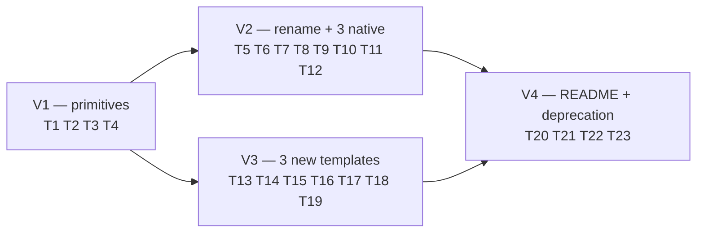

## Summary

Cycle 1 of the 4-phase Mermaid purge (#21). Build the 6 native fgraph templates (`gantt`, `pie`, `er`, `sequence`, `state`, `dep-graph`) backed by 3 new `fgraph-base.css` primitives (date axis, lifeline, 5 crow's-foot markers), rename 3 Mermaid originals to `*-mermaid.html` for coexistence, add 6 worked demos, expand the graph-templates README (additive), and land soft deprecation (banner + non-blocking lefthook warn). Ships standalone — Mermaid still works.

## Architecture

### Data flow

```mermaid
flowchart TD
  subgraph primitives [fgraph-base.css § new sections]
    P1[".fg-axis-date\n+ tick children"]
    P2[".fg-lifeline\n+ .fg-lifeline-activation"]
    P3["5 × &lt;marker&gt;\nfg-er-{one,zero-one,many,one-many,zero-many}"]
  end

  subgraph templates [graph-templates/*.html — 6 native]
    T1[gantt.html]
    T2[pie.html]
    T3[er.html]
    T4[sequence.html]
    T5[state.html]
    T6[dep-graph.html]
  end

  subgraph demos [examples/*.html]
    D1[gantt demo]
    D2[pie demo]
    D3[er demo]
    D4[sequence demo]
    D5[state demo]
    D6[dep-graph demo]
  end

  subgraph docs [graph-templates/README.md — additive]
    R1[Showcase × 6 new sub-sections]
    R2[Templates table +6 rows]
    R3[Shape picker +6 rows]
  end

  subgraph deprecation [soft deprecation]
    DEP1[mermaid-init.js banner]
    DEP2[lefthook.yml\nmermaid-deprecation-warn\n(exit 0)]
  end

  P1 --> T1
  P2 --> T4
  P3 --> T3
  T1 --> D1
  T2 --> D2
  T3 --> D3
  T4 --> D4
  T5 --> D5
  T6 --> D6
  T1 --> R1
  T2 --> R1
  T3 --> R1
  T4 --> R1
  T5 --> R1
  T6 --> R1

  classDef new fill:#1a3a1a,stroke:#4ade80
  class P1,P2,P3,T1,T2,T3,T4,T5,T6,D1,D2,D3,D4,D5,D6,R1,R2,R3,DEP1,DEP2 new
```

### File × function map

```mermaid
flowchart LR
  subgraph css [graph-templates/fgraph-base.css]
    css_existing["existing tokens / tones / shapes / fg-arr-*"]
    css_axis[".fg-axis-date\n.fg-axis-date-tick\n.fg-axis-date-label"]
    css_life[".fg-lifeline\n.fg-lifeline-activation"]
    css_er["&lt;marker&gt; fg-er-one\nfg-er-zero-one\nfg-er-many\nfg-er-one-many\nfg-er-zero-many"]
    css_gantt_bar[".fg-gantt-bar"]
  end

  subgraph templates
    gantt[gantt.html] --> css_axis
    gantt --> css_gantt_bar
    pie[pie.html] --> css_existing
    er[er.html] --> css_er
    seq[sequence.html] --> css_life
    state[state.html] --> css_existing
    dep[dep-graph.html] --> css_existing
  end

  subgraph examples
    ex_gantt[examples/gantt.html] --> gantt
    ex_pie[examples/pie.html] --> pie
    ex_er[examples/er.html] --> er
    ex_seq[examples/sequence.html] --> seq
    ex_state[examples/state.html] --> state
    ex_dep[examples/dep-graph.html] --> dep
  end

  subgraph deprecation
    init[base/mermaid-init.js] -. banner prepend .-> init
    lh[lefthook.yml] --> warn[mermaid-deprecation-warn\nstep]
    warn -. grep .-> staged[staged files]
  end

  subgraph legacy [renamed in V2]
    gantt_old[gantt-mermaid.html] -. was gantt.html .- gantt
    pie_old[pie-mermaid.html] -. was pie.html .- pie
    er_old[er-mermaid.html] -. was er.html .- er
  end

  subgraph readme [README.md — additive]
    showcase[Showcase §]
    tpl_tbl[Templates table]
    pick[Shape picker]
  end

  gantt --> showcase
  pie --> showcase
  er --> showcase
  seq --> showcase
  state --> showcase
  dep --> showcase
  gantt --> tpl_tbl
  pie --> tpl_tbl
  er --> tpl_tbl
  seq --> tpl_tbl
  state --> tpl_tbl
  dep --> tpl_tbl
  gantt --> pick
  pie --> pick
  er --> pick
  seq --> pick
  state --> pick
  dep --> pick
```

## Bootstrap Context

From `artifacts/analyses/21-purge-mermaid-analysis.mdx` (Shape 2 selected):

- **Distribution:** all 6 templates are **single-file HTML with inline `fgraph-base.css`** (per `plugins/forge/CLAUDE.md § Distribution rule` — single-file, `file://`-safe, ≥ 2 fgraph diagrams rule doesn't apply here).
- **Coexistence:** Mermaid originals renamed to `*-mermaid.html` via `git mv` in V2 before native versions ship at canonical names — no git-history break.
- **Scope guard on P1.1 (`fg-axis-date`):** API surface limited to what `gantt.html` consumes. No speculative "event timeline" selectors.
- **P1.13 lefthook:** runs on `{staged_files}` (not `-r` directory scan); exits 0; non-blocking. Flips to blocking `mermaid-guard` in P4 (sub-issue #24).
- **Elbow routing for `dep-graph.html`:** declarative only in P1 — template accepts pre-positioned nodes (`--x` / `--y` injected by `gen-deps.py` in P2/#23). P1 template must be data-driven; no Python-side logic here.
- **No existing template modified** beyond the 3 renames. Byte-identical verification via `git diff --stat` at V4 gate.

## Agents

| Agent | Count | Files |
|---|---|---|
| frontend-dev | 1 | `fgraph-base.css`, 9 `*.html` templates, 6 `examples/*.html` |
| doc-writer | 1 | `README.md` (3 additive sections × 6 rows) |
| devops | 1 | `lefthook.yml`, `base/mermaid-init.js` |
| tester | 1 | RED-GATE verifications per slice (grep + visual smoke via curl/file-serve) |

Single-domain dominance (CSS + HTML templating) — no architect or security-auditor needed.

## Consistency Report

| Metric | Value |
|---|---|
| Acceptance criteria covered | 11 / 11 |
| Uncovered criteria | 0 |
| Micro-tasks total | 22 |
| Untraced tasks | 0 |
| Exemptions | Cross-cutting "no new runtime deps" + "byte-size drop" are V4 RED-GATE spot-checks, not standalone tasks. |

Bidirectional trace:

| Criterion | Micro-tasks | Slice |
|---|---|---|
| Primitives (3 sections in fgraph-base.css) | T1, T2, T3 | V1 |
| Gantt native | T5, T6, T11 | V2 |
| Pie native | T5, T7, T12 | V2 |
| ER native | T5, T8, T13 | V2 |
| Sequence | T15, T18 | V3 |
| State | T16, T19 | V3 |
| Dep-graph | T17, T20 | V3 |
| Demos (6 total) | T11, T12, T13, T18, T19, T20 | V2 + V3 |
| README additions | T21 | V4 |
| Soft guard + banner | T22, T23 | V4 |
| No existing template modified | GATE-V4 | V4 |
| Plugin sync succeeds | GATE-V4 | V4 |

## Micro-Tasks

### V1 — three new `fgraph-base.css` primitives (RED → GREEN → RED-GATE)

#### T1. Add `.fg-axis-date` primitive (P1.1) — GREEN

- **File:** `plugins/forge/references/graph-templates/fgraph-base.css` (append new section before the `/* === markers === */` block or at EOF with clear `/* ── date axis ── */` banner)
- **Agent:** frontend-dev
- **Difficulty:** 2
- **Parallel:** N (serialize all fgraph-base.css edits)
- **Spec trace:** SC-Primitives, P1.1
- **Slice:** V1 · **Phase:** GREEN
- **Skeleton:**
  ```css
  /* ── date axis ── */
  /* Consumed by: gantt.html
     Authoring: set --axis-start-pct and --axis-end-pct on .fg-axis-date parent;
     tick children carry individual --x. Date→% mapping formula:
       x% = (tick_date - start_date) / (end_date - start_date) * 100
  */
  .fg-axis-date { position: absolute; left: 0; right: 0; bottom: 12%; height: 14px; ... }
  .fg-axis-date-baseline { ... }
  .fg-axis-date-tick { position: absolute; left: calc(var(--x, 0) * 1%); ... }
  .fg-axis-date-label { ... }
  ```
- **Verify:** `grep -c 'fg-axis-date' plugins/forge/references/graph-templates/fgraph-base.css`
- **Expected:** ≥ 3

#### T2. Add `.fg-lifeline` + `.fg-lifeline-activation` (P1.2) — GREEN

- **File:** same, append immediately after T1 block (`/* ── lifelines ── */`)
- **Agent:** frontend-dev · **Difficulty:** 2 · **Parallel:** N · **Spec trace:** P1.2 · **Slice:** V1 · **Phase:** GREEN
- **Skeleton:**
  ```css
  /* ── lifelines ── */
  /* Consumed by: sequence.html. Pairs with a top participant row (.fgraph-node.pill).
     --x positions the vertical rule; activation modifier draws a solid rectangle
     while a participant is processing a message. */
  .fg-lifeline {
    position: absolute;
    left: calc(var(--x, 50) * 1%);
    top: 12%;
    bottom: 8%;
    width: 0;
    border-left: 1px dashed var(--border-bright);
  }
  .fg-lifeline-activation { ... }
  ```
- **Verify:** `grep -c 'fg-lifeline' plugins/forge/references/graph-templates/fgraph-base.css`
- **Expected:** ≥ 2

#### T3. Add 5 `fg-er-*` crow's-foot markers (P1.3) — GREEN

- **File:** same, append in `/* ── ER markers ── */` block adjacent to existing `fg-arr-*` marker defs. Markers live in a shared `<defs>` block referenced by inline SVG in templates — document pattern in header comment.
- **Agent:** frontend-dev · **Difficulty:** 3 · **Parallel:** N · **Spec trace:** P1.3 · **Slice:** V1 · **Phase:** GREEN
- **Skeleton:**
  ```css
  /* ── ER markers ── */
  /* Chen / crow's-foot convention. Consumed by: er.html.
     Marker glyphs (d = dash; | = vertical bar; o = circle; { = crow's foot):
       fg-er-one       d=||  one (mandatory)
       fg-er-zero-one  d=o|  zero-or-one (optional)
       fg-er-many      d=o{  zero-or-many (optional)
       fg-er-one-many  d=}|  one-or-many (mandatory)
       fg-er-zero-many d=}o  zero-or-many (dashed crow)
     The marker defs themselves live in each er.html's inline <defs> (SVG scope);
     this CSS block styles the marker stroke/fill via .mk-er-* classes. */
  .mk-er-stroke { stroke: var(--border-bright); fill: none; stroke-width: 1.2; }
  ```
  Note: SVG `<marker>` defs are authored inline in `er.html` because `<marker>` is an SVG element, not a CSS construct. This CSS block ships the shared styling classes.
- **Verify:** `grep -c 'mk-er-\|ER markers' plugins/forge/references/graph-templates/fgraph-base.css`
- **Expected:** ≥ 2

#### T4. GATE-V1 — smoke-test all 3 primitives — RED-GATE

- **File:** scratch `/tmp/fgraph-v1-smoke.html` (not committed) — single page inline-imports `fgraph-base.css`, renders one `.fg-axis-date`, one `.fg-lifeline`, and one path referencing `fg-er-many`; opens under `file://`.
- **Agent:** tester · **Difficulty:** 1 · **Parallel:** N · **Spec trace:** GATE-V1 · **Slice:** V1 · **Phase:** RED-GATE
- **Verify:**
  ```
  python3 -c "import webbrowser; webbrowser.open('file:///tmp/fgraph-v1-smoke.html')"
  grep -c 'fg-axis-date\|fg-lifeline\|fg-er-' plugins/forge/references/graph-templates/fgraph-base.css
  ```
- **Expected:** grep count ≥ 6; visual check: all 3 primitives render with visible strokes under `file://`.

### V2 — rename Mermaid originals + ship 3 native templates

#### T5. Rename Mermaid originals (prerequisite) — REFACTOR

- **Files:** `git mv plugins/forge/references/graph-templates/{gantt.html → gantt-mermaid.html, pie.html → pie-mermaid.html, er.html → er-mermaid.html}` (3 separate `git mv` calls in one commit).
- **Agent:** frontend-dev · **Difficulty:** 1 · **Parallel:** N (must precede T6–T8) · **Spec trace:** P1.4–6 prerequisite · **Slice:** V2 · **Phase:** REFACTOR
- **Verify:** `ls plugins/forge/references/graph-templates/*-mermaid.html | wc -l`
- **Expected:** `3`

#### T6. Native `gantt.html` (P1.4) — GREEN [P]

- **File:** `plugins/forge/references/graph-templates/gantt.html` (new file at canonical name)
- **Agent:** frontend-dev · **Difficulty:** 4 · **Parallel:** Y (after T5) · **Spec trace:** SC-Gantt, P1.4 · **Slice:** V2 · **Phase:** GREEN
- **Skeleton:** single-file HTML; diagram-meta header (title/date/category/color); inline `fgraph-base.css`; body has `<div class="fgraph-wrap">` → `<div class="fg-axis-date">` with ≥ 6 ticks → 3 sections × 3 `<rect class="fg-gantt-bar">` bars → `.fgraph-legend`. Placeholders `{{TITLE}} {{SECTION_N_LABEL}} {{TASK_N_M_START}} {{TASK_N_M_DURATION}}`.
- **Verify:**
  ```
  test -f plugins/forge/references/graph-templates/gantt.html
  grep -c 'fg-axis-date\|fg-gantt-bar' plugins/forge/references/graph-templates/gantt.html
  grep -c 'cdn.jsdelivr.net\|mermaid' plugins/forge/references/graph-templates/gantt.html
  ```
- **Expected:** file exists; primitive refs ≥ 2; Mermaid/CDN refs = 0.

#### T7. Native `pie.html` (P1.5) — GREEN [P]

- **File:** `plugins/forge/references/graph-templates/pie.html`
- **Agent:** frontend-dev · **Difficulty:** 3 · **Parallel:** Y · **Spec trace:** SC-Pie, P1.5 · **Slice:** V2 · **Phase:** GREEN
- **Skeleton:** single-file; inline `<svg viewBox="0 0 100 100">` with 5 pre-computed arc `<path>` elements (header comment documents arc-path computation: `A rx ry 0 large-arc-flag sweep x y`); legend below.
- **Verify:** `grep -cE '<path .*d="M.*A[0-9]' plugins/forge/references/graph-templates/pie.html`
- **Expected:** ≥ 5

#### T8. Native `er.html` (P1.6) — GREEN [P]

- **File:** `plugins/forge/references/graph-templates/er.html`
- **Agent:** frontend-dev · **Difficulty:** 4 · **Parallel:** Y · **Spec trace:** SC-ER, P1.6 · **Slice:** V2 · **Phase:** GREEN
- **Skeleton:** 4 entity `<div>` boxes with attribute rows; inline `<defs>` block carrying 5 `<marker id="fg-er-*">` defs; ≥ 2 relationship `<path>`s referencing different markers; endpoint-offset lookup table in header HTML comment (attributes-per-entity → anchor offset).
- **Verify:**
  ```
  grep -c '<marker id="fg-er-' plugins/forge/references/graph-templates/er.html
  grep -c 'marker-end="url(#fg-er-' plugins/forge/references/graph-templates/er.html
  ```
- **Expected:** ≥ 5 markers; ≥ 2 relationship refs.

#### T9. Example `examples/gantt.html` (P1.10a) — GREEN [P]

- **File:** `plugins/forge/references/graph-templates/examples/gantt.html`
- **Agent:** frontend-dev · **Difficulty:** 2 · **Parallel:** Y · **Spec trace:** P1.10 · **Slice:** V2 · **Phase:** GREEN
- **Realistic data:** the #21 4-phase plan (P1 Cycle 1 bars + P2/P3/P4 Cycle 2 bars). Opens under `file://`.
- **Verify:** `test -f plugins/forge/references/graph-templates/examples/gantt.html && grep -c 'fg-gantt-bar' plugins/forge/references/graph-templates/examples/gantt.html`
- **Expected:** ≥ 6

#### T10. Example `examples/pie.html` (P1.10b) — GREEN [P]

- **File:** `plugins/forge/references/graph-templates/examples/pie.html`
- **Agent:** frontend-dev · **Difficulty:** 1 · **Parallel:** Y · **Spec trace:** P1.10 · **Slice:** V2 · **Phase:** GREEN
- **Realistic data:** LOC distribution across forge plugin dirs (references/, skills/, scripts/, runtime/, supervisor/).
- **Verify:** `grep -cE '<path .*d="M.*A' plugins/forge/references/graph-templates/examples/pie.html`
- **Expected:** ≥ 5

#### T11. Example `examples/er.html` (P1.10c) — GREEN [P]

- **File:** `plugins/forge/references/graph-templates/examples/er.html`
- **Agent:** frontend-dev · **Difficulty:** 2 · **Parallel:** Y · **Spec trace:** P1.10 · **Slice:** V2 · **Phase:** GREEN
- **Realistic data:** GitHub issue / PR / label / sub-issue relationships.
- **Verify:** `grep -c 'marker-end="url(#fg-er-' plugins/forge/references/graph-templates/examples/er.html`
- **Expected:** ≥ 2

#### T12. GATE-V2 — verify V2 acceptance — RED-GATE

- **Agent:** tester · **Difficulty:** 1 · **Parallel:** N · **Spec trace:** SC-Gantt + SC-Pie + SC-ER · **Slice:** V2 · **Phase:** RED-GATE
- **Verify (all must pass):**
  ```
  ls plugins/forge/references/graph-templates/{gantt,pie,er}.html
  ls plugins/forge/references/graph-templates/{gantt,pie,er}-mermaid.html
  ! grep -l 'cdn.jsdelivr.net\|mermaid' plugins/forge/references/graph-templates/{gantt,pie,er}.html
  ls plugins/forge/references/graph-templates/examples/{gantt,pie,er}.html
  ```
- **Expected:** both native and `-mermaid` files exist; native files contain no CDN/Mermaid refs; 3 example files exist; visual smoke: each demo renders under `file://`.

### V3 — sequence + state + dep-graph templates

#### T13. `sequence.html` (P1.7) — GREEN [P]

- **File:** `plugins/forge/references/graph-templates/sequence.html`
- **Agent:** frontend-dev · **Difficulty:** 4 · **Parallel:** Y · **Spec trace:** SC-Sequence, P1.7 · **Slice:** V3 · **Phase:** GREEN
- **Skeleton:** aspect override `aspect-ratio: unset; height: calc(120px + var(--msg-count) * 40px);` on wrap; 4 participant pills along top; 4 `.fg-lifeline` below; 5 horizontal message arrows (SVG paths with `fg-arr-*` markers); header comment caps message count at 15.
- **Verify:** `grep -c 'fg-lifeline\|--msg-count' plugins/forge/references/graph-templates/sequence.html`
- **Expected:** ≥ 5

#### T14. `state.html` (P1.8) — GREEN [P]

- **File:** `plugins/forge/references/graph-templates/state.html`
- **Agent:** frontend-dev · **Difficulty:** 3 · **Parallel:** Y · **Spec trace:** SC-State, P1.8 · **Slice:** V3 · **Phase:** GREEN
- **Skeleton:** 4–6 state nodes (`.fgraph-node.circle` or `.fgraph-node.diamond`); transition `<path class="fg-edge control">` with labels (`.fgraph-lbl`).
- **Verify:** `grep -c 'fgraph-node.*\(circle\|diamond\)\|fg-edge' plugins/forge/references/graph-templates/state.html`
- **Expected:** ≥ 5

#### T15. `dep-graph.html` (P1.9) — GREEN [P]

- **File:** `plugins/forge/references/graph-templates/dep-graph.html`
- **Agent:** frontend-dev · **Difficulty:** 4 · **Parallel:** Y · **Spec trace:** SC-DepGraph, P1.9 · **Slice:** V3 · **Phase:** GREEN
- **Skeleton:** phase-column header row (`.fgraph-lbl`); issue cards positioned via `--x`/`--y` placeholders (declarative — `gen-deps.py` in P2 injects values); elbow SVG paths (≥ 2 segments each); ghost-node classes reserved for cross-phase deps. Template is pure scaffolding — no hand-coded literals in card coords.
- **Verify:** `grep -c 'style="--x:.*--y:\|class="fg-edge' plugins/forge/references/graph-templates/dep-graph.html`
- **Expected:** ≥ 4

#### T16. Example `examples/sequence.html` — GREEN [P]

- **File:** `plugins/forge/references/graph-templates/examples/sequence.html`
- **Agent:** frontend-dev · **Difficulty:** 2 · **Parallel:** Y · **Spec trace:** P1.10 · **Slice:** V3 · **Phase:** GREEN
- **Realistic data:** `/dev #22` pipeline — user → /dev → /plan → /implement → /pr message exchange.
- **Verify:** `grep -c 'fg-lifeline' plugins/forge/references/graph-templates/examples/sequence.html`
- **Expected:** ≥ 4

#### T17. Example `examples/state.html` — GREEN [P]

- **File:** `plugins/forge/references/graph-templates/examples/state.html`
- **Agent:** frontend-dev · **Difficulty:** 1 · **Parallel:** Y · **Spec trace:** P1.10 · **Slice:** V3 · **Phase:** GREEN
- **Realistic data:** GitHub issue lifecycle (backlog → todo → in-progress → in-review → done).
- **Verify:** `grep -c 'fgraph-node' plugins/forge/references/graph-templates/examples/state.html`
- **Expected:** ≥ 4

#### T18. Example `examples/dep-graph.html` — GREEN [P]

- **File:** `plugins/forge/references/graph-templates/examples/dep-graph.html`
- **Agent:** frontend-dev · **Difficulty:** 2 · **Parallel:** Y · **Spec trace:** P1.10 · **Slice:** V3 · **Phase:** GREEN
- **Realistic data:** the #21 → #22 → #23 → #24 dependency chain (with #21 parent as ghost).
- **Verify:** `grep -c 'class="fg-edge' plugins/forge/references/graph-templates/examples/dep-graph.html`
- **Expected:** ≥ 3

#### T19. GATE-V3 — verify V3 acceptance — RED-GATE

- **Agent:** tester · **Difficulty:** 1 · **Parallel:** N · **Spec trace:** SC-Sequence + SC-State + SC-DepGraph · **Slice:** V3 · **Phase:** RED-GATE
- **Verify:**
  ```
  ls plugins/forge/references/graph-templates/{sequence,state,dep-graph}.html
  ls plugins/forge/references/graph-templates/examples/{sequence,state,dep-graph}.html
  ! grep -l 'mermaid\|cdn.jsdelivr.net' plugins/forge/references/graph-templates/{sequence,state,dep-graph}.html
  ```
- **Expected:** 6 files present; no Mermaid/CDN refs; visual smoke under `file://`.

### V4 — README updates + soft deprecation

#### T20. README additions (P1.11) — GREEN [P]

- **File:** `plugins/forge/references/graph-templates/README.md` (3 distinct sections: Showcase, Templates table, Shape picker — all additive; Mermaid rows retained)
- **Agent:** doc-writer · **Difficulty:** 3 · **Parallel:** Y · **Spec trace:** SC-README, P1.11 · **Slice:** V4 · **Phase:** GREEN
- **Deliverable:**
  - Add 6 `### {shape}` sub-sections under `## Showcase` — each with ASCII sketch + "Reference consumer" line pointing at the demo in `examples/`.
  - Add 6 rows to the Templates table (under `## Templates`) — columns: name, shape, consumes, aspect, link.
  - Add 6 rows to the Shape picker table (under `## Shape picker — which template?`) — condition → template file.
- **Verify:**
  ```
  grep -c '^### \(Gantt\|Pie\|ER\|Sequence\|State\|Dep-Graph\)' plugins/forge/references/graph-templates/README.md
  grep -c 'gantt\.html\|pie\.html\|er\.html\|sequence\.html\|state\.html\|dep-graph\.html' plugins/forge/references/graph-templates/README.md
  ```
- **Expected:** ≥ 6 new showcase headings; file references ≥ 12 (6 × at least once in Templates + once in Shape picker).

#### T21. Deprecation banner in `mermaid-init.js` (P1.12) — REFACTOR [P]

- **File:** `plugins/forge/references/base/mermaid-init.js` (prepend comment block; do not modify existing init logic)
- **Agent:** devops · **Difficulty:** 1 · **Parallel:** Y · **Spec trace:** SC-DeprecationBanner, P1.12 · **Slice:** V4 · **Phase:** REFACTOR
- **Skeleton:**
  ```js
  // ══════════════════════════════════════════════════════════════════
  // DEPRECATED — scheduled for deletion in Cycle 2 of the Mermaid purge.
  // See: https://github.com/Roxabi/roxabi-forge/issues/21
  //
  // New artifacts should use the native fgraph templates in
  // ../graph-templates/ (gantt, pie, er, sequence, state, dep-graph).
  // ══════════════════════════════════════════════════════════════════
  ```
- **Verify:** `head -5 plugins/forge/references/base/mermaid-init.js | grep -c 'DEPRECATED\|#21'`
- **Expected:** ≥ 2

#### T22. Non-blocking `mermaid-deprecation-warn` in lefthook (P1.13) — GREEN [P]

- **File:** `lefthook.yml` (add step to `pre-commit.commands`, non-blocking via explicit `exit 0` wrapper)
- **Agent:** devops · **Difficulty:** 2 · **Parallel:** Y · **Spec trace:** SC-DeprecationBanner, P1.13 · **Slice:** V4 · **Phase:** GREEN
- **Skeleton:**
  ```yaml
  mermaid-deprecation-warn:
    run: |
      matches=$(grep -n '\bmermaid\b' {staged_files} 2>/dev/null || true)
      if [ -n "$matches" ]; then
        echo "warn: mermaid references detected in staged files (scheduled for deletion — see #21)"
        echo "$matches"
      fi
      exit 0
    glob:
      - "plugins/forge/**/*"
      - "scripts/*.py"
  ```
- **Verify:**
  ```
  grep -A 5 'mermaid-deprecation-warn' lefthook.yml | grep -c 'exit 0\|{staged_files}'
  ```
- **Expected:** ≥ 2 (confirms both non-blocking exit and staged-files scoping).

#### T23. GATE-V4 — final acceptance (Cycle 1 ships) — RED-GATE

- **Agent:** tester · **Difficulty:** 2 · **Parallel:** N · **Spec trace:** all 11 SC + "no existing template modified" + "plugin sync succeeds" · **Slice:** V4 · **Phase:** RED-GATE
- **Verify:**
  ```bash
  # 11 SC sweep
  ls plugins/forge/references/graph-templates/{gantt,pie,er,sequence,state,dep-graph}.html
  ls plugins/forge/references/graph-templates/{gantt,pie,er}-mermaid.html
  ls plugins/forge/references/graph-templates/examples/{gantt,pie,er,sequence,state,dep-graph}.html
  grep -c 'fg-axis-date\|fg-lifeline\|mk-er-' plugins/forge/references/graph-templates/fgraph-base.css
  ! grep -l 'cdn.jsdelivr.net' plugins/forge/references/graph-templates/{gantt,pie,er,sequence,state,dep-graph}.html
  head -5 plugins/forge/references/base/mermaid-init.js | grep -c 'DEPRECATED'
  grep -c 'mermaid-deprecation-warn' lefthook.yml

  # No existing template modified (byte-identical)
  git diff --stat HEAD -- plugins/forge/references/graph-templates/{radial-hub,linear-flow,dual-cluster,radial-ring,layered,machine-clusters,deployment-tiers}.html
  # → must show nothing

  # Plugin sync
  ./sync-plugins.sh --local
  # → exit 0

  # Warn step actually fires on a mermaid edit (dry-run via lefthook)
  echo '// test: import mermaid' > /tmp/mermaid-test.js
  cp /tmp/mermaid-test.js plugins/forge/references/base/test-mermaid-tmp.js
  git add plugins/forge/references/base/test-mermaid-tmp.js
  lefthook run pre-commit  # expect: warn printed, exit 0
  git rm -f plugins/forge/references/base/test-mermaid-tmp.js
  ```
- **Expected:** all 11 spec checkboxes green; no existing template diff; `sync-plugins.sh --local` succeeds; warn step fires but exits 0.

## Slice dependency graph



V2 and V3 both depend on V1 (primitives exist) but are independent of each other — V3 may proceed in parallel once V1 is green.

## Task IDs

<!-- Generated by /plan. Used by /implement to resume tasks on session restart. -->

- T1:  8  — Add .fg-axis-date primitive to fgraph-base.css
- T2:  9  — Add .fg-lifeline + .fg-lifeline-activation to fgraph-base.css
- T3:  10 — Add fg-er-* crow's-foot markers section to fgraph-base.css
- T4:  11 — GATE-V1 smoke test — all 3 primitives render under file://
- T5:  12 — git mv {gantt,pie,er}.html → *-mermaid.html
- T6:  13 — Author native gantt.html
- T7:  14 — Author native pie.html
- T8:  15 — Author native er.html
- T9:  16 — Example examples/gantt.html (issue #21 4-phase plan)
- T10: 17 — Example examples/pie.html (forge LOC distribution)
- T11: 18 — Example examples/er.html (GitHub issue/PR/label schema)
- T12: 19 — GATE-V2 — verify V2 acceptance
- T13: 20 — Author sequence.html
- T14: 21 — Author state.html
- T15: 22 — Author dep-graph.html (declarative)
- T16: 23 — Example examples/sequence.html (/dev #22 pipeline)
- T17: 24 — Example examples/state.html (issue lifecycle)
- T18: 25 — Example examples/dep-graph.html (#21 chain)
- T19: 26 — GATE-V3 — verify V3 acceptance
- T20: 27 — README additions — Showcase + Templates + Shape picker (6 rows each, additive)
- T21: 28 — Prepend deprecation banner to mermaid-init.js
- T22: 29 — Add non-blocking mermaid-deprecation-warn step to lefthook.yml
- T23: 30 — GATE-V4 — final P1 acceptance (all 11 SC + byte-identical existing templates + sync-plugins)
