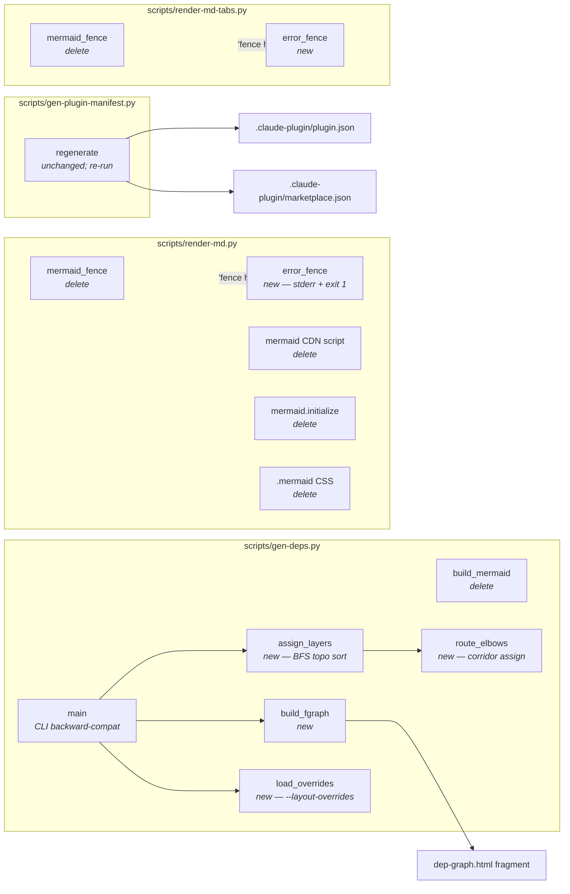

## Summary

Cycle 2 P2 of the 4-phase Mermaid purge (#21). Migrate 5 forge `SKILL.md` files (`forge-chart`, `forge-slides`, `forge-epic`, `forge-guide`, `forge-md`) off Mermaid onto the 6 native fgraph templates shipped in #22. Rewrite `scripts/gen-deps.py` to emit `dep-graph.html` fragments with Python-side topological layer assignment + elbow-routed SVG paths (`CORRIDOR_WIDTH = 2`, `--layout-overrides path.json` escape hatch). Drop the `mermaid_fence` handler from `scripts/render-md.py` and `scripts/render-md-tabs.py` so ` ```mermaid ` fences hard-error with a redirect to `graph-templates/README.md`. Bump `.claude-plugin/plugin.json.version` (0.6.0 → 0.7.0) and regenerate the marketplace manifest. Leaves all Mermaid source files still present — P3 (issue #24) handles deletion + the CI grep guard.

## Architecture

### Data flow

```mermaid
flowchart TD
    subgraph SKILLS[5× SKILL.md — Visual Type / CDN / Diagram prose]
      FC[forge-chart/SKILL.md]
      FS[forge-slides/SKILL.md]
      FE[forge-epic/SKILL.md]
      FG[forge-guide/SKILL.md]
      FM[forge-md/SKILL.md]
    end

    subgraph TEMPLATES[plugins/forge/references/graph-templates/ — built in #22]
      T_GANTT[gantt.html]
      T_PIE[pie.html]
      T_ER[er.html]
      T_SEQ[sequence.html]
      T_STATE[state.html]
      T_DEP[dep-graph.html]
    end

    subgraph SCRIPTS[scripts/]
      GD[gen-deps.py]
      RM[render-md.py]
      RMT[render-md-tabs.py]
      GPM[gen-plugin-manifest.py]
    end

    subgraph MANIFESTS[.claude-plugin/]
      PJ[plugin.json]
      MJ[marketplace.json]
    end

    subgraph OUTPUTS[runtime outputs]
      TD[~/.roxabi/forge/2ndbrain/tab-dependencies.html]
      ERR[stderr: 'Mermaid fences no longer supported']
    end

    SKILLS -- 'reference by path' --> TEMPLATES
    GD -- 'emits dep-graph fragment' --> T_DEP
    GD -- 'writes' --> TD
    RM -- 'on ``` mermaid fence' --> ERR
    RMT -- 'on ``` mermaid fence' --> ERR
    PJ -- 'version bump' --> GPM
    GPM -- 'regenerates' --> MJ
    GPM -- 'enumerates' --> SKILLS

    style SKILLS fill:#1a2332,stroke:#4ade80
    style SCRIPTS fill:#2a1a33,stroke:#a78bfa
    style OUTPUTS fill:#331a1a,stroke:#f87171
```



### File × function map



## Bootstrap Context

- **Spec:** [`artifacts/specs/21-purge-mermaid-spec.mdx`](../specs/21-purge-mermaid-spec.mdx) — P2 = slices 5–7, Success Criteria § "P2 — Migrate (Cycle 2)" (8 items).
- **Analysis:** [`artifacts/analyses/21-purge-mermaid-analysis.mdx`](../analyses/21-purge-mermaid-analysis.mdx) — §Fit Check on `gen-deps.py` elbow routing (sort cross-phase edges by source `--y`, assign corridors at `CORRIDOR_WIDTH = 2`).
- **Predecessor:** #22 merged via PR #25 — the 6 native templates (`gantt.html`, `pie.html`, `er.html`, `sequence.html`, `state.html`, `dep-graph.html`) are now shipped at canonical names under `plugins/forge/references/graph-templates/`. Mermaid originals coexist as `*-mermaid.html`.
- **Dep-graph template shape:** `plugins/forge/references/graph-templates/dep-graph.html` uses `.fgraph-wrap.dep-graph`, `.fg-dep-phase-lbl` for phase column headers, `.fg-dep-card` for issue cards with `--x`/`--y` custom props (0..100 space), and `<svg class="fgraph-edges">` for elbow paths. Authors pass data via `{{PLACEHOLDERS}}`; `gen-deps.py` replaces them.
- **Existing `gen-deps.py` CLI contract:** `python3 gen-deps.py [data.json] --out path --github-sync` — must stay backward-compatible. `--layout-overrides path.json` is additive.
- **Current version:** `.claude-plugin/plugin.json.version` = `0.6.0` → bump to `0.7.0`.
- **Pattern refs:**
  - `plugins/forge/references/graph-templates/fgraph-base.css:1-250` — custom-prop coord model (`--x`, `--y` in 0..100).
  - `scripts/gen-deps.py:77-200` — current `build_mermaid` signature + ghost-node logic to port.
  - `scripts/render-md.py:250-269` + `scripts/render-md-tabs.py:274-297` — current `mermaid_fence` + pymdownx config to delete.
  - `artifacts/plans/22-mermaid-purge-p1-plan.mdx` — sibling plan for task-table style.

## Agents

| Agent | Task count | File groups |
|---|---|---|
| doc-writer | 5 | `plugins/forge/skills/forge-{chart,slides,epic,guide,md}/SKILL.md` |
| devops | 5 | `scripts/gen-deps.py`, `scripts/render-md.py`, `scripts/render-md-tabs.py`, `.claude-plugin/plugin.json`, manifest regen |
| tester | 3 | RED-GATE verifications (V5, V6, V7) |

F-full tier — same-domain parallelism fits: 5 SKILL.md edits in V5 are independent; both render scripts in V7 are independent.

## Consistency Report

| Success Criterion (spec § P2) | Covered by task(s) |
|---|---|
| SC-P2.1 — Skill references: `grep -rn '\bmermaid\b' plugins/forge/skills/` == 0 | T1, T2, T3, T4, T5 |
| SC-P2.2 — forge-chart Visual Type table: 6 fgraph rows (gantt, pie, er, sequence, state, dep-graph) | T1 |
| SC-P2.3 — CDN allowlist purged from forge-slides (`mermaid@11`, `svg-pan-zoom@3.6.2` if unused) | T2 |
| SC-P2.4 — `gen-deps.py` rewritten: no `build_mermaid\|flowchart TD`, emits `<svg class="fgraph-edges">`, backward-compat CLI, `--help` lists `--layout-overrides` | T8, T10 |
| SC-P2.5 — Elbow routing: cross-phase `<path>` ≥ 2 segments; `CORRIDOR_WIDTH = 2` offsets | T9 |
| SC-P2.6 — Render fences hard-error (both scripts): exit non-zero + stderr redirect message | T12, T13 |
| SC-P2.7 — Clean markdown renders byte-identically before/after | T14 |
| SC-P2.8 — Manifests in sync: `plugin.json.version` bumped minor + `gen-plugin-manifest.py --check` exits 0 | T6 |

Covered: 8/8. Untraced tasks: 0. Exemptions: 0.

## Micro-Tasks

Task numbering is per-slice-global. Each task lists dependencies by task number. `[P]` = parallel-safe within its slice.

### Slice V5 — Skill migrations + manifest bump

**Phase: RED → GREEN**

---

#### T1 [P] · `forge-chart/SKILL.md` — rewrite Visual Type + drop Mermaid prose
- **Agent:** doc-writer
- **File:** `plugins/forge/skills/forge-chart/SKILL.md`
- **Slice:** V5 · **Phase:** GREEN · **Difficulty:** 2 · **Spec trace:** SC-P2.1, SC-P2.2
- **Change:**
  - Line 34: drop `${CLAUDE_PLUGIN_ROOT}/references/mermaid-guide.md` reference line.
  - Line 137 Visual Type Selection table: delete the Mermaid row (`Mermaid (flowchart / sequence / state / class)`); add 6 rows for `gantt.html`, `pie.html`, `er.html`, `sequence.html`, `state.html`, `dep-graph.html` each with the native template path + one-line use case.
  - Lines 155–156, 201, 208, 263, 372, 407: delete `.diagram-shell` / `pre class="mermaid"` / `mermaid.render()` / `{HEAD_EXTRAS} mermaid CDN` prose and the pitfall/checklist rows that reference them.
- **Verify:** `grep -cin '\bmermaid\b' plugins/forge/skills/forge-chart/SKILL.md`
- **Expected:** `0`
- **Time:** 6 min
- **Ref pattern:** existing Visual Type table structure in the same file; template filenames from `plugins/forge/references/graph-templates/`.
- **Deps:** none.

---

#### T2 [P] · `forge-slides/SKILL.md` — purge CDN allowlist + diagram prose
- **Agent:** doc-writer
- **File:** `plugins/forge/skills/forge-slides/SKILL.md`
- **Slice:** V5 · **Phase:** GREEN · **Difficulty:** 2 · **Spec trace:** SC-P2.1, SC-P2.3
- **Change:**
  - Line 39: drop `and Mermaid (\`cdn.jsdelivr.net/npm/mermaid\`) when diagram slides are present` clause.
  - Line 168: delete the "Mermaid source provided or flow > 8 nodes → `diagram` slide" pattern row; replace with a row pointing to the 6 native fgraph templates.
  - Lines 218, 227: drop `<div class="mermaid" data-mermaid>` prose + `initSlideMermaid` references.
  - Line 297: CDN allowlist checklist — remove `cdn.jsdelivr.net/npm/mermaid`. Before removing `svg-pan-zoom@3.6.2`, run `grep -rn 'svg-pan-zoom' plugins/forge/`; keep only if it has a non-mermaid consumer.
- **Verify:** `grep -cin '\bmermaid\b' plugins/forge/skills/forge-slides/SKILL.md`
- **Expected:** `0`
- **Time:** 5 min
- **Ref pattern:** existing CDN allowlist block in the same file.
- **Deps:** none.

---

#### T3 [P] · `forge-epic/SKILL.md` — swap dependency-diagram ref
- **Agent:** doc-writer
- **File:** `plugins/forge/skills/forge-epic/SKILL.md`
- **Slice:** V5 · **Phase:** GREEN · **Difficulty:** 1 · **Spec trace:** SC-P2.1
- **Change:**
  - Line 33: drop `${CLAUDE_PLUGIN_ROOT}/references/mermaid-guide.md` reference line.
  - Line 95: replace the "Mermaid dependency diagram" Visual-Type row → "Dependency diagram" pointing at `${CLAUDE_PLUGIN_ROOT}/references/graph-templates/dep-graph.html`.
  - Lines 114, 218, 337: drop `.diagram-shell` wrapper prose; rewrite the **Deps tab** subsection to reference `dep-graph.html` (declarative template filled by `gen-deps.py` at roadmap render time).
- **Verify:** `grep -cin '\bmermaid\b' plugins/forge/skills/forge-epic/SKILL.md`
- **Expected:** `0`
- **Time:** 4 min
- **Ref pattern:** `plugins/forge/references/graph-templates/dep-graph.html` header comment documents authoring contract.
- **Deps:** none.

---

#### T4 [P] · `forge-guide/SKILL.md` — drop conditional Mermaid tab pattern
- **Agent:** doc-writer
- **File:** `plugins/forge/skills/forge-guide/SKILL.md`
- **Slice:** V5 · **Phase:** GREEN · **Difficulty:** 1 · **Spec trace:** SC-P2.1
- **Change:**
  - Line 35: drop `${CLAUDE_PLUGIN_ROOT}/references/mermaid-guide.md` reference line.
  - Line 107: delete the "Mermaid (any type)" Visual-Type row; add 3 rows for the relevant fgraph templates (`gantt.html`, `sequence.html`, `state.html`).
  - Lines 126, 229, 291, 310: drop `.diagram-shell` / `.mermaid-wrap` / "If Mermaid" conditional instructions + the "Bare `<pre class="mermaid">`" pitfall row.
- **Verify:** `grep -cin '\bmermaid\b' plugins/forge/skills/forge-guide/SKILL.md`
- **Expected:** `0`
- **Time:** 4 min
- **Ref pattern:** existing Visual Type table in the same file.
- **Deps:** none.

---

#### T5 [P] · `forge-md/SKILL.md` — update fence prose
- **Agent:** doc-writer
- **File:** `plugins/forge/skills/forge-md/SKILL.md`
- **Slice:** V5 · **Phase:** GREEN · **Difficulty:** 1 · **Spec trace:** SC-P2.1
- **Change:**
  - Line 17: remove `mermaid` from the handled-features enumeration ("sorting, tab labels, mermaid, tables, ..."). Add a new paragraph: "Mermaid fences are no longer supported — `render-md*.py` emits an error to stderr and exits non-zero. Use `plugins/forge/references/graph-templates/<shape>.html` instead; see `graph-templates/README.md`."
- **Verify:** `grep -cin '\bmermaid\b' plugins/forge/skills/forge-md/SKILL.md`
- **Expected:** matches only the new "no longer supported" sentence (grep with `-c` may return > 0 — inspect context).
- **Time:** 3 min
- **Ref pattern:** capitalized `Mermaid` in error-message prose is allowed per spec wiring rules (word-boundary blocking guard in P4.1 matches lowercase only).
- **Deps:** none.

---

#### T6 · Bump plugin.json.version + regenerate marketplace manifest
- **Agent:** devops
- **Files:** `.claude-plugin/plugin.json`, `.claude-plugin/marketplace.json`
- **Slice:** V5 · **Phase:** GREEN · **Difficulty:** 1 · **Spec trace:** SC-P2.8
- **Change:**
  - Edit `.claude-plugin/plugin.json`: `"version": "0.6.0"` → `"version": "0.7.0"` (minor bump per spec wiring rule).
  - Run `python3 scripts/gen-plugin-manifest.py` to sync `marketplace.json`.
- **Verify:** `python3 scripts/gen-plugin-manifest.py --check; echo $?`
- **Expected:** `0`
- **Time:** 2 min
- **Ref pattern:** `CLAUDE.md § Plugin manifests (generated)` — version is source of truth in `plugin.json`, script reads (does not bump).
- **Deps:** T1, T2, T3, T4, T5 (SKILL.md `summary` fields stable before manifest regen).

---

#### T7 · RED-GATE V5 — skill migration verification
- **Agent:** tester
- **File:** n/a (verification only)
- **Slice:** V5 · **Phase:** RED-GATE · **Difficulty:** 1 · **Spec trace:** SC-P2.1, SC-P2.8
- **Verify:**
  ```bash
  grep -rn '\bmermaid\b' plugins/forge/skills/
  python3 scripts/gen-plugin-manifest.py --check
  ```
- **Expected:** first command returns 0 matches; second exits 0.
- **Time:** 2 min
- **Deps:** T1, T2, T3, T4, T5, T6.

### Slice V6 — `gen-deps.py` rewrite

**Phase: RED → GREEN → REFACTOR**

---

#### T8 · Replace `build_mermaid` with `build_fgraph` + Python-side layer assignment
- **Agent:** devops
- **File:** `scripts/gen-deps.py`
- **Slice:** V6 · **Phase:** GREEN · **Difficulty:** 4 · **Spec trace:** SC-P2.4
- **Change:**
  - Delete `build_mermaid(phase_id, all_issues, domains)` and its helper styles (`CROSS_PHASE_STYLE`, `VIRTUAL_STYLE`, `domain_style()` Mermaid builders).
  - Add `assign_layers(phase_issues, all_issues) -> dict[iid, int]`: BFS topological sort within the phase (roots = issues with no intra-phase blocker); ties broken alphabetically by `iid`. Returns `{iid: layer_index}` in 0..N-1.
  - Add `build_fgraph(phase_id, all_issues, domains, overrides=None) -> str`: emits an HTML fragment matching the `dep-graph.html` shape — `<div class="fgraph-wrap dep-graph">` wrapper, `<div class="fg-dep-phase-lbl">` headers per column, `<div class="fg-dep-card">` per issue with `style="--x:...; --y:...;"`, `<svg class="fgraph-edges" viewBox="0 0 100 100" preserveAspectRatio="none">` with `<path>` children. Coord model: `--x` from phase layer index, `--y` from alphabetical intra-layer index (both in 0..100 space).
  - Port ghost-node logic from `build_mermaid`: cross-phase incoming/outgoing ghosts render as `.fg-dep-card.ghost` variants with source/target phase annotated.
  - Update `main()`: callsite switches from `build_mermaid(...)` → `build_fgraph(...)`. Replace the `<pre class="mermaid">...</pre>` wrapper (line 380) with direct injection of the fragment. Drop the `.dep-phase__svg` / `<pre class="mermaid">` wrapper div.
- **Code shape:**
  ```python
  def assign_layers(phase_issues: dict, all_issues: dict) -> dict:
      """BFS topo sort within phase. Roots = no intra-phase blocker. Alphabetical tie-break."""
      ...

  def build_fgraph(phase_id: str, all_issues: dict, domains: dict,
                   overrides: dict | None = None) -> str:
      """Emit dep-graph.html fragment for one phase.

      Layout: Python-assigned --x (phase layer × 100/(N+1)) + --y (alpha index × 100/(M+1)).
      Edges: elbow-routed SVG paths via route_elbows().
      """
      ...
  ```
- **Verify:**
  ```bash
  grep -cn 'build_mermaid\|flowchart TD\|<pre class="mermaid"' scripts/gen-deps.py
  ```
- **Expected:** `0` in each.
- **Time:** 25 min
- **Ref pattern:** `plugins/forge/references/graph-templates/dep-graph.html:1-80` for DOM shape; `plugins/forge/references/graph-templates/fgraph-base.css` for custom-prop API.
- **Deps:** none (V6 is independent of V5).

---

#### T9 · Add elbow routing with corridor assignment
- **Agent:** devops
- **File:** `scripts/gen-deps.py`
- **Slice:** V6 · **Phase:** REFACTOR · **Difficulty:** 4 · **Spec trace:** SC-P2.5
- **Change:**
  - Add `route_elbows(edges, node_positions) -> list[str]`: sort cross-phase edges by source node's `--y` (ascending); assign each edge a corridor offset `edge_index × CORRIDOR_WIDTH` (CORRIDOR_WIDTH = 2 units in 0..100 space); emit SVG `<path d="M sx,sy H corridor_x V ty H tx">` (3-segment elbow). Intra-phase (same-layer) edges emit single-segment straight verticals.
  - Module constant: `CORRIDOR_WIDTH = 2`.
  - Call `route_elbows` from `build_fgraph` after positions are assigned; inject the resulting `<path>` strings into the `<svg class="fgraph-edges">` block.
- **Verify:**
  ```bash
  python3 scripts/gen-deps.py --github-sync --out /tmp/tab-deps.html
  grep -c '<svg class="fgraph-edges"' /tmp/tab-deps.html    # ≥ phase count
  grep -c '<div class="mermaid"' /tmp/tab-deps.html          # == 0
  grep -c 'd="M [0-9]\+' /tmp/tab-deps.html                  # ≥ 1 per cross-phase edge
  ```
- **Expected:** matches phase count ≥ 3, mermaid count = 0, path count ≥ cross-phase edge count.
- **Time:** 20 min
- **Ref pattern:** `plugins/forge/references/graph-templates/fgraph-base.css` `.fgraph-edges path` + `.fg-edge.{tone}` + `vector-effect: non-scaling-stroke`.
- **Deps:** T8.

---

#### T10 · CLI `--layout-overrides` + backward-compatible contract
- **Agent:** devops
- **File:** `scripts/gen-deps.py`
- **Slice:** V6 · **Phase:** GREEN · **Difficulty:** 2 · **Spec trace:** SC-P2.4
- **Change:**
  - Add `argparse` flag: `--layout-overrides PATH` (optional, default `None`) — loads a JSON mapping `{iid: {"x": int, "y": int}}` and passes it to `build_fgraph(overrides=...)`. Each override replaces the computed `--x/--y` for that issue.
  - Preserve existing CLI: `[data.json]` positional, `--github-sync`, `--out PATH`.
  - Update `--help` text so the new flag appears with a one-line description.
- **Verify:**
  ```bash
  python3 scripts/gen-deps.py --help | grep -c -- '--layout-overrides'
  python3 scripts/gen-deps.py --github-sync --out /tmp/t1.html
  echo '{"iss_42": {"x": 50, "y": 20}}' > /tmp/ov.json
  python3 scripts/gen-deps.py --github-sync --out /tmp/t2.html --layout-overrides /tmp/ov.json
  ```
- **Expected:** `--help` shows the flag; both runs exit 0; outputs differ when an override matches a live issue id.
- **Time:** 8 min
- **Ref pattern:** existing `argparse.ArgumentParser` usage at bottom of `gen-deps.py`.
- **Deps:** T8.

---

#### T11 · RED-GATE V6 — gen-deps rewrite verification
- **Agent:** tester
- **File:** n/a
- **Slice:** V6 · **Phase:** RED-GATE · **Difficulty:** 1 · **Spec trace:** SC-P2.4, SC-P2.5
- **Verify:**
  ```bash
  grep -n 'build_mermaid\|flowchart TD' scripts/gen-deps.py   # 0 matches
  python3 scripts/gen-deps.py --help | grep -- '--layout-overrides'
  python3 scripts/gen-deps.py --github-sync --out /tmp/tab-deps.html
  test $(grep -c '<svg class="fgraph-edges"' /tmp/tab-deps.html) -ge 3
  test $(grep -c '<div class="mermaid"' /tmp/tab-deps.html) -eq 0
  # spot check elbow paths: ≥ 2 segments (presence of both H and V commands)
  grep -o 'd="M[^"]*"' /tmp/tab-deps.html | head -5
  ```
- **Expected:** all checks pass; emitted paths contain both `H` and `V` commands for cross-phase edges.
- **Time:** 3 min
- **Deps:** T8, T9, T10.

### Slice V7 — Render-script fence handlers

**Phase: RED → GREEN**

---

#### T12 [P] · `scripts/render-md.py` — drop Mermaid, hard-error on fences
- **Agent:** devops
- **File:** `scripts/render-md.py`
- **Slice:** V7 · **Phase:** GREEN · **Difficulty:** 2 · **Spec trace:** SC-P2.6
- **Change:**
  - Delete `mermaid_fence` function (lines ~250–254).
  - In `superfences` config (line ~269), replace the `{"name": "mermaid", "class": "mermaid", "format": mermaid_fence}` entry with a new `error_fence` formatter that writes the redirect message to `sys.stderr` and calls `sys.exit(1)`:
    ```python
    def error_fence(source, language, css_class, options, md, **kwargs):
        import sys
        sys.stderr.write(
            "ERROR: Mermaid diagram fences are no longer supported in forge. "
            "Use plugins/forge/references/graph-templates/<shape>.html — "
            "see graph-templates/README.md\n"
        )
        sys.exit(1)
    ```
  - Delete Mermaid CDN `<script src=...>` line (line 54).
  - Delete `.mermaid {}` CSS rule (line ~199) and `mermaid.initialize({})` init block (line ~223).
  - Update module docstring (lines 12, 25, 42) so stale "mermaid" prose no longer misleads.
- **Verify:**
  ```bash
  grep -cin '\bmermaid\b' scripts/render-md.py
  ```
- **Expected:** matches only `Mermaid` inside the error-message string (capitalized); lowercase `mermaid` count = 0.
- **Time:** 8 min
- **Ref pattern:** `pymdownx.superfences` custom_fences signature (same in `render-md-tabs.py`).
- **Deps:** none.

---

#### T13 [P] · `scripts/render-md-tabs.py` — mirror T12
- **Agent:** devops
- **File:** `scripts/render-md-tabs.py`
- **Slice:** V7 · **Phase:** GREEN · **Difficulty:** 2 · **Spec trace:** SC-P2.6
- **Change:**
  - Delete `mermaid_fence` (lines ~277–281).
  - Replace superfences mermaid entry (line ~294) with the same `error_fence` as T12.
  - Delete Mermaid CDN `<script src=...>` (line 37).
  - Delete `.mermaid {}` CSS (line ~200) and `mermaid.initialize({})` (line ~222).
- **Verify:**
  ```bash
  grep -cin '\bmermaid\b' scripts/render-md-tabs.py
  ```
- **Expected:** matches only capitalized `Mermaid` in error string; lowercase count = 0.
- **Time:** 6 min
- **Ref pattern:** T12 changes — mirror byte-for-byte where possible.
- **Deps:** none.

---

#### T14 · RED-GATE V7 — render-script verification + regression check
- **Agent:** tester
- **File:** n/a
- **Slice:** V7 · **Phase:** RED-GATE · **Difficulty:** 2 · **Spec trace:** SC-P2.6, SC-P2.7
- **Verify:**
  ```bash
  # 1. Fence hard-errors (both scripts)
  FIXTURE=$(mktemp --suffix .md)
  printf '# t\n\n```mermaid\ngraph TD\nA-->B\n```\n' > "$FIXTURE"
  python3 scripts/render-md.py "$FIXTURE" /tmp/out.html 2>/tmp/err1; echo "exit=$?"
  grep -q 'no longer supported' /tmp/err1
  python3 scripts/render-md-tabs.py "$FIXTURE" /tmp/out2.html 2>/tmp/err2; echo "exit=$?"
  grep -q 'no longer supported' /tmp/err2

  # 2. Clean markdown still renders (regression guard)
  # Capture a clean-md output at the pre-change commit, diff against HEAD.
  CLEAN_FIXTURE=$(mktemp --suffix .md)
  printf '# hi\n\n- a\n- b\n\n| x | y |\n|---|---|\n| 1 | 2 |\n' > "$CLEAN_FIXTURE"
  git stash push -- scripts/render-md.py scripts/render-md-tabs.py
  python3 scripts/render-md.py "$CLEAN_FIXTURE" /tmp/pre.html
  git stash pop
  python3 scripts/render-md.py "$CLEAN_FIXTURE" /tmp/post.html
  # Diff ignoring the stripped mermaid <script> / CSS / init lines
  diff <(grep -v -e 'mermaid' -e 'jsdelivr' /tmp/pre.html) /tmp/post.html
  ```
- **Expected:** exit codes = 1 on mermaid fences; both stderr files contain the redirect prose; clean-markdown diff is empty (after stripping the known-removed Mermaid boilerplate lines).
- **Time:** 5 min
- **Deps:** T12, T13.

## Dependency graph

```
V5:  T1,T2,T3,T4,T5 ──┐
                      ├─→ T6 ──→ T7
V6:  T8 ──→ T9 ──────┐
     T8 ──→ T10 ─────┼─→ T11
V7:  T12 ────────────┼──────────┐
     T13 ────────────┘          ├─→ T14
                                ┘
```

V5/V6/V7 slices themselves are independent after T6 (manifest regen) — V6 and V7 can proceed in parallel with V5 if implementer prefers, but the commit sequence is V5 → V6 → V7 for clean history.

## Task count

Total: 14 (11 GREEN + 3 RED-GATE). Avg difficulty: 2.1. Total time budget: ~102 min.

## Task IDs

<!-- Generated by /plan. Used by /implement to resume tasks on session restart. -->

- T1: 8 — forge-chart/SKILL.md rewrite
- T2: 9 — forge-slides/SKILL.md CDN purge
- T3: 10 — forge-epic/SKILL.md dep-graph ref swap
- T4: 11 — forge-guide/SKILL.md drop conditional Mermaid
- T5: 12 — forge-md/SKILL.md prose update
- T6: 13 — plugin.json version bump + manifest regen
- T7: 14 — RED-GATE V5
- T8: 15 — gen-deps.py build_mermaid → build_fgraph + layer assignment
- T9: 16 — gen-deps.py elbow routing (CORRIDOR_WIDTH=2)
- T10: 17 — gen-deps.py --layout-overrides flag
- T11: 18 — RED-GATE V6
- T12: 19 — render-md.py drop Mermaid + error_fence
- T13: 20 — render-md-tabs.py mirror T12
- T14: 21 — RED-GATE V7
