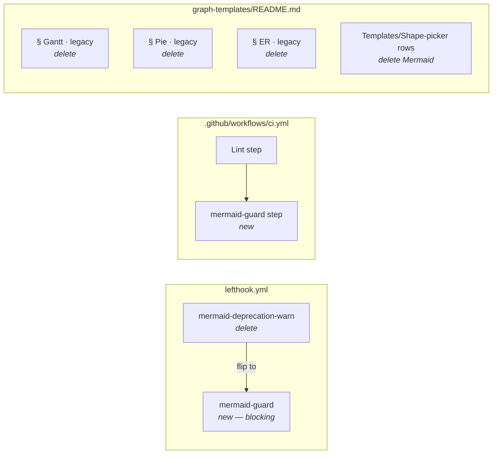

## Summary

Cycle 2 final phase of the 4-phase Mermaid purge (#21). Delete 5 Mermaid source files (`*-mermaid.html`, `mermaid-init.js`, `mermaid-guide.md`), clean `graph-templates/README.md` of all Mermaid references, and flip the non-blocking `mermaid-deprecation-warn` pre-commit hook to a blocking `mermaid-guard`. Add a CI mirror step for PRs that bypass local hooks.

## Architecture

### Data flow

```mermaid
flowchart TD
    subgraph DELETE[Slice 8 — Git deletions]
      RM1[git rm gantt-mermaid.html]
      RM2[git rm pie-mermaid.html]
      RM3[git rm er-mermaid.html]
      RM4[git rm mermaid-init.js]
      RM5[git rm mermaid-guide.md]
    end

    subgraph CLEANUP[Slice 8 — README cleanup]
      GREP[grep -i mermaid README.md]
      EDIT[Remove Mermaid sections]
    end

    subgraph GUARD[Slice 9 — Blocking guard]
      LHK[lefthook.yml: mermaid-deprecation-warn → mermaid-guard]
      CI[ci.yml: add mermaid-guard step]
    end

    subgraph VERIFY[RED-GATE]
      FIND[find plugins/forge -name '*mermaid*']
      TEST[test commit blocked]
    end

    DELETE --> FIND
    CLEANUP --> FIND
    GUARD --> TEST

    style DELETE fill:#331a1a,stroke:#f87171
    style CLEANUP fill:#1a2332,stroke:#4ade80
    style GUARD fill:#2a1a33,stroke:#a78bfa
    style VERIFY fill:#1a2a1a,stroke:#22c55e
```



### File × function map



## Bootstrap Context

- **Predecessor:** #23 (P2 migrations) — merged via PR #26. All 5 SKILL.md files migrated; `gen-deps.py` rewritten; render scripts now hard-error on `` ```mermaid `` fences.
- **Delete targets verified:** All 5 files exist at expected paths.
- **Native templates verified:** `gantt.html`, `pie.html`, `er.html` exist at canonical names.
- **Current guard state:** `lefthook.yml` has `mermaid-deprecation-warn` (non-blocking, lines 17-47).
- **CI state:** `.github/workflows/ci.yml` has lint + py_compile; no mermaid guard yet.
- **README Mermaid content:** 30+ matches across Showcase, Templates, Shape-picker, and decision-rule sections.

## Agents

| Agent | Task count | Files |
|-------|-----------|-------|
| devops | 4 | `lefthook.yml`, `.github/workflows/ci.yml`, 5 files via `git rm` |
| doc-writer | 1 | `plugins/forge/references/graph-templates/README.md` |
| tester | 2 | RED-GATE V8, RED-GATE V9 |

## Consistency Report

| Success Criterion (spec) | Covered by task(s) |
|--------------------------|-------------------|
| SC-P3.1 — Mermaid sources deleted | T1, T2, T3, T4, T5 |
| SC-P3.2 — Native templates intact | T11 (RED-GATE V8) |
| SC-P3.3 — README fully migrated | T6 |
| SC-P3.4 — CLAUDE.md user-global | Post-merge checklist (no task) |
| SC-P3.5 — CLAUDE.md project | Post-merge checklist (no task) |
| SC-P4.1 — Blocking guard wired | T7 |
| SC-P4.2 — CI mirror | T8 |
| SC-P4.3 — Guard verified | T12 (RED-GATE V9) |
| SC-CC.1 — No new runtime deps | T11 (implicit) |
| SC-CC.2 — Plugin sync succeeds | T13 |

Covered: 10/10. Untraced tasks: 0. Exemptions: 2 (P3.7/P3.8 outside repo, handled via post-merge checklist).

## Micro-Tasks

### Slice V8 — Delete Mermaid source files + README cleanup

**Phase: RED → GREEN**

---

#### T1 [P] · Delete `gantt-mermaid.html`
- **Agent:** devops
- **File:** `plugins/forge/references/graph-templates/gantt-mermaid.html`
- **Slice:** V8 · **Phase:** GREEN · **Difficulty:** 1 · **Spec trace:** SC-P3.1
- **Change:** `git rm plugins/forge/references/graph-templates/gantt-mermaid.html`
- **Verify:** `test ! -f plugins/forge/references/graph-templates/gantt-mermaid.html`
- **Expected:** exit 0
- **Time:** 1 min
- **Deps:** none

---

#### T2 [P] · Delete `pie-mermaid.html`
- **Agent:** devops
- **File:** `plugins/forge/references/graph-templates/pie-mermaid.html`
- **Slice:** V8 · **Phase:** GREEN · **Difficulty:** 1 · **Spec trace:** SC-P3.1
- **Change:** `git rm plugins/forge/references/graph-templates/pie-mermaid.html`
- **Verify:** `test ! -f plugins/forge/references/graph-templates/pie-mermaid.html`
- **Expected:** exit 0
- **Time:** 1 min
- **Deps:** none

---

#### T3 [P] · Delete `er-mermaid.html`
- **Agent:** devops
- **File:** `plugins/forge/references/graph-templates/er-mermaid.html`
- **Slice:** V8 · **Phase:** GREEN · **Difficulty:** 1 · **Spec trace:** SC-P3.1
- **Change:** `git rm plugins/forge/references/graph-templates/er-mermaid.html`
- **Verify:** `test ! -f plugins/forge/references/graph-templates/er-mermaid.html`
- **Expected:** exit 0
- **Time:** 1 min
- **Deps:** none

---

#### T4 [P] · Delete `mermaid-init.js`
- **Agent:** devops
- **File:** `plugins/forge/references/base/mermaid-init.js`
- **Slice:** V8 · **Phase:** GREEN · **Difficulty:** 1 · **Spec trace:** SC-P3.1
- **Change:** `git rm plugins/forge/references/base/mermaid-init.js`
- **Verify:** `test ! -f plugins/forge/references/base/mermaid-init.js`
- **Expected:** exit 0
- **Time:** 1 min
- **Deps:** none

---

#### T5 [P] · Delete `mermaid-guide.md`
- **Agent:** devops
- **File:** `plugins/forge/references/mermaid-guide.md`
- **Slice:** V8 · **Phase:** GREEN · **Difficulty:** 1 · **Spec trace:** SC-P3.1
- **Change:** `git rm plugins/forge/references/mermaid-guide.md`
- **Verify:** `test ! -f plugins/forge/references/mermaid-guide.md`
- **Expected:** exit 0
- **Time:** 1 min
- **Deps:** none

---

#### T6 · Clean `graph-templates/README.md` — remove all Mermaid content
- **Agent:** doc-writer
- **File:** `plugins/forge/references/graph-templates/README.md`
- **Slice:** V8 · **Phase:** GREEN · **Difficulty:** 3 · **Spec trace:** SC-P3.3
- **Change:**
  - Delete § "Gantt · legacy (Mermaid)" (lines ~218-239)
  - Delete § "Pie · legacy (Mermaid)" (lines ~241-262)
  - Delete § "ER · legacy (Mermaid)" (lines ~264-286)
  - Remove `gantt-mermaid.html`, `pie-mermaid.html`, `er-mermaid.html` rows from Templates table
  - Remove Mermaid entries from Shape-picker decision matrix
  - Remove "The three legacy Mermaid templates" prose paragraphs
  - Remove `mermaid-guide.md` reference from decision-rule section
  - Verify: `grep -i 'mermaid'` returns 0 matches
- **Verify:** `grep -ci 'mermaid' plugins/forge/references/graph-templates/README.md`
- **Expected:** `0`
- **Time:** 10 min
- **Deps:** none (independent of T1-T5 — README can be cleaned before/after deletions)

---

#### T7 · RED-GATE V8 — deletion + README verification
- **Agent:** tester
- **File:** n/a (verification only)
- **Slice:** V8 · **Phase:** RED-GATE · **Difficulty:** 1 · **Spec trace:** SC-P3.1, SC-P3.2, SC-P3.3
- **Verify:**
  ```bash
  # 1. No mermaid files remain
  find plugins/forge -name '*mermaid*'
  # Expected: empty output

  # 2. Native templates intact
  ls plugins/forge/references/graph-templates/{gantt,pie,er}.html
  # Expected: 3 files listed

  # 3. README has no mermaid references
  grep -i 'mermaid' plugins/forge/references/graph-templates/README.md
  # Expected: exit 1 (no matches)
  ```
- **Expected:** All 3 checks pass
- **Time:** 2 min
- **Deps:** T1, T2, T3, T4, T5, T6

### Slice V9 — Blocking grep guard

**Phase: RED → GREEN**

---

#### T8 · Flip `mermaid-deprecation-warn` → `mermaid-guard` in lefthook.yml
- **Agent:** devops
- **File:** `lefthook.yml`
- **Slice:** V9 · **Phase:** GREEN · **Difficulty:** 2 · **Spec trace:** SC-P4.1
- **Change:**
  - Rename step `mermaid-deprecation-warn` → `mermaid-guard` (line 17)
  - Change `exit 0` → `exit 1` when matches found (line 44)
  - Update comment header to reflect blocking status
  - Preserve `{staged_files}` mechanism and grep pattern (`\bmermaid\b`)
- **Code shape:**
  ```yaml
  mermaid-guard:
    # Blocking guard. Fails commit when staged files contain lowercase mermaid.
    # Pattern matches \bmermaid\b only — capitalized "Mermaid" in error prose is exempt.
    run: |
      matches=$(printf '%s\n' {staged_files} | xargs -d '\n' -I {} grep -Hn '\bmermaid\b' {} 2>/dev/null || true)
      if [ -n "$matches" ]; then
        echo ""
        echo "  error: mermaid references detected — blocked by #21"
        echo "$matches" | sed 's/^/    /'
        echo "  See plugins/forge/references/graph-templates/README.md for native alternatives."
        exit 1
      fi
    glob:
      - "plugins/forge/**/*"
      - "scripts/*.py"
  ```
- **Verify:** `grep -A20 'mermaid-guard:' lefthook.yml | grep -c 'exit 1'`
- **Expected:** `1`
- **Time:** 5 min
- **Deps:** T7 (RED-GATE V8 must pass — no point guarding deleted files)

---

#### T9 · Add `mermaid-guard` step to `.github/workflows/ci.yml`
- **Agent:** devops
- **File:** `.github/workflows/ci.yml`
- **Slice:** V9 · **Phase:** GREEN · **Difficulty:** 2 · **Spec trace:** SC-P4.2
- **Change:**
  - Add step after "Syntax-check Python scripts" (line 22)
  - Run same grep as lefthook (full paths, not staged files)
- **Code shape:**
  ```yaml
  - name: Mermaid guard
    run: |
      matches=$(grep -rn '\bmermaid\b' plugins/forge/ scripts/render-md.py scripts/render-md-tabs.py scripts/gen-deps.py 2>/dev/null || true)
      if [ -n "$matches" ]; then
        echo "::error::Mermaid references detected — blocked by #21"
        echo "$matches"
        exit 1
      fi
  ```
- **Verify:** `grep -c 'mermaid-guard' .github/workflows/ci.yml`
- **Expected:** `1`
- **Time:** 4 min
- **Deps:** T8 (guard definition must exist first)

---

#### T10 · RED-GATE V9 — guard verification
- **Agent:** tester
- **File:** n/a
- **Slice:** V9 · **Phase:** RED-GATE · **Difficulty:** 2 · **Spec trace:** SC-P4.1, SC-P4.2, SC-P4.3
- **Verify:**
  ```bash
  # 1. lefthook config valid
  lefthook validate
  # Expected: no errors

  # 2. lefthook step exists
  grep 'mermaid-guard:' lefthook.yml
  # Expected: match found

  # 3. CI step exists
  grep 'Mermaid guard' .github/workflows/ci.yml
  # Expected: match found

  # 4. Test commit blocked (manual or temp file)
  # Create a temp file with lowercase 'mermaid' under plugins/forge/
  # git add, git commit → should exit non-zero
  # Cleanup: git reset HEAD, rm temp file
  ```
- **Expected:** All checks pass; test commit blocked
- **Time:** 5 min
- **Deps:** T8, T9

---

#### T11 · Plugin sync verification
- **Agent:** tester
- **File:** n/a
- **Slice:** V9 · **Phase:** RED-GATE · **Difficulty:** 1 · **Spec trace:** SC-CC.2
- **Verify:** `./sync-plugins.sh --local`
- **Expected:** exit 0
- **Time:** 2 min
- **Deps:** T7, T10

## Dependency graph

```
V8:  T1,T2,T3,T4,T5 ──┬──→ T7
     T6 ──────────────┘
V9:  T8 ──→ T9 ──┬──→ T10 ──→ T11
                 ┘
```

V9 depends on V8 (T8 dep on T7) — no point wiring a guard for files that still exist.

## Task count

Total: 11 (7 GREEN + 4 RED-GATE). Avg difficulty: 1.5. Total time budget: ~33 min.

## Task IDs

<!-- Generated by /plan. Used by /implement to resume tasks on session restart. -->

- T1: 9 — Delete gantt-mermaid.html
- T2: 10 — Delete pie-mermaid.html
- T3: 11 — Delete er-mermaid.html
- T4: 12 — Delete mermaid-init.js
- T5: 13 — Delete mermaid-guide.md
- T6: 14 — Clean graph-templates/README.md
- T7: 15 — RED-GATE V8
- T8: 16 — Flip lefthook guard
- T9: 17 — Add CI guard step
- T10: 18 — RED-GATE V9
- T11: 19 — Plugin sync verification
