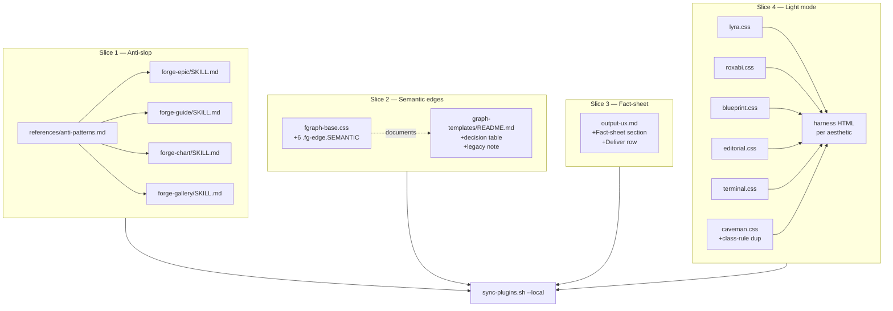

## Summary

18 micro-tasks across 4 slices: anti-slop doc + SKILL links, semantic fgraph edges + README, fact-sheet Deliver step, OS-native light mode across 6 aesthetics. All changes additive in `plugins/forge/references/` and `plugins/forge/skills/*/SKILL.md` — no template HTML edits, no skill logic changes.

**Scope deviation from spec:** forge-init has no Deliver phase (it is an environment bootstrap skill), so 4 SKILL.md files link to anti-patterns, not 5. Criterion SC-2 amended in this plan's Consistency Report.

## Architecture



```mermaid
flowchart LR
  subgraph READ[Runtime readers]
    AG[forge sub-agents at Deliver]
    HTML[rendered artifact HTML]
    OS[reader OS theme preference]
  end
  subgraph REFS[references/]
    AP[anti-patterns.md]
    FB[fgraph-base.css]
    GR[graph-templates/README.md]
    OU[output-ux.md]
    AES[aesthetics/*.css]
  end
  AP -->|linked from| SK4[4 SKILL.md Deliver checklists]
  SK4 -.consulted by.-> AG
  OU -.consulted by.-> AG
  GR -.consulted by author.-> HTML
  FB -->|styles| HTML
  AES -->|styles| HTML
  OS -->|@media matches| AES
```

## Agents

| Agent | Task count | Files |
|---|---|---|
| doc-writer | 18 | all docs (MD) + CSS ref + SKILL.md |

Single-agent plan — all changes are documentation / CSS reference material, no domain split.

## Consistency Report

| SC | Task coverage |
|---|---|
| SC-1 anti-patterns.md ≥8 categories | T1 |
| SC-2 4 SKILL.md link (amended from 5) | T2, T3, T4, T5 |
| SC-3 6 semantic fgraph classes | T7 |
| SC-4 decision table | T8 |
| SC-5 legacy note | T9 |
| SC-6 fact-sheet section + row | T10 |
| SC-7 `color-scheme` in 6 aesthetics | T11–T16 |
| SC-8 `@media` block in 6 aesthetics | T11–T16 |
| SC-9 manual `[data-theme="dark"]` overrides OS light | T17 |
| SC-10 no fgraph template HTML modified | T18 (guard) |
| SC-11 `sync-plugins.sh --local` clean | T18 |

Exemption: SC-2 amended (4 not 5); forge-init has no Deliver phase.

## Micro-Tasks

### Slice 1 — Anti-slop doc

**T1** — Create `plugins/forge/references/anti-patterns.md` with ≥8 rule categories (shadows, text effects, backgrounds, radii, decorative glyphs, animation, fonts, colors) — each row: restriction + one-line reason + optional exception.
- Phase: RED
- Difficulty: 2
- Verify: `test -f plugins/forge/references/anti-patterns.md && grep -c '^## ' plugins/forge/references/anti-patterns.md`
- Expected: ≥8
- Parallel-safe: Y
- Spec trace: SC-1

**T2** — Add anti-patterns link to `plugins/forge/skills/forge-epic/SKILL.md` Deliver checklist.
- Phase: GREEN — Parallel-safe: Y
- Verify: `grep -c 'anti-patterns.md' plugins/forge/skills/forge-epic/SKILL.md` → ≥1
- Spec trace: SC-2

**T3** — Same for `forge-guide/SKILL.md`.
- Phase: GREEN — Parallel-safe: Y
- Verify: `grep -c 'anti-patterns.md' plugins/forge/skills/forge-guide/SKILL.md` → ≥1
- Spec trace: SC-2

**T4** — Same for `forge-chart/SKILL.md`.
- Phase: GREEN — Parallel-safe: Y
- Verify: `grep -c 'anti-patterns.md' plugins/forge/skills/forge-chart/SKILL.md` → ≥1
- Spec trace: SC-2

**T5** — Same for `forge-gallery/SKILL.md`.
- Phase: GREEN — Parallel-safe: Y
- Verify: `grep -c 'anti-patterns.md' plugins/forge/skills/forge-gallery/SKILL.md` → ≥1
- Spec trace: SC-2

**T6 [RED-GATE]** — Verify slice 1.
- Verify: `grep -l 'anti-patterns.md' plugins/forge/skills/*/SKILL.md | wc -l` → 4
- Expected: 4 SKILL.md files link to the doc.

### Slice 2 — Semantic fgraph edges

**T7** — Append 6 semantic rules to `plugins/forge/references/graph-templates/fgraph-base.css` **after the `.fg-edge.dim` rule (line 151) and before `.fg-edge.dashed` (line 154)**. Each: `.fg-edge.{control,write,read,data,async,feedback} { stroke: var(--edge-{name}, var(--fallback-tone)); [stroke-dasharray]; }` per spec N4 fallback mapping.
- Phase: GREEN — Difficulty: 2
- Verify: `grep -cE '\.fg-edge\.(control|write|read|data|async|feedback)' plugins/forge/references/graph-templates/fgraph-base.css` → ≥6
- Spec trace: SC-3

**T8** — Add `## Edge Flow Semantics` decision table to `graph-templates/README.md`: row per semantic class (intent, default color, when to use, example markup snippet).
- Phase: GREEN — Parallel-safe: Y (different lines from T9)
- Verify: `grep -A2 'Edge Flow Semantics' plugins/forge/references/graph-templates/README.md | head -5`
- Spec trace: SC-4

**T9** — Add "Legacy color classes" note to `graph-templates/README.md` stating `.amber|.cyan|.purple|.green|.red|.dim` remain supported; new work prefers semantic.
- Phase: GREEN — Parallel-safe: Y
- Verify: `grep -i 'legacy' plugins/forge/references/graph-templates/README.md`
- Spec trace: SC-5

### Slice 3 — Fact-sheet Deliver step

**T10** — Add `## Fact-sheet` section (3–5 lines: enumerate factual claims, verify each) + Deliver checklist row to `plugins/forge/references/output-ux.md`.
- Phase: GREEN — Difficulty: 2
- Verify: `grep -c '## Fact-sheet' plugins/forge/references/output-ux.md` → 1; `grep -c 'Fact-sheet' plugins/forge/references/output-ux.md` → ≥2 (section + checklist row)
- Spec trace: SC-6

### Slice 4 — OS-native light mode

**T11** — Update `plugins/forge/references/aesthetics/lyra.css`: add `color-scheme: light dark;` to `:root`, add `@media (prefers-color-scheme: light) { :root:not([data-theme="dark"]) { /* re-declare 8 tokens from [data-theme="light"] block */ } }`.
- Phase: GREEN — Parallel-safe: Y
- Verify: `grep -c 'color-scheme\|prefers-color-scheme' plugins/forge/references/aesthetics/lyra.css` → ≥2
- Spec trace: SC-7, SC-8

**T12** — Same for `roxabi.css`.
- Phase: GREEN — Parallel-safe: Y
- Verify: `grep -c 'color-scheme\|prefers-color-scheme' plugins/forge/references/aesthetics/roxabi.css` → ≥2
- Spec trace: SC-7, SC-8

**T13** — `editorial.css` — mirror strategy; editorial already has `[data-theme="light"]` token pair.
- Phase: GREEN — Parallel-safe: Y
- Verify: `grep -c 'color-scheme\|prefers-color-scheme' plugins/forge/references/aesthetics/editorial.css` → ≥2
- Spec trace: SC-7, SC-8

**T14** — `terminal.css` — spot-check root structure first (may differ), then add `color-scheme` + `@media` block.
- Phase: GREEN — Difficulty: 3
- Verify: `grep -c 'color-scheme\|prefers-color-scheme' plugins/forge/references/aesthetics/terminal.css` → ≥2
- Spec trace: SC-7, SC-8

**T15** — `blueprint.css` — special: blueprint is **light-default**. The `@media (prefers-color-scheme: light)` block MUST apply the light tokens that are already on `:root` (or no-op them). Inverse: add `@media (prefers-color-scheme: dark) { :root:not([data-theme="light"]) { /* dark tokens */ } }` if blueprint has a `[data-theme="dark"]` block, else keep minimal with just `color-scheme: light dark;` and rely on existing defaults.
- Phase: GREEN — Difficulty: 3
- Verify: `grep -c 'color-scheme' plugins/forge/references/aesthetics/blueprint.css` → ≥1; inspect manually that default tokens match `prefers-color-scheme: light`
- Spec trace: SC-7, SC-8

**T16** — `caveman.css` — tokens AND class-specific `[data-theme="light"]` rules (`.caveman-grid`, `.glass-card`, `.glass-terminal`, lines 136–230) duplicated into new `@media (prefers-color-scheme: light)` block wrapped in `:root:not([data-theme="dark"])` scope (or use `:where()` for specificity parity).
- Phase: GREEN — Difficulty: 4
- Verify: `grep -c 'color-scheme\|prefers-color-scheme' plugins/forge/references/aesthetics/caveman.css` → ≥2; count `.caveman-grid`/`.glass-card`/`.glass-terminal` occurrences doubled vs. pre-change.
- Spec trace: SC-7, SC-8

**T17 [RED-GATE]** — Create minimal harness HTML (6 files, one per aesthetic) in `/tmp/forge-light-test/` importing only `base/reset.css` + the aesthetic file, containing visible tokens + a `.caveman-grid` etc. element. Test matrix: OS=dark no attr | OS=light no attr | OS=dark [data-theme="light"] | OS=light [data-theme="dark"]. Expected: attribute wins over OS.
- Phase: RED-GATE — Difficulty: 3
- Verify: manual DevTools emulation; commit no harness (throwaway). Report PASS/FAIL for 6 aesthetics × 4 matrix cells.
- Spec trace: SC-9

### Wrap

**T18 [RED-GATE]** — Run `./sync-plugins.sh --local`, confirm no existing `graph-templates/*.html` file modified, confirm script exits 0.
- Phase: RED-GATE — Difficulty: 1
- Verify: `./sync-plugins.sh --local && git diff --name-only | grep -E 'graph-templates/.*\.html$' | wc -l` → 0
- Spec trace: SC-10, SC-11

## Task IDs

<!-- Generated by /plan. Used by /implement to resume tasks on session restart. -->
- T1: 12 — Create anti-patterns.md with ≥8 categories
- T2: 13 — Link anti-patterns from forge-epic Deliver
- T3: 14 — Link anti-patterns from forge-guide Deliver
- T4: 15 — Link anti-patterns from forge-chart Deliver
- T5: 16 — Link anti-patterns from forge-gallery Deliver
- T6: 17 — RED-GATE slice 1 verification
- T7: 18 — Append 6 semantic .fg-edge classes to fgraph-base.css
- T8: 19 — Edge Flow Semantics decision table in README
- T9: 20 — Legacy color-class note in README
- T10: 21 — Fact-sheet section + Deliver row in output-ux.md
- T11: 22 — Light-mode update lyra.css
- T12: 23 — Light-mode update roxabi.css
- T13: 24 — Light-mode update editorial.css
- T14: 25 — Light-mode update terminal.css
- T15: 26 — Light-mode update blueprint.css (light-default)
- T16: 27 — Light-mode update caveman.css (tokens + class-rule duplication)
- T17: 28 — RED-GATE light-mode harness verification
- T18: 29 — RED-GATE sync-plugins + backwards-compat proof
