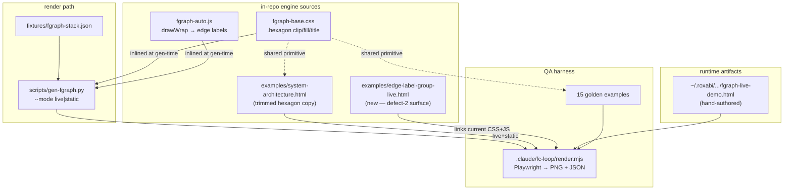
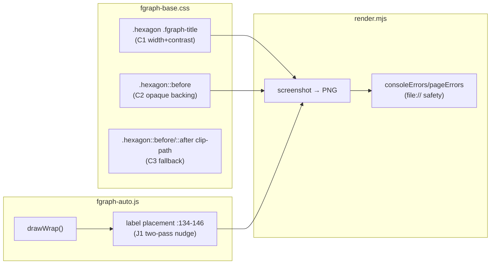

## Summary

Fix 3 fgraph render defects across 3 file-independent slices (hexagon CSS, edge-label JS, showcase artifact), each screenshot-verified via the `.claude/fc-loop/render.mjs` Playwright harness, with a final independent regression gate over the 15 golden examples.

## Architecture

### Data flow

### File × Function map

## Agents

| Agent instance | Tasks | Files |
|---|---|---|
| frontend-dev-A | T1, T2, T3 | `fgraph-base.css`, `examples/system-architecture.html` |
| frontend-dev-B | T4, T5, T6 | `fgraph-auto.js`, new `examples/edge-label-group-live.html` |
| frontend-dev-C | T7, T8 | `~/.roxabi/forge/_shared/diagrams/fgraph-live-demo.html` |
| tester-A | T9 | golden examples + comparison (read-only QA) |

## Wave Structure

2 waves, max 3 parallel agents. Elapsed ~1 build session vs ~3 sequential.

| Wave | Trigger | Agents | Tasks |
|------|---------|--------|-------|
| 1 | start | 3 ∥ | frontend-dev-A: T1→T2→T3 · frontend-dev-B: T4→T5→T6 · frontend-dev-C: T7→T8 |
| 2 | Wave 1 done | 1 | tester-A: T9 |

### Budget — per task

| Task | Items | Class | Est. ops | Split? |
|------|-------|-------|----------|--------|
| T1 CSS hexagon fix | 1 | judgmental | 6 | — |
| T2 mirror example | 1 | bounded | 3 | — |
| T3 screenshot gate (S1) | 1 | judgmental | 8 | — |
| T4 two-pass JS | 1 | exploratory | 10 | — |
| T5 new live fixture | 1 | judgmental | 6 | — |
| T6 screenshot gate (S2) | 1 | judgmental | 8 | — |
| T7 drop dup node | 1 | trivial | 2 | — |
| T8 screenshot gate (S3) | 1 | judgmental | 6 | — |
| T9 regression + file:// + comparison | 1 | exploratory | 12 | — |

**Total estimated ops: 61**

### Budget — per agent instance

| Instance | Tasks | Σ ops | Subjects | Split? |
|----------|-------|-------|----------|--------|
| frontend-dev-A | T1, T2, T3 | 17 | hexagon-css | — |
| frontend-dev-B | T4, T5, T6 | 24 | edge-label | — |
| frontend-dev-C | T7, T8 | 8 | showcase | — |
| tester-A | T9 | 12 | qa-regression | — |

## Consistency Report

- Covered: 7/7 spec Success Criteria.
- SC "Defect 1 (clip)" → T1, T3 · SC "Defect 1 (contrast)" → T1, T3 · SC "Defect 1 (static parity)" → T2, T3
- SC "Defect 2" → T4, T5, T6 · SC "Defect 3" → T7, T8
- SC "No regression" → T2 (example mirror) + T9 · SC "file://-safe" → T6, T9 (render.mjs JSON)
- Uncovered: none. Untraced tasks: none. Exemptions: 3b engine guard (dropped in spec).

## Micro-Tasks

### Slice S1 — Hexagon legibility (defect 1) · frontend-dev-A

**T1 — Apply hexagon title width + contrast (C1+C2)** · `fgraph-base.css` · RED→GREEN · diff 3
- C1: add `max-width` (≈ safe inner band) + `color: var(--text)` + weight to `.fgraph-node.hexagon .fgraph-title` (~:581). Allow wrap if needed.
- C2: give text an opaque/contrasting backing on `.fgraph-node.hexagon::before` — **split the shared `:638` selector** (currently `.hexagon, .diamond, .folded`) so the contrast change is scoped to hexagon (or apply to all three intentionally + note it in the commit).
- Verify: `git diff --stat` shows only fgraph-base.css; CSS parses (no stray braces).
- Subject: hexagon-css · Spec: SC-D1 · Slice: V1 · Diff: 3

**T2 — Mirror fix into golden example** · `examples/system-architecture.html` · GREEN · diff 2
- That example carries its OWN trimmed copy of the hexagon polygon + title rules (template drift = systemic per QA memory). Apply the same C1/C2 changes there.
- Verify: `grep -n "hexagon .fgraph-title\|hexagon::before" examples/system-architecture.html` reflects the fix.
- Subject: hexagon-css · Spec: SC-D1(static parity), SC-regression · Slice: V1 · blockedBy: T1

**T3 — RED-GATE: screenshot S1 (live + static)** · QA · RED-GATE · diff 4
- `python3 scripts/gen-fgraph.py --in plugins/forge/skills/forge-chart/fixtures/fgraph-stack.json --out /tmp/52-stack-live.html --mode live` (and `--mode static` → `/tmp/52-stack-static.html`).
- `PLAYWRIGHT_BROWSERS_PATH=/home/mickael/.cache/ms-playwright node /home/mickael/projects/roxabi-forge/.claude/fc-loop/render.mjs /tmp/52-stack-live.html /home/mickael/projects/roxabi-forge/.claude/fc-loop/shots/52-stack-live.png 1280 dark` (repeat for static + system-architecture.html).
- `Read` each PNG → confirm every hexagon label ("Whisper · STT", "Chatterbox · TTS", bot labels) fully visible + legible. **If still clipped → apply C3** (flatten clip slants 25%→~14% in `fgraph-base.css:529`) and re-screenshot, then re-screenshot all 15 goldens for regression.
- Expected: render.mjs JSON `ok:true`, no clipped glyphs in PNG.
- Subject: hexagon-css · Spec: SC-D1 · Slice: V1 · blockedBy: T2

### Slice S2 — Edge-label frame avoidance (defect 2) · frontend-dev-B

**T4 — Two-pass edge-label placement** · `fgraph-auto.js` · RED→GREEN · diff 4
- Refactor the label block (`:134–146`) into two passes inside `drawWrap`: pass 1 — append all `<text>` labels (so `getBBox()` is valid); pass 2 — collect `.fgraph-group` rects (relative to wrap) + each label's `getBBox()`, and if a label's box intersects a frame-border line, nudge it clear (along edge normal / toward edge interior).
- Keep `aria-hidden`, marker, and RAF/ResizeObserver behavior intact.
- Verify: `node -c` (syntax) or load in render.mjs without console errors.
- Subject: edge-label · Spec: SC-D2 · Slice: V2 · Diff: 4

**T5 — Add committed live group-frame fixture** · new `graph-templates/examples/edge-label-group-live.html` · GREEN · diff 3
- Minimal `data-fgraph="live"` doc: 2 nodes inside a `.fgraph-group` frame + 1 node outside, one edge whose midpoint lands on the frame border, with a label. Reference the CURRENT engine (link `../fgraph-base.css` + `../fgraph-auto.js` relatively — `file://`-safe — OR inline; must reflect the fixed JS, not a frozen copy).
- Verify: opens via `file://` with no console errors.
- Subject: edge-label · Spec: SC-D2 · Slice: V2 · blockedBy: T4

**T6 — RED-GATE: screenshot S2** · QA · RED-GATE · diff 3
- `render.mjs` on the new fixture (and/or `fgraph-live-demo.html`) → `Read` PNG → confirm no edge label sits on a group-frame border line.
- Check render.mjs JSON `consoleErrors:[]` + `pageErrors:[]` (file:// safety).
- Subject: edge-label · Spec: SC-D2, SC-file:// · Slice: V2 · blockedBy: T5

### Slice S3 — Showcase overlap (defect 3) · frontend-dev-C

**T7 — Drop redundant NATS node** · `~/.roxabi/forge/_shared/diagrams/fgraph-live-demo.html` · GREEN · diff 1
- Delete the `
` block (~:230) — the `.fg-bus-strip` already represents NATS. Re-point any edge referencing `nats` to the appropriate node or drop it.
- Verify: `grep -c 'data-node="nats"' fgraph-live-demo.html` → 0; bus-strip retained.
- Subject: showcase · Spec: SC-D3 · Slice: V3 · Diff: 1

**T8 — RED-GATE: screenshot S3** · QA · RED-GATE · diff 2
- `render.mjs` on `fgraph-live-demo.html` → `Read` PNG → confirm NATS appears once (bus-strip), no node overlapping the `.fg-bus-strip` band, subject text legible.
- Subject: showcase · Spec: SC-D3 · Slice: V3 · blockedBy: T7

### Final gate — regression + acceptance · tester-A

**T9 — RED-GATE: full regression + file:// + comparison** · QA · RED-GATE · diff 6
- Render the 15 golden examples (via `examples/*.html` and/or `scripts/build.sh` output) through `render.mjs` → `Read` PNGs → confirm NO new clip/overlap/contrast defect from the shared CSS change.
- Confirm `render.mjs` JSON `consoleErrors:[]`/`pageErrors:[]` for live outputs (file:// safety).
- Final showcase comparison: corrected `fgraph-live-demo.html` vs intent of `roxabi-stack.html`.
- Independent blind adjudication (per QA memory: agents over-flag → read PNGs, don't trust mental gates). Also run `plugins/forge/scripts/validate-svg.sh` on changed/generated outputs.
- Subject: qa-regression · Spec: SC-regression, SC-file:// · blockedBy: T3, T6, T8

## Task Seeding Blueprint

<!-- Used by /implement to seed TaskCreate calls. T-numbers ref this list, not session IDs.
     Seed in wave order; within a wave all rows are parallel (∥). -->

### Wave 1 — no cross-instance deps, 3 agents ∥

| Task | Agent instance | blockedBy | Subject |
|------|---------------|-----------|---------|
| T1 | frontend-dev-A | — | hexagon-css |
| T2 | frontend-dev-A | T1 | hexagon-css |
| T3 | frontend-dev-A | T2 | hexagon-css |
| T4 | frontend-dev-B | — | edge-label |
| T5 | frontend-dev-B | T4 | edge-label |
| T6 | frontend-dev-B | T5 | edge-label |
| T7 | frontend-dev-C | — | showcase |
| T8 | frontend-dev-C | T7 | showcase |

### Wave 2 — after T3, T6, T8

| Task | Agent instance | blockedBy | Subject |
|------|---------------|-----------|---------|
| T9 | tester-A | T3, T6, T8 | qa-regression |

## Task IDs

<!-- Generated by /plan. Used by /implement to resume tasks on session restart. -->
- T1: 13 — hexagon-css (frontend-dev-A)
- T2: 14 — hexagon-css (frontend-dev-A) — blockedBy T1
- T3: 15 — hexagon-css RED-GATE (frontend-dev-A) — blockedBy T2
- T4: 16 — edge-label (frontend-dev-B)
- T5: 17 — edge-label (frontend-dev-B) — blockedBy T4
- T6: 18 — edge-label RED-GATE (frontend-dev-B) — blockedBy T5
- T7: 19 — showcase (frontend-dev-C)
- T8: 20 — showcase RED-GATE (frontend-dev-C) — blockedBy T7
- T9: 21 — qa-regression RED-GATE (tester-A) — blockedBy T3, T6, T8
