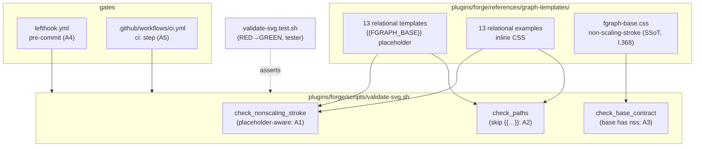
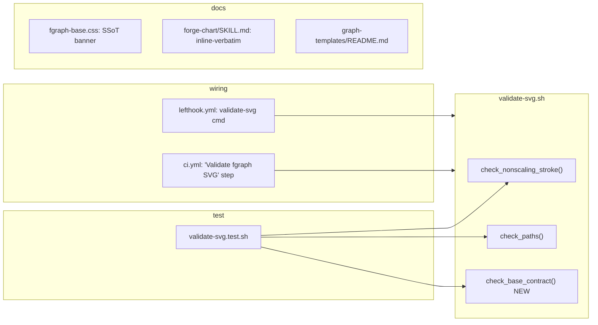

## Summary

Make `validate-svg.sh` placeholder-aware (so `{{FGRAPH_BASE}}` templates stop false-failing), wire it into lefthook pre-commit + the existing CI job, mark the canonical edge/marker config in `fgraph-base.css` as SSoT, and document it. Test-first: a contract/negative test script goes RED before the validator changes land.

## Architecture

### Data flow

### File × Function map

## Agents

| Agent instance | Tasks | Files | Subject |
|---|---|---|---|
| tester-A | T1, T5, T8 | `plugins/forge/scripts/validate-svg.test.sh` | validator-test, ci-test |
| devops-A | T2, T3, T4 | `plugins/forge/scripts/validate-svg.sh` | validator |
| devops-B | T6, T7 | `lefthook.yml`, `.github/workflows/ci.yml` | ci |
| doc-writer-A | T9, T10, T11 | `fgraph-base.css`, `forge-chart/SKILL.md`, `graph-templates/README.md` | docs |

## Wave Structure

4 waves, max 2 parallel agents. Elapsed ~2 sequential-equivalents saved (docs ∥ test/impl).

| Wave | Trigger | Agents | Tasks |
|------|---------|--------|-------|
| 1 | start | 2 ∥ | tester-A: T1 (RED) · doc-writer-A: T9→T10→T11 |
| 2 | RED-GATE-V1 (T1 red) | 1 | devops-A: T2→T3→T4 (validator) |
| 3 | T4 done | 2 ∥ | tester-A: T5 (corpus green) · devops-B: T6→T7 (gates) |
| 4 | T7 done | 1 | tester-A: T8 (negative test: hook blocks + CI red) |

### Budget — per task

| Task | Items | Class | Est. ops | Split? |
|------|-------|-------|----------|--------|
| T1 test script | 1 | judgmental | 6 | — |
| T2 nss placeholder-aware | 1 | judgmental | 5 | — |
| T3 check_paths skip {{}} | 1 | bounded | 3 | — |
| T4 check_base_contract | 1 | bounded | 3 | — |
| T5 corpus verify | 1 | bounded | 3 | — |
| T6 lefthook cmd | 1 | judgmental | 5 | — |
| T7 ci step | 1 | bounded | 3 | — |
| T8 negative test | 1 | judgmental | 6 | — |
| T9 SSoT banner | 1 | bounded | 2 | — |
| T10 SKILL directive | 1 | bounded | 3 | — |
| T11 README | 1 | judgmental | 4 | — |

**Total estimated ops: ~43**

### Budget — per agent instance

| Instance | Tasks | Σ ops | Subjects | Split? |
|----------|-------|-------|----------|--------|
| tester-A | T1, T5, T8 | 15 | validator-test, ci-test | — (2 subjects ≤ 2) |
| devops-A | T2, T3, T4 | 11 | validator | — |
| devops-B | T6, T7 | 8 | ci | — |
| doc-writer-A | T9, T10, T11 | 9 | docs | — |

## Consistency Report

9/9 success criteria covered. 0 uncovered. 0 untraced tasks.

| SC | Covered by |
|---|---|
| SC1 corpus exit 0 | T5 |
| SC2 template + er.html pass | T2, T3 → T5 |
| SC3 base self-guard | T4 (↩ T1) |
| SC4 lefthook empty-guard | T6 (↩ T8) |
| SC5 CI step, no new check | T7 (↩ T8) |
| SC6 negative test (3 vectors) | T8 (↩ T1) |
| SC7 SSoT banner | T9 |
| SC8 SKILL inline-verbatim | T10 |
| SC9 README | T11 |

## Micro-Tasks

### V1 — Validator placeholder-aware + corpus green

**T1 [RED] — contract/negative test script** · tester-A · `plugins/forge/scripts/validate-svg.test.sh`
- Assert (must FAIL pre-impl): (a) a `none`+marker file containing `{{FGRAPH_BASE}}` → `check_nonscaling_stroke` exit 0; (b) `examples/../er.html`-style `d="{{REL_1_PATH}}"` → `check_paths` exit 0; (c) running validator over the 26 relational files + `fgraph-base.css` → exit 0; (d) `fgraph-base.css` with `non-scaling-stroke` stripped → validator exit ≠ 0.
- Verify: `bash plugins/forge/scripts/validate-svg.test.sh; echo $?` → non-zero now (RED). Phase RED. Difficulty 3. Trace SC2,SC3.

**RED-GATE-V1** — T1 committed and red before V1 GREEN begins.

**T2 [GREEN] — placeholder-aware `check_nonscaling_stroke`** · devops-A · `validate-svg.sh`
- Condition becomes: fail iff `preserveAspectRatio="none"` ∧ `marker-(end|start)=` ∧ NOT `non-scaling-stroke` ∧ NOT `{{FGRAPH_BASE}}`. Snippet: add `&& ! grep -q '{{FGRAPH_BASE}}' "$f"` to the existing guard.
- Verify: a template now passes; a template with BOTH placeholder+css removed fails. Phase GREEN. Diff 2. Trace SC2,SC6.

**T3 [GREEN] — `check_paths` skips `{{…}}`** · devops-A · `validate-svg.sh`
- In the `d="…"` loop, `continue` when the value matches `{{.*}}`. Verify: `er.html` passes path-data. Phase GREEN. Diff 2. Trace SC2.

**T4 [GREEN] — `check_base_contract` (SSoT self-guard)** · devops-A · `validate-svg.sh`
- New check (wired into the main loop): when the file basename is `fgraph-base.css`, require it to contain `non-scaling-stroke`, else `note_fail`. Verify: stripping the rule → exit ≠ 0. Phase GREEN. Diff 2. Trace SC3.

**T5 [verify] — corpus green** · tester-A · (run)
- Run validator over 13 templates + 13 examples + `fgraph-base.css` → exit 0; T1 asserts (a)–(d) now pass. Verify: `bash validate-svg.test.sh` exit 0. Phase REFACTOR/verify. Diff 1. Trace SC1,SC2.

### V2 — Gates wired

**T6 [GREEN] — lefthook pre-commit command** · devops-B · `lefthook.yml`
- Add `validate-svg` under `pre-commit.commands`, mirroring `brand-drift`'s empty-`$staged` guard:
  `staged=$(printf '%s\n' {staged_files} | grep -E 'graph-templates/.*\.html$' || true); if [ -n "$staged" ]; then bash plugins/forge/scripts/validate-svg.sh $staged; fi` · glob `plugins/forge/references/graph-templates/**/*.html`.
- Verify: a drift commit is blocked; an unrelated commit is unaffected. Phase GREEN. Diff 3. Trace SC4.

**T7 [GREEN] — CI step** · devops-B · `.github/workflows/ci.yml`
- Add step after "Mermaid guard" in the `ci:` job:
  `- name: Validate fgraph SVG` → `run: bash plugins/forge/scripts/validate-svg.sh plugins/forge/references/graph-templates/*.html plugins/forge/references/graph-templates/examples/*.html plugins/forge/references/graph-templates/fgraph-base.css`
- Verify: rides existing `ci` required check (no branch-protection change). Phase GREEN. Diff 2. Trace SC5.

**T8 [verify] — negative test (gates live)** · tester-A · (run + fixture)
- Three drift vectors each → red, revert → green: (a) drop `non-scaling-stroke` AND `{{FGRAPH_BASE}}` from a template; (b) `markerUnits="userSpaceOnUse"` on an edge layer; (c) dangling `marker-end="url(#missing)"`. Confirm lefthook blocks + the CI command exits 1. Verify: scripted, all 3 fire. Phase verify. Diff 3. Trace SC4,SC5,SC6.

### V3 — SSoT marked + docs

**T9 — SSoT banner** · doc-writer-A · `fgraph-base.css`
- Comment block above the marker `<defs>` / `.fg-edge` naming the 3 locked props (`vector-effect: non-scaling-stroke`, default `markerUnits`, `markerWidth/Height=6` arrow family) + "SSoT — do not hand-trim; templates inject via `{{FGRAPH_BASE}}`." Verify: banner present. Diff 1. Trace SC7.

**T10 — SKILL inline-verbatim directive** · doc-writer-A · `plugins/forge/skills/forge-chart/SKILL.md`
- One line: generated single-file outputs MUST inline the canonical edge/marker block verbatim (no hand-trimming the edge CSS). Verify: directive present. Diff 1. Trace SC8.

**T11 — README docs** · doc-writer-A · `plugins/forge/references/graph-templates/README.md`
- Section: SSoT block location, the lefthook + CI gates, the `{{FGRAPH_BASE}}` placeholder contract (why templates have no inline nss). Verify: section present. Diff 2. Trace SC9.

## Task Seeding Blueprint

<!-- Used by /implement to seed TaskCreate calls. T-numbers are blueprint-local. -->

### Wave 1 — no deps, 2 agents ∥

| Task | Agent instance | blockedBy | Subject |
|------|---------------|-----------|---------|
| T1 | tester-A | — | validator-test |
| T9 | doc-writer-A | — | docs |
| T10 | doc-writer-A | T9 | docs |
| T11 | doc-writer-A | T9 | docs |

### Wave 2 — after RED-GATE-V1 (T1), 1 agent

| Task | Agent instance | blockedBy | Subject |
|------|---------------|-----------|---------|
| T2 | devops-A | T1 | validator |
| T3 | devops-A | T2 | validator |
| T4 | devops-A | T3 | validator |

### Wave 3 — after T4, 2 agents ∥

| Task | Agent instance | blockedBy | Subject |
|------|---------------|-----------|---------|
| T5 | tester-A | T4 | validator-test |
| T6 | devops-B | T4 | ci |
| T7 | devops-B | T6 | ci |

### Wave 4 — after T7, 1 agent

| Task | Agent instance | blockedBy | Subject |
|------|---------------|-----------|---------|
| T8 | tester-A | T7 | ci-test |

## Task IDs

<!-- Generated by /plan. Used by /implement to resume tasks on session restart. -->
- T1: 36 — validator-test (RED)
- T2: 37 — validator
- T3: 38 — validator
- T4: 39 — validator
- T5: 40 — validator-test
- T6: 41 — ci
- T7: 42 — ci
- T8: 43 — ci-test
- T9: 44 — docs
- T10: 45 — docs
- T11: 46 — docs
