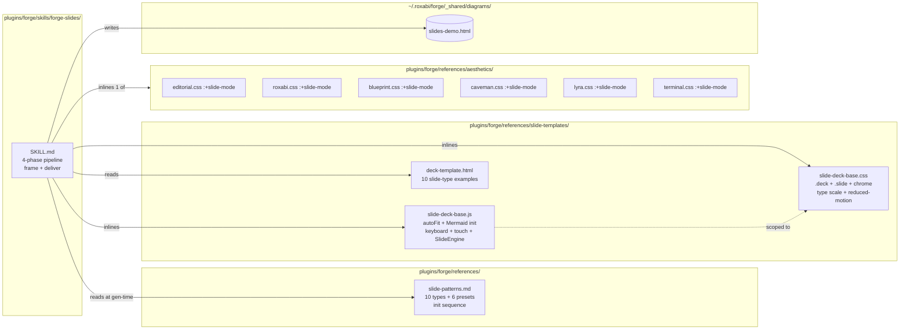

## Summary

Add a 6th forge skill that generates single-file, offline-playable scroll-snap presentation decks. Ship in 3 vertical slices (base engine → full coverage → skill wiring) inside one PR. Work spans CSS/JS/HTML reference templates, 6 aesthetic tunings, one SKILL.md, and one hand-authored-then-skill-regenerated demo deck.

## Architecture

### Data flow

```mermaid
flowchart TD
    subgraph Input
        I1[issue #N] & I2[markdown path] & I3[free prompt]
        I4[--aesthetic override]
    end
    subgraph ContextPhase["Phase 1 — Context"]
        BB[brand-book-loader.md]
        AD[aesthetic detection]
    end
    subgraph DecisionPhase["Phase 2 — Decision"]
        FR[Frame: reader/action/takeaway/tone]
        DO[Silent deck outline]
    end
    subgraph GenerationPhase["Phase 3 — Generation"]
        SH[Shell assembly]
        INL[Inline base+aesthetic+slide-deck-base]
        EM[Emit 10 slide types with --i]
    end
    subgraph DeliverPhase["Phase 4 — Deliver"]
        OUT[(slides/{name}.html)]
        META[diagram-meta]
    end
    I1 & I2 & I3 --> ContextPhase
    I4 --> AD
    ContextPhase --> DecisionPhase
    DecisionPhase --> GenerationPhase
    GenerationPhase --> DeliverPhase

    classDef phase fill:#1e3a5f,stroke:#4a9eff,color:#fff
    class ContextPhase,DecisionPhase,GenerationPhase,DeliverPhase phase
```

### File × Function map



## Bootstrap Context

**Spec:** `artifacts/specs/6-forge-slides-skill-spec.mdx` (3 slices, 23 acceptance criteria, 0 clarifications).

**Reference implementation to adapt:** `~/.claude/plugins/cache/visual-explainer-marketplace/visual-explainer/0.6.3/references/slide-patterns.md` (1,406 lines). Adapt — don't lift verbatim — because:
- VE ships a general-purpose slide engine; forge integrates it with the 4-phase pipeline, aesthetic system, and brand-book loader.
- VE's Mermaid init contract is different (no tab-loader).

**Sibling skills to mirror for SKILL.md structure + frame phase wiring:**
- `plugins/forge/skills/forge-epic/SKILL.md` — closest peer (issue-seeded, frame-driven, split-shell output).
- `plugins/forge/skills/forge-guide/SKILL.md` — simpler pipeline, useful for input-mode handling.

**Shared primitives already in forge — reuse directly (no re-implementation):**
- `plugins/forge/references/base/reset.css`, `base/typography.css` — inline first.
- `plugins/forge/references/fgraph-base.css` — for in-slide fgraph diagrams.
- `plugins/forge/references/diagram-meta.md` — meta tag format.
- `plugins/forge/references/brand-book-loader.md` — Track A/B detection.
- `plugins/forge/references/frame-phase.md` — 3-signal inference.
- `plugins/forge/references/design-phase-two-track.md` — track-by-track behavior.

**NOT reused verbatim:**
- `plugins/forge/references/base/mermaid-init.js` — its `window.__postLoad` contract is tab-loader-specific; `slide-deck-base.js` ships its own scoped Mermaid init (see spec Expected Behavior).

**Distribution rule (see CLAUDE.md "Distribution rule"):** slide decks are single-file `file://`-compatible. All CSS/JS is **inlined** into the output deck — `slide-templates/` files are generation source, not runtime dependencies. No `~/.roxabi/forge/_shared/slide-templates/` mirror needed.

## Agents

| Agent | Task count | Files |
|---|---|---|
| frontend-dev | 11 | `slide-deck-base.{css,js}`, `deck-template.html`, 6× `aesthetics/*.css`, hand-authored demo deck updates |
| doc-writer | 2 | `slide-patterns.md`, `forge-slides/SKILL.md` |
| devops | 1 | Makefile deploy / sync-plugins verification |
| tester | 1 | Manual browser acceptance of all 23 SCs |

Total: 15 micro-tasks + 3 RED-GATE sentinels = 18 tasks.

## Consistency Report

**Coverage (spec SCs → tasks):** 23/23 SCs traced to tasks. All 10 breadboard affordances covered.

| SC group | Covered by |
|---|---|
| SKILL.md structure (1 SC) | T14 |
| Reference doc (1 SC) | T1 |
| slide-deck-base.css features (1 SC) | T2 |
| slide-deck-base.js features (2 SCs incl. Mermaid contract) | T3 |
| deck-template.html shell (1 SC) | T4, T8 |
| S1 aesthetic gate (1 SC) | T5, T6 |
| S2 aesthetic gate (1 SC) | T10–T13 |
| Demo deck (1 SC) | T7, T9, T17 |
| CDN allowlist (1 SC) | T18 (V2 gate) + T21 (V3 gate) |
| Reduced-motion (1 SC) | T8 (V1 gate) |
| `autoFit` verified (1 SC) | T18 (V2 gate) |
| No Mermaid ID collision (1 SC) | T18 (V2 gate) |
| Touch swipe (1 SC) | T8 (V1 gate) |
| fgraph reuse (1 SC) | T9, T18 |
| 3 input modes + `--aesthetic` override (4 SCs) | T14, T15, T20, T21 |
| Output path + diagram-meta (1 SC) | T17, T21 |
| Silent overwrite (1 SC) | T17, T21 |
| Deploy + sync (2 SCs) | T16, T19 |

**Uncovered:** none. **Untraced:** none. **Exemptions:** none.

## Micro-Tasks

### V1 — Base engine + reference doc

#### T1 · Write slide-patterns.md reference doc

- **File:** `plugins/forge/references/slide-patterns.md`
- **Agent:** doc-writer
- **Spec trace:** SC "plugins/forge/references/slide-patterns.md exists..."
- **Phase:** GREEN · **Difficulty:** 3 · **Time:** 15–20 min · `[P]` with T2
- **Skeleton:** frontmatter + sections: (1) Overview + when-to-use, (2) 10 slide types with HTML shape + CSS hook + example, (3) Runtime init sequence (`initSlideMermaid` → `autoFit` → `SlideEngine` — SVGs must render before autoFit patches them), (4) 6 aesthetic presets table (display/heading/body/caption deltas), (5) Resize handler note (landscape↔portrait, desktop-only known-limitation), (6) Out-of-scope v0.1 (`svg-pan-zoom`, presenter mode).
- **Source to adapt:** VE's `~/.claude/plugins/cache/visual-explainer-marketplace/visual-explainer/0.6.3/references/slide-patterns.md` — cut to forge style, drop VE-specific CSS patterns that duplicate our aesthetics.
- **Verify:** `wc -l plugins/forge/references/slide-patterns.md` → expect 400–700 lines. `grep -c '^### ' plugins/forge/references/slide-patterns.md` → ≥ 10 (one per slide type).

#### T2 · Write slide-deck-base.css

- **File:** `plugins/forge/references/slide-templates/slide-deck-base.css` (create `slide-templates/` dir)
- **Agent:** frontend-dev
- **Spec trace:** SC "slide-deck-base.css exports scroll-snap engine + nav chrome + type scale tokens"
- **Phase:** GREEN · **Difficulty:** 3 · **Time:** 20 min · `[P]` with T1
- **Skeleton:**
  - `.deck { scroll-snap-type: y mandatory; height: 100dvh; overflow-y: auto; }`
  - `.slide { scroll-snap-align: start; height: 100dvh; display: grid; place-items: center; }`
  - Type-scale CSS vars: `--fs-display: clamp(48px, 8vw, 120px); --fs-heading: clamp(28px, 4vw, 48px); --fs-body: clamp(16px, 2vw, 24px); --fs-caption: clamp(10px, 1vw, 14px);`
  - Chrome: `.deck-progress`, `.deck-counter`, `.deck-dots { position: fixed; ... }`.
  - 3 slide-type stubs: `.slide--title`, `.slide--content`, `.slide--closing`.
  - `@media (prefers-reduced-motion: reduce) { * { animation: none !important; transition: none !important; transform: none !important; } }`
- **Verify:** `grep -c 'scroll-snap' plugins/forge/references/slide-templates/slide-deck-base.css` → ≥ 2. `grep 'prefers-reduced-motion' plugins/forge/references/slide-templates/slide-deck-base.css` → match.

#### T3 · Write slide-deck-base.js

- **File:** `plugins/forge/references/slide-templates/slide-deck-base.js`
- **Agent:** frontend-dev
- **Spec trace:** SC "slide-deck-base.js provides autoFit + keyboard + touch + ..." + SC "ships its own Mermaid init"
- **Phase:** GREEN · **Difficulty:** 4 · **Time:** 30 min · blocked by T2
- **Skeleton:**
  - `function autoFit()` — scan `.slide--diagram [data-mermaid-fit]`, `.slide--content .kpi`, `.slide--quote blockquote`; compute fit scale; apply `transform: scale()` inside `.slide-inner` containers.
  - `async function initSlideMermaid()` — scoped `document.querySelectorAll('.slide--diagram [data-mermaid]')`, `import()` mermaid ESM, `mermaid.initialize({ startOnLoad: false, securityLevel: 'strict' })`, ∀ node: `const id = 'mermaid-slide-' + i; const { svg } = await mermaid.render(id, node.textContent); node.innerHTML = svg;` — errors caught + reported via `textContent` on a `<pre>` (not innerHTML).
  - `class SlideEngine` — constructor: keyboard listeners (`ArrowUp/Down/PageUp/Down/Space/Home/End`), touch listeners (`touchstart`/`touchend` → direction → `next`/`prev`), `IntersectionObserver` (thresholds 0.5) for active-index + progress + counter + dot-active updates; `prev()` / `next()` / `jumpTo(i)` methods.
  - Bootstrap: `document.addEventListener('DOMContentLoaded', async () => { await initSlideMermaid(); autoFit(); new SlideEngine(document.querySelector('.deck')); });` — SVGs must exist before `autoFit()` patches their dims.
- **Verify:** `node --check plugins/forge/references/slide-templates/slide-deck-base.js` → exit 0. `grep -c 'mermaid-slide-' plugins/forge/references/slide-templates/slide-deck-base.js` → ≥ 1.

#### T4 · Write deck-template.html reference shell

- **File:** `plugins/forge/references/slide-templates/deck-template.html`
- **Agent:** frontend-dev
- **Spec trace:** SC "deck-template.html is a working reference shell"
- **Phase:** GREEN · **Difficulty:** 2 · **Time:** 15 min · blocked by T2, T3
- **Skeleton:** HTML shell with `{PLACEHOLDER}` tokens (`{DECK_TITLE}`, `{AESTHETIC_CSS}`, `{SLIDES_HTML}`); inline `<style>` for `{RESET_CSS}{TYPOGRAPHY_CSS}{AESTHETIC_CSS}{SLIDE_DECK_BASE_CSS}`; inline `<script type="module">{SLIDE_DECK_BASE_JS}</script>`. Body: `.deck` with one `.slide.slide--{type}` for each of the 10 types (filled in V2 for the remaining 7; V1 ships 3: title, content, closing).
- **Verify:** `grep -c '\.slide--' plugins/forge/references/slide-templates/deck-template.html` → 3 (V1 exit).

#### T5 · Tune editorial.css for slide mode

- **File:** `plugins/forge/references/aesthetics/editorial.css` (append)
- **Agent:** frontend-dev
- **Spec trace:** SC "S1 aesthetic gate: editorial + roxabi tuned"
- **Phase:** GREEN · **Difficulty:** 2 · **Time:** 10 min · `[P]` with T6 · blocked by T2
- **Skeleton:** new block `.deck.theme-editorial .slide--title { ... }`, `.slide--content`, `.slide--closing` — magazine-editorial type scale overrides, section-divider backgrounds, full-bleed contrast.
- **Verify:** `grep -c '.deck' plugins/forge/references/aesthetics/editorial.css` → ≥ 3.

#### T6 · Tune roxabi.css for slide mode

- **File:** `plugins/forge/references/aesthetics/roxabi.css` (append)
- **Agent:** frontend-dev
- **Phase:** GREEN · **Difficulty:** 2 · **Time:** 10 min · `[P]` with T5 · blocked by T2
- **Skeleton:** as T5, using roxabi palette + typography.
- **Verify:** `grep -c '.deck' plugins/forge/references/aesthetics/roxabi.css` → ≥ 3.

#### T7 · Write hand-authored demo deck (V1 slice)

- **File:** `~/.roxabi/forge/_shared/diagrams/slides-demo.html`
- **Agent:** frontend-dev
- **Spec trace:** SC "demo deck at _shared/diagrams/slides-demo.html"
- **Phase:** GREEN · **Difficulty:** 2 · **Time:** 10 min · blocked by T4, T5
- **Skeleton:** 5-slide deck using `editorial` aesthetic and 3 slide types (title / 2× content / closing). Uses `deck-template.html` as base — inline all CSS/JS directly, no network deps.
- **Verify:** `test -f ~/.roxabi/forge/_shared/diagrams/slides-demo.html && echo ok`. Open in browser, confirm it renders.

#### T8 · **V1 RED-GATE** · Manual browser acceptance

- **Agent:** tester
- **Spec trace:** SC "scrolls end-to-end with keyboard nav" + SC "prefers-reduced-motion disables transforms" + SC "navigates via swipe gesture on a touch device"
- **Phase:** RED-GATE · **Difficulty:** 2 · **Time:** 10 min · blocked by T1–T7
- **Verify manually in Chrome DevTools:**
  - Scroll-snap works (mouse wheel / trackpad snaps to next slide).
  - Keyboard nav: ↑/↓, Space, PageUp/Down, Home, End all advance/retreat correctly.
  - Touch swipe: DevTools mobile emulation → swipe up/down navigates.
  - Progress bar advances. Counter shows `N / total`. Dot-indicator click jumps.
  - DevTools → Rendering → Emulate CSS media feature `prefers-reduced-motion: reduce` → transitions disabled.
- **Expected output:** checklist all green.

### V2 — Full slide-type + aesthetic coverage

#### T9 · Extend slide-deck-base.css with 7 remaining slide types

- **File:** `plugins/forge/references/slide-templates/slide-deck-base.css` (append)
- **Agent:** frontend-dev
- **Spec trace:** SC "S2 aesthetic gate" + SC "In-slide fgraph diagrams reuse fgraph-base.css"
- **Phase:** GREEN · **Difficulty:** 3 · **Time:** 25 min · blocked by T8
- **Skeleton:** add `.slide--section`, `.slide--diagram`, `.slide--table`, `.slide--code`, `.slide--quote`, `.slide--image`, `.slide--comparison` blocks. `.slide--diagram` composes with `fgraph-base.css` classes (no duplication). `.slide--code` inherits code-block styles.
- **Verify:** `grep -c '\.slide--' plugins/forge/references/slide-templates/slide-deck-base.css` → 10.

#### T10 · Tune blueprint.css for slide mode

- **File:** `plugins/forge/references/aesthetics/blueprint.css` (append)
- **Agent:** frontend-dev
- **Phase:** GREEN · **Difficulty:** 2 · **Time:** 10 min · `[P]` with T11, T12, T13 · blocked by T9

#### T11 · Tune caveman.css for slide mode · `[P]`

- **File:** `plugins/forge/references/aesthetics/caveman.css` (append)
- **Agent:** frontend-dev · Difficulty 2 · 10 min · blocked by T9

#### T12 · Tune lyra.css for slide mode · `[P]`

- **File:** `plugins/forge/references/aesthetics/lyra.css` (append)
- **Agent:** frontend-dev · Difficulty 2 · 10 min · blocked by T9

#### T13 · Tune terminal.css for slide mode · `[P]`

- **File:** `plugins/forge/references/aesthetics/terminal.css` (append)
- **Agent:** frontend-dev · Difficulty 2 · 10 min · blocked by T9

#### T14 · Update deck-template.html with all 10 slide types

- **File:** `plugins/forge/references/slide-templates/deck-template.html`
- **Agent:** frontend-dev
- **Phase:** GREEN · Difficulty 2 · 15 min · blocked by T9
- **Verify:** `grep -c '\.slide--' plugins/forge/references/slide-templates/deck-template.html` → 10.

#### T15 · Extend hand-authored demo deck to all 10 slide types

- **File:** `~/.roxabi/forge/_shared/diagrams/slides-demo.html`
- **Agent:** frontend-dev
- **Spec trace:** SC "uses all 10 slide types" + SC "deck with ≥ 2 diagram slides renders both without ID collision"
- **Phase:** GREEN · Difficulty 3 · 20 min · blocked by T10, T11, T12, T13, T14
- **Notes:** demo deck must include **2 separate `diagram` slides** (one with Mermaid, one with fgraph) to validate ID collision fix.

#### T16 · **V2 RED-GATE** · Multi-aesthetic + multi-diagram acceptance

- **Agent:** tester
- **Spec trace:** SC "all 6 aesthetics tuned" + SC "autoFit: Mermaid SVG fills slide body at 1920×1080 + 1280×800" + SC "≥ 2 diagram slides render without collision" + SC "no external requests beyond the allowlist" + SC "fgraph reuses fgraph-base.css"
- **Phase:** RED-GATE · Difficulty 3 · Time 20 min · blocked by T15
- **Verify manually:**
  - Swap the aesthetic inline block in `slides-demo.html` across all 6 (`editorial`, `roxabi`, `blueprint`, `caveman`, `lyra`, `terminal`). Each renders without layout break.
  - At 1920×1080 and 1280×800 viewports, Mermaid SVG in the `diagram` slide fills the slide body, no horizontal overflow.
  - Both Mermaid diagrams render (IDs: `mermaid-slide-0`, `mermaid-slide-N`) without console errors.
  - DevTools Network tab: only requests are to `fonts.googleapis.com`, `fonts.gstatic.com`, `cdn.jsdelivr.net/npm/mermaid`.

### V3 — Skill wiring + pipeline integration

#### T17 · Write forge-slides SKILL.md

- **File:** `plugins/forge/skills/forge-slides/SKILL.md`
- **Agent:** doc-writer
- **Spec trace:** SC "SKILL.md exists with frontmatter, trigger phrases, 4-phase pipeline, frame guidance, deliver checklist"
- **Phase:** GREEN · Difficulty 3 · Time 25 min · blocked by T16
- **Skeleton:** frontmatter (`name: forge-slides`, `description: ... Triggers: "create deck" | "slides from #N" | "make a deck" | "forge slides" ...`, `version: 0.1.0`, `allowed-tools: Read, Write, Edit, Bash, Glob, Grep, Agent`). Sections: Phase 1 Context (brand-book-loader reuse + aesthetic detection + 3 input-mode parsing incl. `--aesthetic` override), Phase 2 Decision (Frame + silent deck outline), Phase 3 Generation (inline order: reset → typography → aesthetic → slide-deck-base.css, then slide-deck-base.js as `<script type="module">`; emit `.slide.slide--{type}` per outline slide with `--i` stagger), Phase 4 Deliver (write to `~/.roxabi/forge/<project>/slides/{name}.html` — silent overwrite, inject `diagram-meta` with `categories`, `aestheticLabel`, `latest: true`; report path + preview URL; acceptance checklist).
- **Pattern reference:** mirror structure of `plugins/forge/skills/forge-epic/SKILL.md`.

#### T18 · Regenerate skill-authored demo deck via /forge-slides #6

- **File:** `~/.roxabi/forge/_shared/diagrams/slides-demo.html` (overwrite)
- **Agent:** frontend-dev
- **Spec trace:** SC "S3 replaces it with a skill-generated version at the same path" + SC "silent overwrite"
- **Phase:** GREEN · Difficulty 2 · Time 10 min · blocked by T17
- **Steps:** invoke `/forge-slides #6` → skill reads issue #6 + frame + spec → produces skill-generated deck at same path → confirm it still opens, renders all 10 slide types (if outline picks them), diagram-meta tag injected.
- **Verify:** `grep 'diagram-meta' ~/.roxabi/forge/_shared/diagrams/slides-demo.html` → matches `latest: true`.

#### T19 · Verify deploy + sync-plugins wiring

- **File:** `plugins/forge/Makefile` (verify, likely no change), `sync-plugins.sh` (verify)
- **Agent:** devops
- **Spec trace:** SC "make -C plugins/forge deploy copies the new references into ~/.roxabi/forge/_shared/ as needed" + SC "./sync-plugins.sh --local picks up the new skill"
- **Phase:** GREEN · Difficulty 2 · Time 10 min · blocked by T17
- **Steps:**
  - Confirm distribution rule (CLAUDE.md): single-file offline decks inline all CSS/JS → `slide-templates/` is generation source, not runtime → no `_shared/slide-templates/` mirror needed → no Makefile change needed.
  - `./sync-plugins.sh --local` → verify new `forge-slides/` skill and `slide-templates/` dir land in local plugin cache.
- **Verify:** `./sync-plugins.sh --local 2>&1 | grep forge-slides` → matches. `ls ~/.claude/plugins/cache/roxabi-marketplace/roxabi-forge/*/plugins/forge/skills/forge-slides/SKILL.md` → exists.
- **Expected output:** "distribution = inline; no Makefile deploy change needed" + confirmed skill sync.

#### T20 · **V3 RED-GATE** · End-to-end acceptance (3 input modes + override)

- **Agent:** tester
- **Spec trace:** all remaining SCs: 3 input modes, `--aesthetic` override, output path convention, diagram-meta, silent overwrite
- **Phase:** RED-GATE · Difficulty 3 · Time 25 min · blocked by T19
- **Verify manually:**
  - (a) `/forge-slides #6` → deck at expected path.
  - (b) Create a temp `brief.md` (H1 + 3 H2s), run `/forge-slides /tmp/brief.md` → deck reflects structure.
  - (c) `/forge-slides "brand pitch for roxabi — 6 slides"` → deck with 6 slides.
  - (d) `/forge-slides #6 --aesthetic blueprint` → blueprint aesthetic applied. Repeat with `--aesthetic caveman`.
  - (e) Run (a) a second time → previous file silently overwritten (same path, updated `generatedAt`).
  - (f) Spot-check diagram-meta for `categories`, `aestheticLabel`, `latest: true`.
  - All 23 spec SCs pass.

## Task IDs

<!-- Generated by /plan. Used by /implement to resume tasks on session restart. -->

- T1: 12 — Write slide-patterns.md reference doc
- T2: 13 — Write slide-deck-base.css
- T3: 14 — Write slide-deck-base.js
- T4: 15 — Write deck-template.html (V1 — 3 slide types)
- T5: 16 — Tune editorial.css for slide mode
- T6: 17 — Tune roxabi.css for slide mode
- T7: 18 — Write V1 hand-authored demo deck (editorial, 3 slide types)
- T8: 19 — V1 RED-GATE — Manual browser acceptance
- T9: 20 — Extend slide-deck-base.css with 7 remaining slide types
- T10: 21 — Tune blueprint.css for slide mode
- T11: 22 — Tune caveman.css for slide mode
- T12: 23 — Tune lyra.css for slide mode
- T13: 24 — Tune terminal.css for slide mode
- T14: 25 — Update deck-template.html with all 10 slide types
- T15: 26 — Extend V2 hand-authored demo to all 10 slide types + 2 Mermaid
- T16: 27 — V2 RED-GATE — Multi-aesthetic + multi-diagram acceptance
- T17: 28 — Write forge-slides SKILL.md
- T18: 29 — Regenerate demo deck via /forge-slides #6
- T19: 30 — Verify deploy + sync-plugins wiring
- T20: 31 — V3 RED-GATE — E2E acceptance (3 input modes + override)
