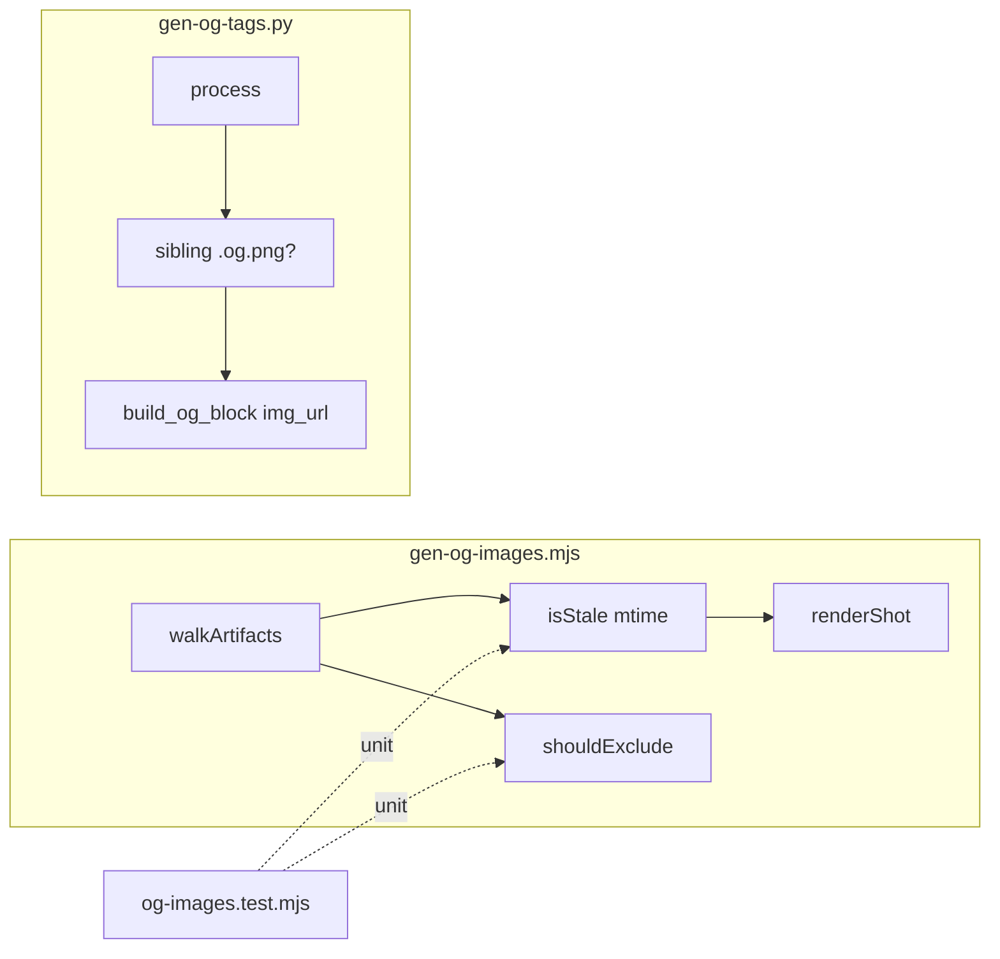

## Summary

Add `scripts/gen-og-images.mjs` (Playwright 1200×630 per-artifact screenshots), make
`gen-og-tags.py` prefer a sibling `.og.png` over the global banner, and wire the new step
into `build.sh` + the plugin `Makefile` deploy. Single domain (build tooling).

## Architecture

## Agents

| Agent instance | Tasks | Files | Subject |
|---|---|---|---|
| devops-A | T1 | `scripts/gen-og-images.mjs` | screenshot |
| devops-B | T2, T3 | `scripts/gen-og-tags.py`, `scripts/build.sh`, `plugins/forge/Makefile` | og-tags, build-wiring |
| tester-A | T4 | `scripts/__tests__/og-images.test.mjs` (or repo test loc) + fixture verify | verify |

## Wave Structure

3 waves, max 2 parallel agents. Elapsed ~1 short session vs ~3 sequential.

| Wave | Trigger | Agents | Tasks |
|------|---------|--------|-------|
| 1 | start | 2 ∥ | devops-A: T1 · devops-B: T2 |
| 2 | Wave 1 done | 1 | devops-B: T3 |
| 3 | Wave 2 done | 1 | tester-A: T4 |

### Budget — per task

| Task | Items | Class | Est. ops | Split? |
|------|-------|-------|----------|--------|
| T1 gen-og-images.mjs | 1 | judgmental | 6 | — |
| T2 gen-og-tags.py | 1 | judgmental | 5 | — |
| T3 build.sh + Makefile | 2 | bounded | 3 | — |
| T4 tests + verify | 2 | judgmental | 5 | — |

**Total estimated ops: 19**

### Budget — per agent instance

| Instance | Tasks | Σ ops | Subjects | Split? |
|----------|-------|-------|----------|--------|
| devops-A | T1 | 6 | screenshot | — |
| devops-B | T2, T3 | 8 | og-tags, build-wiring | — (2 tasks ≤4, 2 subjects ≤2) |
| tester-A | T4 | 5 | verify | — |

## Consistency Report

- Success criteria covered: 8/8 (SC1–SC2→T1, SC3→T1, SC4–SC5→T2, SC6→T3, SC7→T3, SC8→T1+T2).
- Uncovered: none. Untraced tasks: none. Exemptions: none.

## Micro-Tasks

### Slice V1 — gen-og-images.mjs (devops-A)

**T1** — Create `scripts/gen-og-images.mjs`. [screenshot · diff 4 · SC1-3,8 · V1 · GREEN]
- Own Playwright setup: `chromium.launch()`, `newContext({viewport:{width:1200,height:630}, deviceScaleFactor:2})`, one reused page.
- Walk `glob($FORGE_DIR/**/*.html)`; `shouldExclude(rel)` → site `index.html`, `tabs/` segments, `_dist/`, and any non-`.html`/`.og.png`. Mirror `gen-og-tags.py` exclusions.
- `isStale(html, png)` → png absent OR `mtime(png) < mtime(html)`. `--force` bypasses.
- Render: `page.goto(fileURL, {waitUntil:'networkidle'})`, fonts.ready, force-reveal (lift from `.claude/fc-loop/render.mjs`), `page.screenshot({path: tmp, fullPage:false})` → `rename(tmp, png)`.
- Error granularity: launch fail → `console.warn` + `process.exit(0)`; per-artifact fail → warn + `rm(tmp)` + continue.
- Verify: `node scripts/gen-og-images.mjs --force` on a 1-file fixture → `file name.og.png` reports `1200 x 630`; re-run without `--force` → "0 rendered".

### Slice V2 — gen-og-tags.py (devops-B)

**T2** — Modify `scripts/gen-og-tags.py`. [og-tags · diff 3 · SC4-5,8 · V2 · GREEN]
- `build_og_block(title, description, url, img_url)` — replace internal `OG_IMAGE_URL` with the `img_url` arg.
- In `process()`: `png = filepath.with_suffix('.og.png')` (note: filepath ends `.html` → `.og.png`); `img_url = f'{BASE_URL}/{rel[:-5]}.og.png'` if `png.exists()` else `OG_IMAGE_URL`. Pass to `build_og_block`.
- Keep idempotent strip/re-inject behavior; `OG_IMAGE_URL` stays the module fallback default.
- Verify: fixture dir with `a.html`+`a.og.png` and `b.html` (no png) → `a` meta uses `.../a.og.png`, `b` uses `/og-image.png`.

### Slice V3 — wiring (devops-B) + verify (tester-A)

**T3** — Edit `scripts/build.sh` + `plugins/forge/Makefile`. [build-wiring · diff 2 · SC6-7 · V3 · GREEN] (blockedBy T1, T2)
- `build.sh`: insert `echo "▸ Rendering per-artifact OG images…"; node "$SCRIPT_DIR/gen-og-images.mjs"` immediately BEFORE the `gen-og-tags.py` call (line ~26-27). Ensure `node` available; the OG-images step must not abort the build (script already exits 0 on launch fail).
- `plugins/forge/Makefile` deploy: add `@cp -v $(REPO_ROOT)/scripts/gen-og-images.mjs $(FORGE_DIR)/scripts/gen-og-images.mjs` next to the other `scripts/*` cp lines (~line 41).
- Verify: `FORGE_DIR=<fixture> bash scripts/build.sh` → `find _dist -name '*.og.png'` non-empty AND injected meta resolves to per-artifact URL; `make -C plugins/forge deploy` dry-check lists the new cp.

**T4** — Tests + end-to-end verify. [verify · diff 3 · SC1-8 · V3 · RED-GATE] (blockedBy T3)
- Unit (vitest, no browser): extract/import pure helpers `shouldExclude` + `isStale` from `gen-og-images.mjs`; assert exclusion set + stale logic (absent png, older png, newer png, --force).
- Integration verify: run the full `build.sh` on a 2-artifact fixture, assert all 8 success criteria (dims, no-op, fallback, exclusions, `_dist` contents, Makefile cp).
- Verify: `bunx vitest run` green; verify script prints 8/8.

## Task Seeding Blueprint

<!-- Used by /implement to seed TaskCreate calls on session start.
     Format: T{n} | agent-instance | blockedBy | subject -->

### Wave 1 — no deps, 2 agents ∥

| Task | Agent instance | blockedBy | Subject |
|------|---------------|-----------|---------|
| T1 | devops-A | — | screenshot |
| T2 | devops-B | — | og-tags |

### Wave 2 — after Wave 1, 1 agent

| Task | Agent instance | blockedBy | Subject |
|------|---------------|-----------|---------|
| T3 | devops-B | T1, T2 | build-wiring |

### Wave 3 — after Wave 2, 1 agent

| Task | Agent instance | blockedBy | Subject |
|------|---------------|-----------|---------|
| T4 | tester-A | T3 | verify |

## Task IDs

<!-- Generated by /plan. Used by /implement to resume tasks on session restart. -->
- T1: 12 — screenshot (devops-A)
- T2: 13 — og-tags (devops-B)
- T3: 14 — build-wiring (devops-B) [blockedBy 12,13]
- T4: 15 — verify (tester-A) [blockedBy 14]
