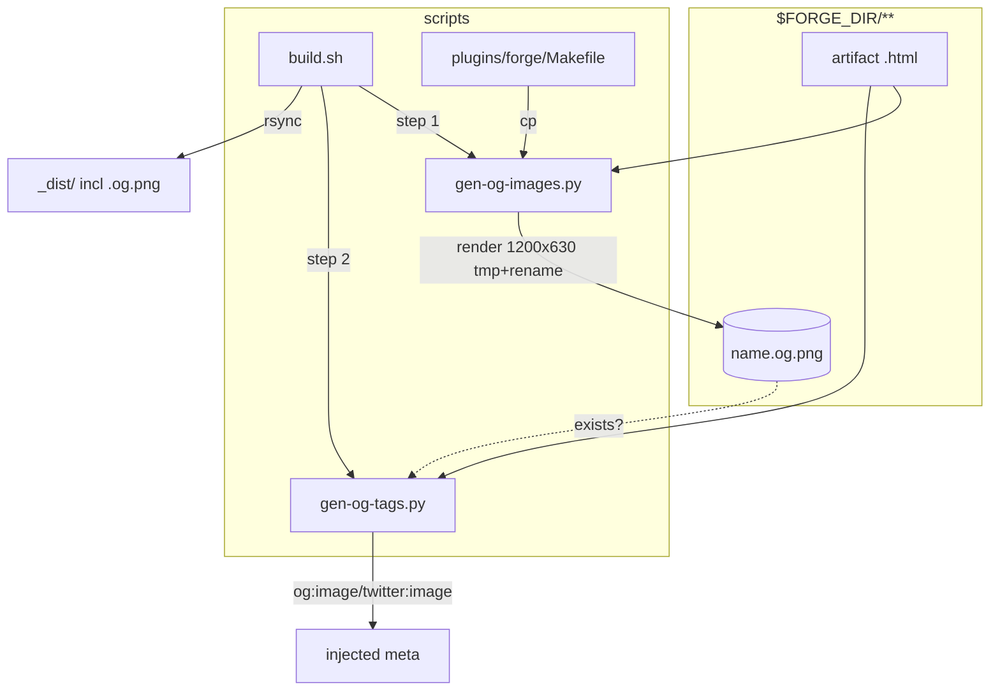

## Summary

Add `scripts/gen-og-images.py` (Playwright sync API, 1200×630 per-artifact screenshots,
run via `uv run --with playwright python3`), make `gen-og-tags.py` prefer a sibling
`.og.png` over the global banner, and wire the new step into `build.sh` + the plugin
`Makefile` deploy. Single domain (build tooling).

> **Pivot (approved 2026-06-14):** renderer is Python `gen-og-images.py` via `uv run
> --with playwright`, NOT node `.mjs` — `$FORGE_DIR` has no `node_modules` and the build
> is 100% Python. T1/T3/T4 reflect this. T4 = vitest **integration** test that shells out
> to the Python scripts on a fixture (repo has no Python test runner; vitest is the only
> QG test stage) + an executed end-to-end `build.sh` verify.

## Architecture




## Agents

| Agent instance | Tasks | Files | Subject |
|---|---|---|---|
| devops-A | T1 | `scripts/gen-og-images.py` | screenshot |
| devops-B | T2, T3 | `scripts/gen-og-tags.py`, `scripts/build.sh`, `plugins/forge/Makefile` | og-tags, build-wiring |
| tester-A | T4 | `scripts/__tests__/og-images.test.mjs` (or repo test loc) + fixture verify | verify |

## Wave Structure

3 waves, max 2 parallel agents. Elapsed ~1 short session vs ~3 sequential.

| Wave | Trigger | Agents | Tasks |
|------|---------|--------|-------|
| 1 | start | 2 ∥ | devops-A: T1 · devops-B: T2 |
| 2 | Wave 1 done | 1 | devops-B: T3 |
| 3 | Wave 2 done | 1 | tester-A: T4 |

### Budget — per task

| Task | Items | Class | Est. ops | Split? |
|------|-------|-------|----------|--------|
| T1 gen-og-images.py | 1 | judgmental | 6 | — |
| T2 gen-og-tags.py | 1 | judgmental | 5 | — |
| T3 build.sh + Makefile | 2 | bounded | 3 | — |
| T4 tests + verify | 2 | judgmental | 5 | — |

**Total estimated ops: 19**

### Budget — per agent instance

| Instance | Tasks | Σ ops | Subjects | Split? |
|----------|-------|-------|----------|--------|
| devops-A | T1 | 6 | screenshot | — |
| devops-B | T2, T3 | 8 | og-tags, build-wiring | — (2 tasks ≤4, 2 subjects ≤2) |
| tester-A | T4 | 5 | verify | — |

## Consistency Report

- Success criteria covered: 8/8 (SC1–SC2→T1, SC3→T1, SC4–SC5→T2, SC6→T3, SC7→T3, SC8→T1+T2).
- Uncovered: none. Untraced tasks: none. Exemptions: none.

## Micro-Tasks

### Slice V1 — gen-og-images.py (devops-A)

**T1** — Create `scripts/gen-og-images.py` (Python, playwright sync API). [screenshot · diff 4 · SC1-3,8 · V1 · GREEN]
- `from playwright.sync_api import sync_playwright`; `p.chromium.launch()`, `browser.new_context(viewport={'width':1200,'height':630}, device_scale_factor=2)`, one reused page.
- Walk `glob(str(DIR/'**/*.html'), recursive=True)`; `should_exclude(rel)` → site `index.html`, `tabs/` segments, `_dist/`. Mirror `gen-og-tags.py` exclusions exactly (line 111).
- `is_stale(html, png)` → png absent OR `png.stat().st_mtime < html.stat().st_mtime`. `--force` bypasses.
- Render: `page.goto(html.resolve().as_uri(), wait_until='networkidle')`, await `document.fonts.ready`, force-reveal `.reveal,[data-reveal]` (set revealed/visible classes + opacity/transform), small settle wait, `page.screenshot(path=tmp, full_page=False)` → `os.replace(tmp, png)` where `tmp = png.parent/(png.name+'.tmp')`.
- Error granularity: chromium launch fail → `print('⚠ …')` + `sys.exit(0)` (build continues); per-artifact fail → warn + `tmp.unlink(missing_ok=True)` + continue.
- Pure helpers `should_exclude(rel)` + `is_stale(html, png)` at module top (importable/exercisable by T4 fixture run). `--self-test` flag runs helper assertions + exits 0 (no browser) so T4 can unit-check logic without chromium.
- Verify: `uv run --with playwright python3 scripts/gen-og-images.py --force` on a 1-file fixture → `file name.og.png` reports `1200 x 630`; re-run without `--force` → "0 rendered".

### Slice V2 — gen-og-tags.py (devops-B)

**T2** — Modify `scripts/gen-og-tags.py`. [og-tags · diff 3 · SC4-5,8 · V2 · GREEN]
- `build_og_block(title, description, url, img_url)` — replace internal `OG_IMAGE_URL` with the `img_url` arg.
- In `process()`: `png = filepath.with_suffix('.og.png')` (note: filepath ends `.html` → `.og.png`); `img_url = f'{BASE_URL}/{rel[:-5]}.og.png'` if `png.exists()` else `OG_IMAGE_URL`. Pass to `build_og_block`.
- Keep idempotent strip/re-inject behavior; `OG_IMAGE_URL` stays the module fallback default.
- Verify: fixture dir with `a.html`+`a.og.png` and `b.html` (no png) → `a` meta uses `.../a.og.png`, `b` uses `/og-image.png`.

### Slice V3 — wiring (devops-B) + verify (tester-A)

**T3** — Edit `scripts/build.sh` + `plugins/forge/Makefile`. [build-wiring · diff 2 · SC6-7 · V3 · GREEN] (blockedBy T1, T2)
- `build.sh`: insert before the `gen-og-tags.py` call (line ~26-27), guarded so the step never aborts the build (`set -euo pipefail`):
  ```bash
  echo "▸ Rendering per-artifact OG images…"
  if command -v uv >/dev/null 2>&1; then
    uv run --with playwright python3 "$SCRIPT_DIR/gen-og-images.py" \
      || echo "  ⚠ OG image render skipped (rc=$?) — cards fall back to banner"
  else
    echo "  ⚠ uv not found — skipping OG image render (cards fall back to banner)"
  fi
  ```
- `plugins/forge/Makefile` deploy: add `@cp -v $(REPO_ROOT)/scripts/gen-og-images.py $(FORGE_DIR)/scripts/gen-og-images.py` next to the other `scripts/*` cp lines (~line 41).
- Verify: `FORGE_DIR=<fixture> bash scripts/build.sh` → `find _dist -name '*.og.png'` non-empty AND injected meta resolves to per-artifact URL; `make -C plugins/forge deploy` dry-check lists the new cp.

**T4** — vitest integration test + end-to-end verify. [verify · diff 3 · SC1-8 · V3 · RED-GATE] (blockedBy T3)
- `scripts/__tests__/og-images.test.ts` (vitest, node env): builds a temp `$FORGE_DIR` fixture (1 renderable artifact `a/index-ish.html` with viewport+title, 1 plain `b.html`, plus an excluded `index.html` + `tabs/x.html`), shells `execFileSync('uv', ['run','--with','playwright','python3', gen-og-images.py])` with `FORGE_DIR` env, then asserts:
  - `a.og.png` exists, PNG header dims = 1200×630 (read IHDR bytes) — SC1.
  - second run renders 0 (mtime no-op); `--force` re-renders — SC2.
  - excluded paths get no `.og.png` — SC8.
  - run `gen-og-tags.py` → `a.html` meta `og:image`/`twitter:image` = `…/a.og.png`; `b.html` = `…/og-image.png` — SC4, SC5.
  - grep `plugins/forge/Makefile` for the `gen-og-images.py` cp line — SC7.
- Skip-guard: if `uv`/chromium unavailable in CI env, `test.skipIf` → mark skipped (graceful — matches SC3 launch-fail path); record in matrix as env-gated.
- Executed e2e (manual during implement, not a committed test): `FORGE_DIR=<fixture> bash scripts/build.sh` → assert `find _dist -name '*.og.png'` non-empty + meta URLs resolve — SC6.
- Verify: `bunx vitest run` green (or skip on browserless CI); e2e prints `_dist` PNG present.

## Task Seeding Blueprint

<!-- Used by /implement to seed TaskCreate calls on session start.
     Format: T{n} | agent-instance | blockedBy | subject -->

### Wave 1 — no deps, 2 agents ∥

| Task | Agent instance | blockedBy | Subject |
|------|---------------|-----------|---------|
| T1 | devops-A | — | screenshot |
| T2 | devops-B | — | og-tags |

### Wave 2 — after Wave 1, 1 agent

| Task | Agent instance | blockedBy | Subject |
|------|---------------|-----------|---------|
| T3 | devops-B | T1, T2 | build-wiring |

### Wave 3 — after Wave 2, 1 agent

| Task | Agent instance | blockedBy | Subject |
|------|---------------|-----------|---------|
| T4 | tester-A | T3 | verify |

## Task IDs

<!-- Generated by /plan. Used by /implement to resume tasks on session restart. -->
- T1: 12 — screenshot (devops-A)
- T2: 13 — og-tags (devops-B)
- T3: 14 — build-wiring (devops-B) [blockedBy 12,13]
- T4: 15 — verify (tester-A) [blockedBy 14]
