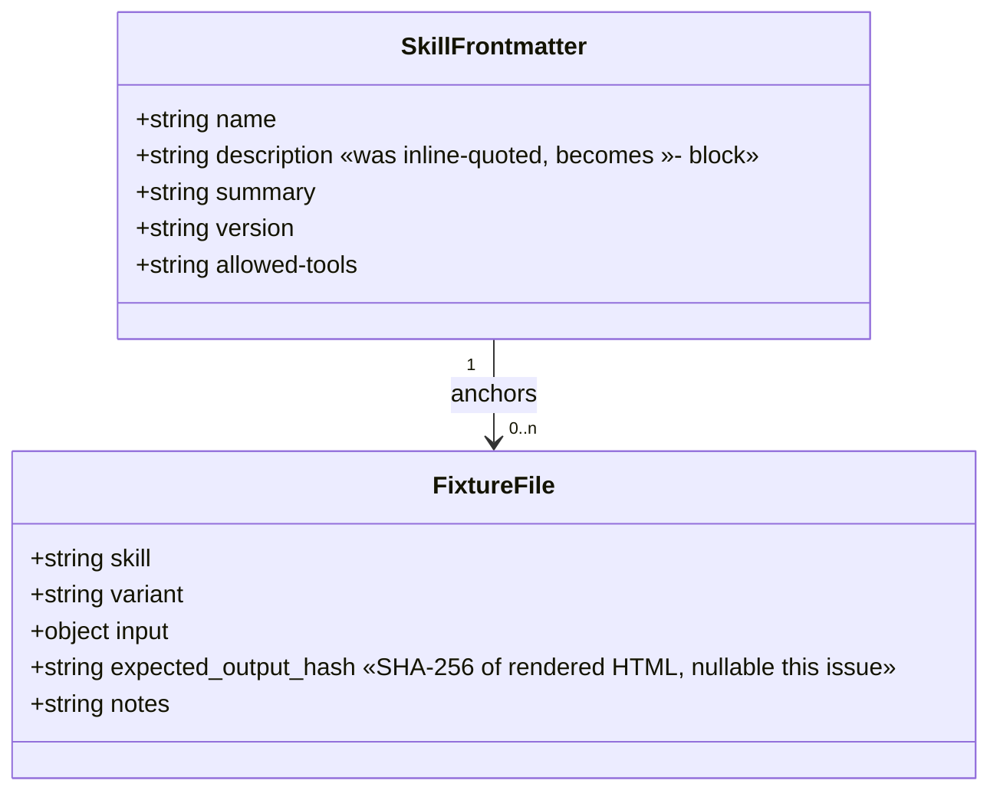
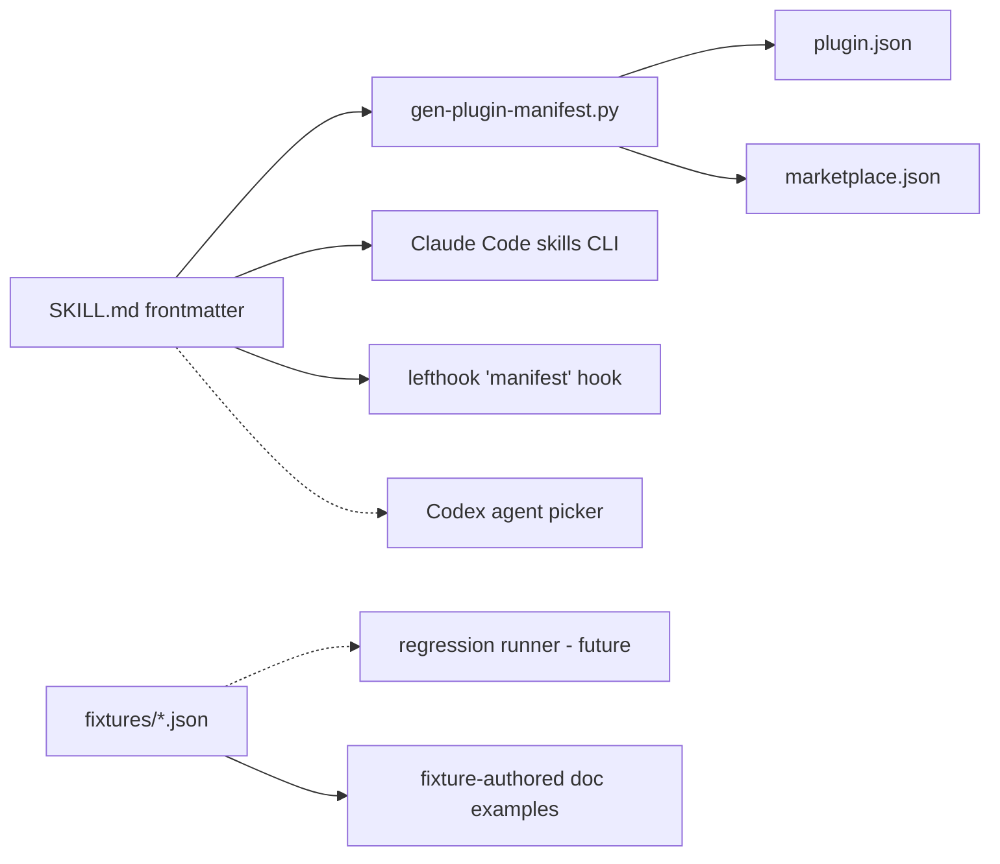

## Context

Promoted from [frame](../frames/10-harden-skill-frontmatter-frame.mdx). Audit of [`fireworks-tech-graph`](https://github.com/yizhiyanhua-ai/fireworks-tech-graph) surfaced three patterns that apply to forge's 7 skills (note: issue body predates `forge-md` and `forge-slides` — scope now covers **all 7**):

1. Fragile single-quoted YAML `description:` fields — one future colon breaks silently.
2. No regression fixtures for high-drift skills (`forge-chart`, `forge-gallery`).
3. `forge-chart` (487 lines) and `forge-guide` (482 lines) carry inline tables that could offload to `references/`.

Related analysis: [`artifacts/analyses/2026-04-12-competitor-skills-analysis.md`](../analyses/2026-04-12-competitor-skills-analysis.md).

## Goal

Make forge's skill metadata parser-proof, drift-detectable, and compact — without changing any skill's runtime behavior.

## Users

- **Primary:** Mickael (maintainer) — add/edit triggers without YAML debugging; catch output regressions across versions.
- **Secondary:** Plugin installers (Claude Code skills CLI, Codex agent picker, manifest generator, lefthook `manifest` hook) — parse frontmatter reliably regardless of content.

## Expected Behavior

- Author edits a SKILL.md `description:` to add a trigger like `"what's in file://"` — the file still parses; no quote-escape dance required.
- Author runs `scripts/gen-plugin-manifest.py` — it reads the new `>-` blocks via `yaml.safe_load` and produces identical `plugin.json`/`marketplace.json` output to today.
- Author changes a prompt pattern in `forge-chart` — re-running the skill against the shipped fixtures produces a byte-identical (or whitelisted-diff) output; any unexpected drift is visible.
- Author reads `forge-chart/SKILL.md` or `forge-guide/SKILL.md` — both ≤ 400 lines, with bulky decision matrices offloaded to `references/` and loaded via a one-line directive.

## Data Model & Consumers

### Frontmatter schema (SKILL.md)

Only `description`'s YAML *form* changes (inline single-quoted → `>-` block scalar). The string value it yields is unchanged.

### Consumer map

Solid = in scope this issue. Dashed = out of scope but field accessibility must be preserved.

### Consumer summary

| Consumer | Fields consumed | When | Status |
|---|---|---|---|
| `gen-plugin-manifest.py` | `name`, `summary` (+ `version` from plugin.json) | pre-commit, manual | this issue (parses `>-` verbatim) |
| Claude Code skills CLI | `name`, `description`, `allowed-tools` | skill load / trigger match | this issue (more robust) |
| lefthook `manifest` hook | entire frontmatter | pre-commit on SKILL.md change | this issue (unchanged) |
| Codex agent picker | `description` | external tooling | future (benefits passively) |
| regression runner | `fixtures/*.json` | future CI hook | future (infra only this issue) |

## Breadboard

### Affordances (P1 — YAML form)

| ID | Where | Change | Handler |
|---|---|---|---|
| N1 | 7 × `SKILL.md` frontmatter | `description: '...'` → `description: >-\n  ...` (frame says 5 — issue body predates `forge-md` + `forge-slides`; actual count is 7) | manual edit |
| N2 | `scripts/gen-plugin-manifest.py` | verify round-trip unchanged | existing `--check` mode |
| N3 | `lefthook.yml` `manifest` hook | confirm still green | existing hook |

### Affordances (P2 — fixtures)

| ID | Where | Change | Handler |
|---|---|---|---|
| N4 | `plugins/forge/skills/forge-chart/fixtures/` (new) | ≥ 3 fixtures (one per chart kind: mermaid, fgraph, plain-CSS) | hand-authored JSON |
| N5 | `plugins/forge/skills/forge-gallery/fixtures/` (new) | ≥ 4 fixtures (pivot, simple, comparison, audio) | hand-authored JSON |
| N6 | `plugins/forge/skills/*/SKILL.md` (chart + gallery only) | add one-line `Fixtures: see fixtures/README.md` reference | manual edit |
| N7 | `fixtures/README.md` per skill | document fixture format + how to regenerate | new docs |

### Affordances (P3 — compression)

| ID | Where | Change | Handler |
|---|---|---|---|
| N8 | `forge-chart/SKILL.md` | identify ≥ 1 offloadable table; move to `references/<name>.md`; replace with `Read references/<name>.md before <action>.` in the skill body — directive is **executed** by the agent, not merely referenced | manual refactor |
| N9 | `forge-guide/SKILL.md` | same pattern as N8 | manual refactor |
| N10 | `forge-chart/references/`, `forge-guide/references/` | new reference files (content preserved verbatim, whitespace normalization excepted) | new docs |

### Wiring

- N1 → N2 (manifest generator re-runs successfully) → N3 (pre-commit green) — this is the acceptance chain for P1.
- N4,N5 → N6 (reference surfaced in SKILL.md) → N7 (README explains format) — P2 self-contained.
- N8,N9 → N10 (offloaded content preserved) — P3 self-contained, line-count assertion is the gate.

## Slices

| # | Slice | Affordances | Demo |
|---|---|---|---|
| S1 | P1 — YAML hardening | N1, N2, N3 | 7 SKILL.md files diff shows only `description:` form change; `gen-plugin-manifest.py --check` exits 0; pre-commit hook green. |
| S2 | P2 — fixture infra | N4, N5, N6, N7 | Two new `fixtures/` dirs with ≥ 7 fixtures total; SKILL.md references them; README explains format. Zero behavior change in the skills themselves. |
| S3 | P3 — compression | N8, N9, N10 | `forge-chart/SKILL.md` and `forge-guide/SKILL.md` each drop by ≥ 25% line count; offloaded content lives verbatim in `references/`; no information lost. |

Slices are independently shippable — each could merge as a separate PR. Default plan: single PR, three commits (one per slice).

## Success Criteria

### P1 — YAML hardening (S1)

- [ ] All 7 skills under `plugins/forge/skills/*/SKILL.md` use `description: >-` block scalar form.
- [ ] `yaml.safe_load` of each migrated frontmatter yields identical string values to pre-migration (verified by diffing the generator's output).
- [ ] `scripts/gen-plugin-manifest.py --check` exits 0 post-migration with no changes to `plugin.json` or `marketplace.json`.
- [ ] `lefthook run pre-commit` passes on the migration commit.
- [ ] No SKILL.md uses inline single- or double-quoted `description:` after this slice.

### P2 — fixture infra (S2)

- [ ] `plugins/forge/skills/forge-chart/fixtures/` contains ≥ 3 JSON fixtures (one each for: mermaid, fgraph, plain-CSS).
- [ ] `plugins/forge/skills/forge-gallery/fixtures/` contains ≥ 4 JSON fixtures (one each for: pivot, simple, comparison, audio).
- [ ] Each fixture has keys: `skill`, `variant`, `input`, `expected_output_hash` (nullable in this issue — algorithm when populated: SHA-256 of rendered HTML output; no hash-validation check runs this issue), `notes`.
- [ ] Each of those two skills has a `fixtures/README.md` explaining format + "how to regenerate hashes" (placeholder — runner is future work).
- [ ] `forge-chart/SKILL.md` and `forge-gallery/SKILL.md` carry a one-line reference pointing at `fixtures/`.

### P3 — compression (S3)

- [ ] `forge-chart/SKILL.md` ≤ 365 lines (25% reduction from 487).
- [ ] `forge-guide/SKILL.md` ≤ 361 lines (25% reduction from 482).
- [ ] Content moved to `references/` is byte-preserved, verified by `diff -u <(cat old-block) <(cat new-ref-file)` showing zero content-bearing changes (whitespace normalization excepted).
- [ ] Each offloaded block is replaced by a `Read references/<name>.md before <action>.` instruction in the skill body — the agent is required to load the reference, not just know it exists.

### Cross-slice

- [ ] `make -C plugins/forge deploy` succeeds post-migration.
- [ ] `./sync-plugins.sh --local` succeeds and cached skills parse identically.
