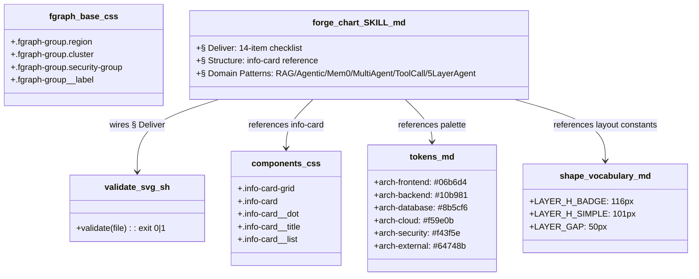
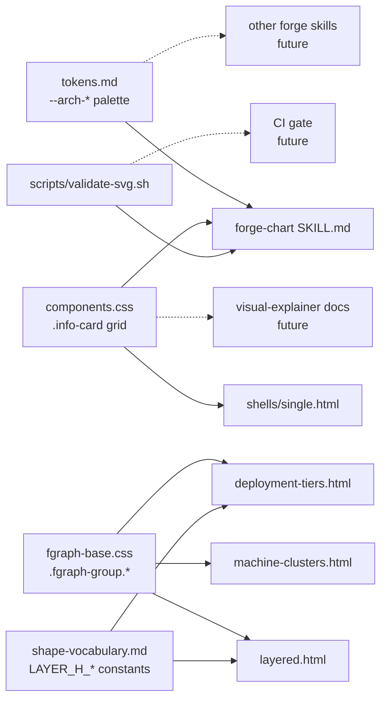

## Context

- **Frame:** [12-tier-1-audit-lift-frame.mdx](../frames/12-tier-1-audit-lift-frame.mdx)
- **Source analyses:**
  - [2026-04-12-competitor-skills-analysis.md](../analyses/2026-04-12-competitor-skills-analysis.md)
  - [2026-04-14-gmdiagram-delta-analysis.md](../analyses/2026-04-14-gmdiagram-delta-analysis.md)
- **Prior pattern:** closed #5 Tier-1 lift bundle.
- **Excludes:** #10 (fireworks frontmatter/fixtures/compression), #11 (forge-slides polish), deferred #7 (auto-layout, JSON IR).

## Goal

Add seven small, sourced, additive capabilities across `plugins/forge/` so that `forge-chart` ships with a Deliver-phase pre-flight gate, semantic color tokens, summary info-card primitives, boundary/cluster group selectors, an SVG validator, an AI-domain primer, and pixel-exact layout constants.

## Users

- **Primary:** forge skill authors writing `forge-chart` outputs — need checkable Deliver gate, semantic tokens, boundary groups, and domain-patterns primer.
- **Secondary:** downstream forge outputs (gallery pages, doc decks) that consume fgraph + components.css primitives.

## Expected Behavior

When an author runs `forge-chart` after this change:

1. Authoring an architecture diagram → they can reach for `--arch-frontend`, `--arch-backend`, `--arch-database`, `--arch-cloud`, `--arch-security`, `--arch-external` tokens documented in `tokens.md`.
2. Needing a cluster frame → they can wrap fgraph nodes in `.fgraph-group.region` / `.cluster` / `.security-group` with dashed frames + group labels.
3. Needing a summary row → they can use the 3-col info-card grid documented in `components.css` + `shells/single.html`, referenced from `forge-chart/SKILL.md § Structure`.
4. Building a layered diagram → they consult `shape-vocabulary.md` for `LAYER_H_BADGE=116px`, `LAYER_H_SIMPLE=101px`, `gap=50px`; `layered.html` and `deployment-tiers.html` apply them.
5. Drafting an AI-domain diagram (RAG, Agentic, Mem0, Multi-Agent, Tool Call, 5-layer Agent Arch) → they consult the new "Domain Patterns" section in `forge-chart/SKILL.md`.
6. Finishing a diagram → `forge-chart § Deliver` enumerates a 14-item pre-flight checklist; `plugins/forge/scripts/validate-svg.sh <file>` runs as the mechanical gate (tag balance, attr quotes, marker refs, path data, rsvg-convert compat) with graceful degradation if tools are absent.

No existing output or skill API changes. Additions are backward-compatible.

## Data Model & Consumers

### Additions (structure)

### Consumers

### Consumer summary

| Consumer | Fields/selectors | When | Status |
|---|---|---|---|
| `forge-chart/SKILL.md` § Deliver | 14-item checklist, `validate-svg.sh` call | every chart generation | this issue |
| `forge-chart/SKILL.md` § Structure | `.info-card*` reference | when author needs summary row | this issue |
| `forge-chart/SKILL.md` § Domain Patterns | 6 AI patterns primer | when drafting AI-domain diagrams | this issue |
| `graph-templates/layered.html` | `LAYER_H_BADGE`, `LAYER_H_SIMPLE`, `LAYER_GAP`, `.fgraph-group.*` | layered archs | this issue |
| `graph-templates/deployment-tiers.html` | same as layered | dev/staging/prod stripes | this issue |
| `graph-templates/machine-clusters.html` | `.fgraph-group.*` (frames only) | multi-host archs | this issue |
| `shells/single.html` | `.info-card-grid` usage | summary row in single-file output | this issue |
| Other forge skills | `--arch-*` palette | when drawing arch diagrams | future (opt-in) |
| Visual-explainer docs | `.info-card-grid` | docs landing pages | future (opt-in) |
| CI gate | `validate-svg.sh` | on commit | future (out of scope) |

## Breadboard

### Affordances

| ID | Affordance | Location | Handler / data |
|---|---|---|---|
| N1 | Semantic palette tokens | `references/tokens.md` | 6 `--arch-*` CSS vars + doc table (name, use, hex) |
| N2 | Info-card grid primitive | `references/base/components.css` | `.info-card-grid{display:grid;grid-template-columns:repeat(3,1fr);gap:var(--sp-4)}` + card elements |
| N3 | Info-card usage example | `references/shells/single.html` | HTML snippet in commented reference region |
| N4 | Boundary/cluster selectors | `references/graph-templates/fgraph-base.css` | `.fgraph-group.{region,cluster,security-group}` + `.fgraph-group__label` |
| N5 | Layout constants | `references/shape-vocabulary.md` (new § Pixel-exact layout) | 3 constants with rationale |
| N6 | Layered template update | `graph-templates/layered.html` | `--layer-h` + `--layer-gap` CSS vars sourced from constants |
| N7 | Deployment-tiers template update | `graph-templates/deployment-tiers.html` | same pattern as N6 |
| N8 | Quality checklist § | `skills/forge-chart/SKILL.md § Deliver` | 14-item `- [ ]` checklist |
| N9 | Domain patterns § | `skills/forge-chart/SKILL.md` new § | primer: RAG, Agentic, Mem0, Multi-Agent, Tool Call, 5-layer Agent Arch |
| N10 | Structure § reference | `skills/forge-chart/SKILL.md § Structure` | 1 line pointing at N2/N3 + N1 + N5 |
| N11 | SVG validator script | `plugins/forge/scripts/validate-svg.sh` | bash; checks tag balance, attr quotes, marker refs, path data, rsvg-convert compat; `exit 0` on pass |
| N12 | Validator wire-up | `skills/forge-chart/SKILL.md § Deliver` | final step: `bash ${CLAUDE_PLUGIN_ROOT}/scripts/validate-svg.sh <file>` |

### Wiring rules

- N1, N2, N4, N5 are additive; no existing selectors renamed.
- N6, N7 keep existing layout; only replace magic numbers with CSS vars + doc reference to N5.
- N8–N10, N12 are appends to existing sections or new sections inside one file (`forge-chart/SKILL.md`).
- N11 is new; no existing script is touched.
- N11 must degrade gracefully: if `rsvg-convert` or `xmllint` is absent, print a yellow "skipped: tool missing" and `exit 0` so author workflow is not broken.

## Slices

| # | Slice | Affordances | Demo-able outcome |
|---|-------|-------------|-------------------|
| 1 | References library additions | N1, N2, N4, N5, N6, N7 | `grep -r '--arch-frontend' plugins/forge/references/tokens.md`, `grep '.fgraph-group.region' fgraph-base.css`, `grep LAYER_H_BADGE shape-vocabulary.md`, diff layered.html shows var-driven heights |
| 2 | SVG validator + graceful fallback | N11 | `bash plugins/forge/scripts/validate-svg.sh samples/good.svg` exits 0; bad.svg exits 1; missing `rsvg-convert` prints skipped + exits 0 |
| 3 | forge-chart SKILL.md wiring | N3, N8, N9, N10, N12 | `grep -A2 '## Deliver' SKILL.md` shows 14-item checklist + validator call; `## Domain Patterns` section exists; `## Structure` references info-card + tokens + layout constants; `shells/single.html` has info-card example comment |

Order: 1 → 2 → 3 (SKILL.md wiring last because it references the primitives built in 1 and 2).

## Success Criteria

- [ ] `plugins/forge/references/tokens.md` defines 6 `--arch-*` CSS variables (frontend, backend, database, cloud, security, external) with hex values matching the sourced palette and a one-line use description each.
- [ ] `plugins/forge/references/base/components.css` defines `.info-card-grid`, `.info-card`, `.info-card__dot`, `.info-card__title`, `.info-card__list` and an example is present (as an HTML comment) in `plugins/forge/references/shells/single.html`.
- [ ] `plugins/forge/references/graph-templates/fgraph-base.css` defines `.fgraph-group`, `.fgraph-group.region`, `.fgraph-group.cluster`, `.fgraph-group.security-group`, `.fgraph-group__label` with dashed frames and named variants.
- [ ] `plugins/forge/references/shape-vocabulary.md` contains a "Pixel-exact layout" section with `LAYER_H_BADGE=116px`, `LAYER_H_SIMPLE=101px`, `LAYER_GAP=50px` and rationale.
- [ ] `plugins/forge/references/graph-templates/layered.html` and `deployment-tiers.html` use CSS vars `--layer-h` / `--layer-gap` whose defaults match the constants in `shape-vocabulary.md`.
- [ ] `plugins/forge/skills/forge-chart/SKILL.md § Deliver` includes a 14-item `- [ ]` quality checklist covering foreignObject xmlns, layer gaps, CSS class enforcement, viewBox fit, escaping, connection routing, legend/title accuracy.
- [ ] `plugins/forge/skills/forge-chart/SKILL.md § Deliver` ends with a call to `bash ${CLAUDE_PLUGIN_ROOT}/scripts/validate-svg.sh <output>` as the last mechanical gate.
- [ ] `plugins/forge/skills/forge-chart/SKILL.md § Structure` references the info-card primitive, the `--arch-*` palette, and the pixel-exact layout constants.
- [ ] `plugins/forge/skills/forge-chart/SKILL.md` contains a new `## Domain Patterns` section covering RAG, Agentic Search, Mem0, Multi-Agent, Tool Call, 5-layer Agent Architecture, memory tiers, and arrow semantics (data/control/memory/feedback).
- [ ] `plugins/forge/scripts/validate-svg.sh` exists, is executable, and checks: tag balance, attribute quotes, marker refs, path data, rsvg-convert compat; exits 0 on pass, 1 on fail, 0 with a "skipped" note if required tools are absent.
- [ ] `scripts/gen-plugin-manifest.py --check` still passes (no frontmatter drift).
- [ ] `./sync-plugins.sh --local` succeeds after changes.
