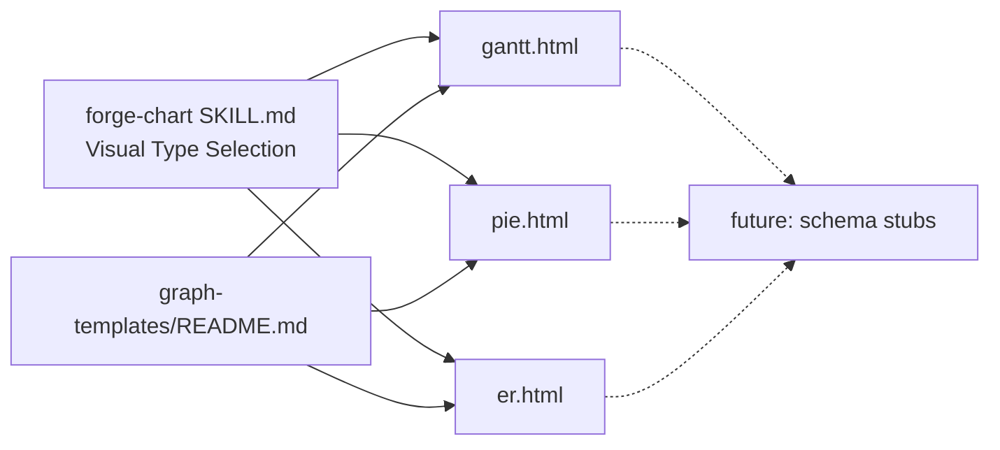

## Context

- **Frame:** [13-diagram-types-p1-frame.mdx](../frames/13-diagram-types-p1-frame.mdx)
- **Source analysis:** [2026-04-14-gmdiagram-delta-analysis.md § D3](../analyses/2026-04-14-gmdiagram-delta-analysis.md)
- **Prior pattern:** #12 (Tier-1 audit lift) — same "additive to `plugins/forge/references/` + SKILL.md reference update" shape.
- **Excludes:** P2/P3 inline-SVG types (UML class, radar, funnel, bubble, scatter) — follow-up issue; PNG/PDF export (#D4); JSON IR two-step (deferred #7).

## Goal

Add three Mermaid-backed diagram types (Gantt, pie, ER) to `forge-chart` by shipping three copy-paste templates under `plugins/forge/references/graph-templates/`, wiring them into the `forge-chart/SKILL.md` Visual Type Selection table, and listing them in the `graph-templates/README.md` Showcase + Templates table.

## Users

- **Primary:** forge skill authors using `forge-chart` who need a timeline (Gantt), proportion (pie), or entity-relationship (ER) diagram — get a drop-in Mermaid template + a Visual Type Selection row pointing at it.
- **Secondary:** downstream artifact consumers (spec decks, roadmap docs, schema READMEs) — can embed these three shapes inline without leaving the forge toolchain.

## Expected Behavior

When an author runs `forge-chart` after this change and needs a timeline / proportion / schema diagram:

1. They consult `forge-chart/SKILL.md § Structure — Which visual type?`. Three new rows point at Mermaid `gantt`, Mermaid `pie`, Mermaid `erDiagram` respectively, with a one-line "Why".
2. They copy the matching template from `plugins/forge/references/graph-templates/` (`gantt.html`, `pie.html`, `er.html`). Each is a self-contained single-file HTML doc: mermaid CDN, `.diagram-shell` wrapper, `.zoom-controls`, a placeholder-filled Mermaid block, matching diagram-meta header.
3. They fill placeholders (title, date, task rows / slices / entities).
4. The output renders `file://`-safely via Mermaid auto-layout — no pixel math, no custom SVG.

No changes to existing chart types, existing templates, or skill contracts. All additions are backward-compatible.

## Data Model & Consumers

### Additions (structure)

```mermaid
classDiagram
    class gantt_html {
      +diagram-meta header
      +.diagram-shell + .zoom-controls
      +mermaid gantt block (3 sections, ~8 tasks)
      +{{TITLE}} {{DATE}} {{SECTION_*}} {{TASK_*}} placeholders
    }
    class pie_html {
      +diagram-meta header
      +.diagram-shell + .zoom-controls
      +mermaid pie block (~5 slices)
      +{{TITLE}} {{SLICE_*_LABEL}} {{SLICE_*_VALUE}} placeholders
    }
    class er_html {
      +diagram-meta header
      +.diagram-shell + .zoom-controls
      +mermaid erDiagram block (~4 entities, 3 relationships)
      +{{TITLE}} {{ENTITY_*}} {{RELATION_*}} placeholders
    }
    class forge_chart_SKILL_md {
      +§ Structure — Visual Type Selection table
      +3 new rows: Gantt, pie, ER
    }
    class graph_templates_README_md {
      +§ Showcase: 3 new entries
      +§ Templates table: 3 new rows
    }
    forge_chart_SKILL_md --> gantt_html : "row → template"
    forge_chart_SKILL_md --> pie_html   : "row → template"
    forge_chart_SKILL_md --> er_html    : "row → template"
    graph_templates_README_md --> gantt_html : lists
    graph_templates_README_md --> pie_html   : lists
    graph_templates_README_md --> er_html    : lists
```

### Consumers



### Consumer summary

| Consumer | Fields / references | When | Status |
|---|---|---|---|
| `forge-chart/SKILL.md § Structure — Visual Type Selection` | 3 new rows (Gantt / pie / ER) | author picks visual type | this issue |
| `references/graph-templates/README.md § Showcase` | 3 new entries with screenshots/preview text | author browsing templates | this issue |
| `references/graph-templates/README.md § Templates` | 3 new rows (when to use, size, key features) | author choosing a template | this issue |
| `forge-chart/SKILL.md § Deliver` Rendering wrappers | already covers Mermaid (`.diagram-shell` + zoom) — verify Gantt/pie/ER inherit this | every chart generation | existing (verify only) |
| JSON schema stubs | optional — deferred | authoring structured input | future (out of scope) |
| P2/P3 inline-SVG types | UML class, radar, funnel, bubble, scatter | authoring richer data charts | follow-up issue |

## Breadboard

### Affordances

| ID | Affordance | Location | Handler / data |
|---|---|---|---|
| N1 | Gantt template | `plugins/forge/references/graph-templates/gantt.html` | Single-file HTML, mermaid CDN, `.diagram-shell` + `.zoom-controls`, `gantt` block with 3 sections × ~3 tasks, placeholder-filled, diagram-meta header |
| N2 | Pie template | `plugins/forge/references/graph-templates/pie.html` | Same shell, `pie` block with ~5 slices, placeholders |
| N3 | ER template | `plugins/forge/references/graph-templates/er.html` | Same shell, `erDiagram` block with ~4 entities + 3 relationships, placeholders |
| N4 | Visual Type Selection rows | `plugins/forge/skills/forge-chart/SKILL.md § Structure — Which visual type?` (~L77 table after `stateDiagram-v2` row) | 3 new rows: Gantt (timeline/schedule → `gantt`), Pie (proportion → `pie`), ER (entity-relationship schema → `erDiagram`) |
| N8 | Footer patch (pre-existing staleness) | `plugins/forge/references/graph-templates/README.md` L432 footer | Replace "All three templates share the same `fgraph-base.css` primitives." with a scoped form that names fgraph templates only; Mermaid templates (Gantt/pie/ER) are explicitly not in that set |
| N5 | README Showcase entries | `plugins/forge/references/graph-templates/README.md § Showcase` | 3 new sub-sections following existing pattern (title, 1-paragraph description, use-case example) |
| N6 | README Templates table rows | `plugins/forge/references/graph-templates/README.md § Templates` | 3 new rows (Template file, When to use, Size, Key features) |
| N7 | README Shape-picker table rows | `plugins/forge/references/graph-templates/README.md § Shape picker` | 3 new rows (diagram shape → template filename) |

### Wiring rules

- N1–N3 are self-contained HTML files — no dependencies on `fgraph-base.css` or `gallery-base.*`. Inline-only (per the distribution rule for new reference sub-trees, a Mermaid block is its own rendering — no shared CSS needed beyond mermaid CDN).
- N4 adds rows **without reordering** existing rows in the Visual Type Selection table. New rows slot after "State machine" (line ~82) so the Mermaid cluster stays contiguous.
- N5–N7 are appends to existing sections in `README.md`. Templates table preserves existing column order (Template / When to use / Size / Key features).
- No schema stubs in this issue (out of scope per frame).
- No changes to `fgraph-base.css`, `components.css`, `tokens.md`, or any existing template file.
- Mermaid wrapper rule from `forge-chart § Deliver` already covers the new types — each template must wrap its Mermaid block in `.diagram-shell` with `.zoom-controls` (spec check N1.c, N2.c, N3.c).

## Slices

| # | Slice | Affordances | Demo-able outcome |
|---|-------|-------------|-------------------|
| 1 | Three Mermaid templates | N1, N2, N3 | `ls plugins/forge/references/graph-templates/{gantt,pie,er}.html` lists all three; opening each in a browser renders a valid Mermaid diagram with `.diagram-shell` + zoom controls |
| 2 | forge-chart wiring | N4 | `grep -A1 'gantt' plugins/forge/skills/forge-chart/SKILL.md`, `grep -A1 ' pie' SKILL.md`, `grep -A1 'erDiagram' SKILL.md` each return a Visual Type Selection row |
| 3 | README discovery surface + footer patch | N5, N6, N7, N8 | `grep -E '^### (Gantt|Pie|ER)' plugins/forge/references/graph-templates/README.md` returns 3 lines; Templates table and Shape-picker each gain 3 rows citing `gantt.html`/`pie.html`/`er.html`; L432 footer no longer claims "All three templates share… `fgraph-base.css`" unconditionally |

Order: 1 → 2 → 3 (SKILL.md + README reference the templates built in slice 1; README wiring follows so it can cite the final filenames).

## Success Criteria

- [ ] `plugins/forge/references/graph-templates/gantt.html` exists; `grep -c 'cdn.jsdelivr.net/npm/mermaid' gantt.html` ≥ 1; `grep -c '<div class="diagram-shell"' gantt.html` ≥ 1; `grep -c '```mermaid' gantt.html` = 0 (no markdown fences); contains a `gantt` block with ≥ 2 `section` lines and ≥ 5 task lines.
- [ ] `plugins/forge/references/graph-templates/pie.html` exists; same mermaid CDN + `.diagram-shell` greps; contains a `pie` block with ≥ 3 slice lines (`"<label>" : <number>`).
- [ ] `plugins/forge/references/graph-templates/er.html` exists; same mermaid CDN + `.diagram-shell` greps; contains an `erDiagram` block with ≥ 3 entity declarations and ≥ 2 relationship lines (matching `\|\|--o\{|\|\|--\|\||\}o--o\{`).
- [ ] Each of the three template files has an HTML comment `diagram-meta` block declaring, at minimum, the keys `title`, `date`, `category`, `color` (same convention as existing templates in the folder).
- [ ] Each template wraps its Mermaid block in `.diagram-shell` with `.zoom-controls` — never bare `<pre class="mermaid">` (anti-pattern check from `forge-chart/SKILL.md § Deliver`).
- [ ] `plugins/forge/skills/forge-chart/SKILL.md § Structure — Which visual type?` table (starting ~L77) gains exactly 3 new rows: Gantt → Mermaid `gantt` | Pie → Mermaid `pie` | ER → Mermaid `erDiagram`, each with a one-line "Why"; inserted after the existing `stateDiagram-v2` row so the Mermaid cluster stays contiguous.
- [ ] `plugins/forge/references/graph-templates/README.md § Showcase` gains exactly 3 new `### `-level sub-sections (`### Gantt`, `### Pie`, `### ER`), each with a 1-paragraph description and an example use case.
- [ ] `plugins/forge/references/graph-templates/README.md § Templates` table gains exactly 3 new rows with Template / When to use / Size / Key features columns filled for `gantt.html`, `pie.html`, `er.html`.
- [ ] `plugins/forge/references/graph-templates/README.md § Shape picker` table gains 3 new rows mapping diagram shape → template filename for the three new templates.
- [ ] `plugins/forge/references/graph-templates/README.md` L432-ish footer that reads "All three templates share the same `fgraph-base.css` primitives." is replaced with a form that scopes the claim to fgraph templates only (and thus excludes the new Mermaid templates).
- [ ] No existing file is modified except `plugins/forge/skills/forge-chart/SKILL.md` and `plugins/forge/references/graph-templates/README.md`. Specifically: no edits to `fgraph-base.css`, `components.css`, `tokens.md`, `shape-vocabulary.md`, or any existing `*.html` template.
- [ ] `scripts/gen-plugin-manifest.py --check` still passes (no SKILL.md frontmatter drift).
- [ ] `./sync-plugins.sh --local` succeeds after changes.
