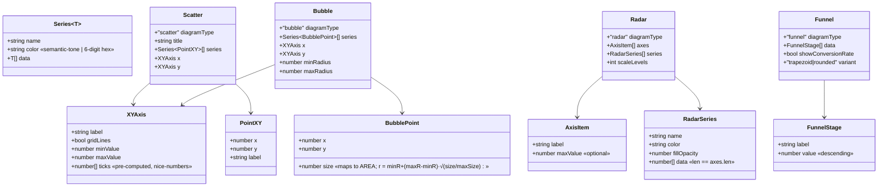
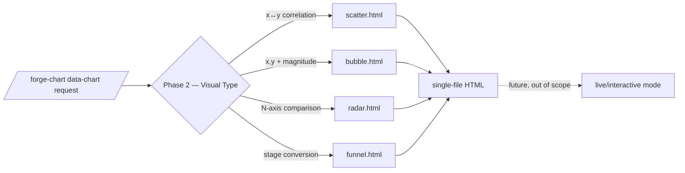

## Context

Promoted from [frame](../frames/20-inline-svg-charts-frame.mdx). `forge-chart` has 15
relational fgraph diagram types but no quantitative data-chart primitives. This spec
adds **4 inline-SVG data-charts** — scatter, bubble, radar, funnel — as native,
no-runtime templates. UML class (the 5th original type) is out of scope → `forge-mermaid`
epic #40 P4.

Data models are grounded in the upstream gmdiagram schemas
(`external_repos/gmdiagram/gm-data-chart/skills/gm-data-chart/assets/schema-{scatter,bubble,radar,funnel,shared}.json`).

## Goal

`/forge-chart` can render scatter / bubble / radar / funnel charts from data into a
self-contained, `file://`-safe HTML artifact that matches the forge visual identity.

## Users

- **Primary:** Claude via `/forge-chart` — fills a vetted template instead of hand-rolling SVG geometry.
- **Secondary:** artifact consumers — get offline, brand-consistent data-viz.

## Expected Behavior

1. User asks for a data chart ("scatter of x vs y", "conversion funnel", "radar comparing A/B across N dims").
2. Phase 2 (Visual Type) routing matches the request to one of the 4 new templates.
3. Claude reads the template's **golden example** (mandatory anchor), computes the data
   geometry (point coords, polygon vertices, trapezoid stops, nice-number ticks), and
   fills the placeholders.
4. Output is a single-file HTML chart in a `0..100` SVG space, strokes crisp via
   `vector-effect: non-scaling-stroke`, circles/polygons undistorted (uniform aspect plot area).
   All text (axis titles, tick labels, point labels) is authored **inside the `<svg>`** in
   user-unit coordinates — mirrors `pie.html`; never HTML positioned outside the SVG (avoids
   coordinate drift on non-square containers).
5. No JS runtime, no CDN — opens correctly via `file://`.

## Data Model & Consumers

Core types (distilled from gmdiagram `schema-shared.json` + per-type schemas). Forge
templates consume a **subset** — author-facing fields only; `metadata.author`,
`format`, and style-engine internals are dropped.

| Consumer | Fields consumed | When | Status |
|---|---|---|---|
| `forge-chart` Phase 2 router | `diagramType` / request intent | type selection | this issue |
| 4 templates | axes, series, points, stages, ticks | fill placeholders | this issue |
| SVG validator (#12) | rendered SVG | CI / validate | this issue |
| forge live mode | (none yet) | future | out of scope (#50/#52 fgraph-only) |

## Breadboard

Affordances = the data-binding seams of each template + the routing/doc surfaces.

| ID | Affordance | Handler / mechanism | Data |
|---|---|---|---|
| N1 | Phase-2 visual-type table row (×4) | `forge-chart/SKILL.md` Structure + Phase 2 | request intent → template path |
| N2 | scatter plot area | `scatter.html` — square plot, value X+Y axes, gridlines, points | `series[].data[].{x,y}`, `ticks` |
| N3 | bubble plot area | `bubble.html` — extends N2 + area→radius sizing | `series[].data[].{x,y,size}`, `minRadius/maxRadius` |
| N4 | radar grid | `radar.html` — radial axes, concentric scale rings, filled series polygons | `axes[]`, `series[].data[]`, `scaleLevels` |
| N5 | funnel stack | `funnel.html` — descending trapezoid/rounded stages + conversion labels | `data[].{label,value}`, `showConversionRate` |
| N6 | golden example (×4) | `graph-templates/examples/{type}.html` — placeholder-free | realistic sample data |
| N7 | fixture (×4) | `forge-chart/fixtures/{type}.json` | sample input + expected-shape assertions |
| N8 | README surfaces | `graph-templates/README.md` Showcase + Templates table + Shape picker | 4 new rows |

## Slices

Vertical, each independently demo-able (renders a real chart end-to-end).

| # | Slice | Delivers | Demo |
|---|---|---|---|
| S1 | **Cartesian foundation + scatter + bubble** | shared value-axis/gridline/nice-ticks + uniform-aspect plot CSS; `scatter.html`, `bubble.html` + examples + fixtures + N1/N8 wiring for both | render a scatter and a bubble chart from sample data via `file://` |
| S2 | **Radar** | `radar.html` (radial grid, scale rings, filled polygons) + example + fixture + wiring | render a 5-axis, 2-series radar |
| S3 | **Funnel** | `funnel.html` (trapezoid + rounded variants, conversion labels) + example + fixture + wiring | render a 4-stage funnel with conversion % |

Order rationale: S1 establishes the cartesian/value-axis + circle-aspect foundation (the
riskiest geometry); bubble = scatter + area-sizing, so they co-ship. Radar is an
independent radial system. Funnel is geometrically trivial → last.

## Success Criteria

- [ ] `/forge-chart` routes scatter/bubble/radar/funnel intent to the 4 templates (SKILL.md Structure table + Phase 2 list updated).
- [ ] 4 templates exist at `references/graph-templates/{scatter,bubble,radar,funnel}.html` — single-file, `file://`-safe, **zero JS runtime / zero CDN**.
- [ ] All 4 render in a `0..100` SVG space with **uniform aspect** (circles stay circular), `vector-effect: non-scaling-stroke` on all strokes, **all text inside the `<svg>`**, and an accessible root (`<svg role="img">` + `<title>` + `aria-label`).
- [ ] Bubble radius is **area-proportional** via `r = minRadius + (maxRadius − minRadius)·√(size / maxSize)` (maxSize = max size across series), clamped to `[minRadius, maxRadius]` — clamping intentionally overrides area-proportionality at the bounds; radar vertices honor per-axis scale; funnel emits conversion-rate labels when `showConversionRate`.
- [ ] Each type ships a **placeholder-free golden example** in `graph-templates/examples/` matching the existing example format.
- [ ] Each type ships a **fixture** in `forge-chart/fixtures/` and passes the **SVG validator (#12)** with no errors.
- [ ] `graph-templates/README.md` updated: Showcase + Templates table + Shape picker each include the 4 new types.
- [ ] **No regression**: existing 15 fgraph golden examples + SVG validator still pass.

## Edge Cases

Templates are Claude-filled (not user-supplied JSON at runtime), so risk is low — but each
golden example + template comment must show the degenerate handling:

| Case | Handling |
|---|---|
| Empty series / zero data points | render axes + gridlines + empty plot (no crash, no `NaN` coords) |
| Funnel with 1 stage | single trapezoid, no conversion arrow |
| Radar with 2 axes | minimum valid polygon (a line/sliver) — still draws ring grid |
| Scatter/bubble single point | point centered to its `(x,y)`; ticks still bracket the lone value |
| `size = 0` (bubble) or negative | clamp to `minRadius`; never produce `r < 0` |
| All-equal axis values (flat range) | synth a ±1 padded range so ticks don't collapse to one value |

## Decisions (resolved — not blocking)

- **Sub-tree:** extend `references/graph-templates/` (not a new `data-chart-templates/`). Precedent: `pie.html` is already a no-runtime SVG data-chart there. → no new CLAUDE.md distribution-profile row; same inline-into-single-file profile.
- **Aspect ratio:** data-charts use a **uniform-scaled** square plot area (default `xMidYMid meet`), diverging from the fgraph edges layer's `preserveAspectRatio="none"`, so circles and radar polygons are not distorted.
- **Ticks:** Claude **pre-computes** nice-number ticks (mirrors gmdiagram; keeps zero runtime). Template documents the mini-algorithm in a comment **and a validity guard**: `ticks[0] ≤ min(axis data)` and `ticks[last] ≥ max(axis data)` — prevents silently clipping data points (a class the SVG validator, which checks well-formedness not data completeness, cannot catch).
- **Bubble radius:** concrete formula `r = minRadius + (maxRadius − minRadius)·√(size / maxSize)`; clamping to `[minRadius, maxRadius]` intentionally overrides strict area-proportionality at the bounds (disclosed in template comment).
- **Text & a11y:** all chart text lives inside the `<svg>` in user units (per `pie.html`); SVG root carries `role="img"` + `<title>` + `aria-label` (matches the #50 aria-label fallback convention).
- **Color:** series default to the fgraph **semantic-tone palette** (`--amber/--cyan/...`) for brand consistency; accept a 6-digit hex override per schema.
- **CSS:** each template inlines a compact `<style>` referencing the shared tone tokens; it does **not** depend on the full `fgraph-base.css` (charts need none of the node/edge/marker machinery).
