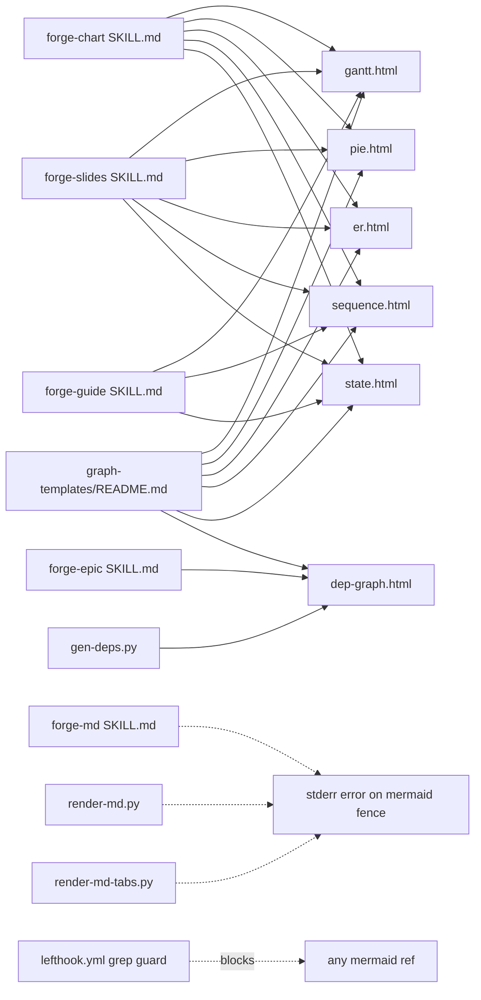

## Context

- **Frame:** [21-purge-mermaid-frame.mdx](../frames/21-purge-mermaid-frame.mdx)
- **Analysis:** [21-purge-mermaid-analysis.mdx](../analyses/21-purge-mermaid-analysis.mdx) — Shape 2 selected (templates + reusable fgraph primitives); Python-side layer assignment with elbow-routed paths for `gen-deps.py`; hard error on `` ```mermaid `` fences.
- **Supersedes:** #19 (Mermaid hardening) — closed during Phase 3.
- **Reverses:** Mermaid portions of #13 (commit `758fdd6`, 2026-04-14).
- **Related (out of scope):** #14 (PNG/PDF export), #20 (P2/P3 inline-SVG types), #7 (closed — auto-layout + JSON IR deferred).
- **Phasing:** 4 phases over 2 cycles — Cycle 1 ships P1 (build + soft deprecation); Cycle 2 ships P2 → P3 → P4 (migrate + delete + block).

## Goal

Eliminate all Mermaid usage from `plugins/forge/` by first building 6 native fgraph templates (`gantt`, `pie`, `er`, `sequence`, `state`, `dep-graph`) backed by 3 new `fgraph-base.css` primitives (date axis, crow's-foot markers, lifeline), then migrating 5 skills + 3 scripts + 2 CLAUDE.md files, then deleting all Mermaid source, then wiring a CI grep guard that blocks re-introduction.

## Users

- **Primary:** Mickael (forge author) + forge skill authors (`forge-chart`, `forge-slides`, `forge-epic`, `forge-guide`, `forge-md`) — gain six native templates consistent with the existing fgraph vocabulary; lose the 900 KB Mermaid runtime dependency and CDN requirement.
- **Secondary:** downstream artifact consumers (specs, roadmap decks, READMEs, issue dep graphs from `gen-deps.py`) — outputs render offline-safely (`file://`), paint faster, and theme uniformly via `fgraph-base.css` tokens.
- **Tertiary:** future contributors to forge — inherit a clear, documented default (6 visible templates + README promotion rule + SKILL.md Visual Type Selection table) so the native pattern is picked without judgment calls; the CI grep guard is the mechanism that enforces this, not the benefit.

## Expected Behavior

**Phase 1 (Cycle 1 — build):**

An author needing a timeline, proportion, schema, sequence, state machine, or large dep graph consults `forge-chart/SKILL.md § Visual Type Selection`. Rows point at native fgraph templates (`gantt.html`, `pie.html`, `er.html`, `sequence.html`, `state.html`, `dep-graph.html`). Author copies the template, fills `{{PLACEHOLDERS}}`, opens the result under `file://` — no CDN, no runtime, no network. Existing Mermaid templates still work; a deprecation banner on `base/mermaid-init.js` + a non-blocking lefthook warn flag new `mermaid` references as "scheduled for deletion."

**Phase 2 (Cycle 2 — migrate):**

Every skill's Mermaid row is replaced with its fgraph equivalent. `gen-deps.py` emits `dep-graph.html` (Python-side topological layer assignment + elbow-routed SVG paths; no mermaid.js at runtime). `render-md.py` and `render-md-tabs.py` drop the `mermaid_fence` handler; a `` ```mermaid `` code fence in a markdown input produces a clear stderr message (`mermaid fences are no longer supported; see plugins/forge/references/graph-templates/README.md`) and non-zero exit.

**Phase 3 (Cycle 2 — delete):**

`base/mermaid-init.js`, `references/mermaid-guide.md`, and the 3 Mermaid templates (`gantt.html`, `pie.html`, `er.html`) are deleted from `plugins/forge/`. `~/.claude/CLAUDE.md` and `~/projects/CLAUDE.md` lose the "> 8 nodes → Mermaid" lines. Issue #19 is closed as superseded.

**Phase 4 (Cycle 2 — guard):**

`lefthook.yml`'s pre-commit hook runs `grep -r "mermaid" plugins/forge/` and fails the commit on any match. New contributions cannot re-introduce Mermaid without deleting the guard, which becomes visible in review.

## Data Model & Consumers

### New fgraph primitives (added to `fgraph-base.css`)

```mermaid
classDiagram
    class fgraph_base_css {
      <<existing>>
      +6 shape modifiers: pill, circle, hexagon, diamond, cylinder, folded
      +5 tone classes: amber, cyan, purple, green, red
      +semantic edge classes: control, write, read, data, async, feedback
      +arrow markers: fg-arr-{tone}
    }
    class fg_axis_date {
      <<new primitive>>
      +--axis-start: date
      +--axis-end: date
      +SVG baseline + tick labels
      +CSS only (no runtime)
    }
    class fg_lifeline {
      <<new primitive>>
      +vertical dashed rule
      +.fg-lifeline-activation modifier box
      +pairs with top participant row
    }
    class fg_er_markers {
      <<new primitive>>
      +marker id fg-er-one      d=||
      +marker id fg-er-zero-one d=o|
      +marker id fg-er-many     d=o{
      +marker id fg-er-one-many d=}|
      +marker id fg-er-zero-many d=}o
    }
    fgraph_base_css <|-- fg_axis_date
    fgraph_base_css <|-- fg_lifeline
    fgraph_base_css <|-- fg_er_markers
```

### Six new templates

```mermaid
classDiagram
    class gantt_html {
      +diagram-meta header
      +<g class="fg-axis-date">
      +bars: <rect class="fg-gantt-bar">
      +3 sections × ~3 tasks
      +{{TITLE}} {{SECTION_*}} {{TASK_*_START}} {{TASK_*_DURATION}}
    }
    class pie_html {
      +diagram-meta header
      +<svg viewBox=0 0 100 100>
      +pre-computed arc paths (5 slices)
      +legend below
      +{{TITLE}} {{SLICE_*_LABEL}} {{SLICE_*_VALUE}}
    }
    class er_html {
      +diagram-meta header
      +entity boxes (HTML divs) + attribute rows
      +relationship paths w/ crow's-foot markers
      +endpoint-offset lookup table (by attribute count)
      +{{ENTITY_*}} {{ATTR_*_*}} {{REL_*}}
    }
    class sequence_html {
      +diagram-meta header
      +aspect-ratio: unset; height: calc(120px + var(--msg-count)*40px)
      +participant lifelines (.fg-lifeline)
      +message arrows (horizontal SVG paths)
      +{{PARTICIPANT_*}} {{MSG_*_FROM}} {{MSG_*_TO}} {{MSG_*_LABEL}}
    }
    class state_html {
      +diagram-meta header
      +state nodes (.fgraph-node.circle + .fgraph-node.diamond)
      +transition arrows (semantic edges)
      +{{STATE_*}} {{TRANS_*_FROM}} {{TRANS_*_TO}} {{TRANS_*_EVENT}}
    }
    class dep_graph_html {
      +diagram-meta header
      +phase columns (Python-assigned --x by phase index)
      +issue cards (--y by intra-phase index)
      +elbow-routed SVG paths
      +declarative: author data from gen-deps.py
    }
    class fgraph_base_css {
      <<consumes>>
    }
    gantt_html     --> fgraph_base_css : fg-axis-date
    pie_html       --> fgraph_base_css : tokens only
    er_html        --> fgraph_base_css : fg-er-markers
    sequence_html  --> fgraph_base_css : fg-lifeline
    state_html     --> fgraph_base_css : shapes + edges
    dep_graph_html --> fgraph_base_css : tokens + edges
```

### Consumer map



Solid = this issue; dashed = deletion / error path or external block.

### Consumer summary

| Consumer | Consumes | When | Status |
|---|---|---|---|
| `forge-chart/SKILL.md § Visual Type Selection` | 5 new rows pointing at `gantt/pie/er/sequence/state.html`; 3 Mermaid rows removed | author picks type | this issue P1 + P2 |
| `forge-slides/SKILL.md` | same 5 references + CDN allowlist loses `mermaid@11` | author builds deck | this issue P2 |
| `forge-epic/SKILL.md § Dependency diagram` | `dep-graph.html` via `gen-deps.py` | epic generation | this issue P2 |
| `forge-guide/SKILL.md § Tab diagrams` | `.diagram-shell` references dropped; native fgraph replaces | guide generation | this issue P2 |
| `forge-md/SKILL.md` | markdown fence handler prose updated | markdown render | this issue P2 |
| `scripts/gen-deps.py` | rewritten: `build_mermaid()` → `build_fgraph()` w/ elbow routing | roadmap render | this issue P2 |
| `scripts/render-md.py`, `render-md-tabs.py` | `mermaid_fence` + pymdownx.superfences config deleted; hard-error prose | any markdown → HTML | this issue P2 |
| `~/.claude/CLAUDE.md` | 1 line deleted ("> 8 nodes → Mermaid") | Claude session start | this issue P3 |
| `~/projects/CLAUDE.md` | 1 line deleted (same) | Claude session start | this issue P3 |
| `lefthook.yml` pre-commit | new `mermaid-guard` step | every commit | this issue P4 |
| `graph-templates/README.md` | Mermaid rows removed, 6 new template rows added, Shape picker updated | author browsing | this issue P1 + P3 |
| `plugins/forge/references/graph-templates/examples/` | 6 worked demos (one per template) | regression eyeball | this issue P1 |

## Breadboard

### Affordances

| ID | Affordance | Location | Handler / data |
|---|---|---|---|
| **P1 — build** | | | |
| P1.1 | `fg-axis-date` primitive | `plugins/forge/references/graph-templates/fgraph-base.css` (append) | `.fg-axis-date` + tick children; CSS-only; custom props `--axis-start-pct`, `--axis-end-pct` (authored pre-computed); doc comment explaining date→% mapping formula |
| P1.2 | `fg-lifeline` primitive | same file | `.fg-lifeline` (dashed vertical rule) + `.fg-lifeline-activation` modifier (solid rectangle); positioned via `--x` custom prop |
| P1.3 | `fg-er-*` crow's-foot markers | same file (`<marker>` block adjacent to existing `fg-arr-*`) | 5 new marker defs: `fg-er-one`, `fg-er-zero-one`, `fg-er-many`, `fg-er-one-many`, `fg-er-zero-many`; paths match Chen/crow's-foot convention |
| P1.4 | `gantt.html` template (native, ships at canonical name) | `plugins/forge/references/graph-templates/gantt.html` — **requires prior rename of Mermaid original to `gantt-mermaid.html` in slice 4** | Single-file HTML, inline `fgraph-base.css`, `<g class="fg-axis-date">` + `<rect class="fg-gantt-bar">` elements, 3 sections × ~3 tasks, `{{PLACEHOLDERS}}`, diagram-meta header |
| P1.5 | `pie.html` template (native, canonical name) | `plugins/forge/references/graph-templates/pie.html` — Mermaid original renamed to `pie-mermaid.html` in slice 4 | Same shell, inline `<svg viewBox="0 0 100 100">` with 5 pre-computed arc `<path>` elements, legend below, `{{SLICE_*_LABEL}}`/`{{SLICE_*_VALUE}}` placeholders; header comment documents arc-path computation |
| P1.6 | `er.html` template (native, canonical name) | `plugins/forge/references/graph-templates/er.html` — Mermaid original renamed to `er-mermaid.html` in slice 4 | Same shell, 4 entity HTML `<div>` boxes with attribute rows, relationship `<path>`s w/ crow's-foot `<marker>` refs, endpoint-offset lookup table in header comment (attributes-per-entity → anchor offset) |
| P1.7 | `sequence.html` template | `plugins/forge/references/graph-templates/sequence.html` | Same shell, `aspect-ratio: unset; height: calc(120px + var(--msg-count) * 40px)` override, 4 participants + 5 messages, lifelines via `.fg-lifeline`, message arrows as horizontal SVG paths; cap at 15 messages documented in header |
| P1.8 | `state.html` template | `plugins/forge/references/graph-templates/state.html` | Same shell, 4–6 state nodes (circle/diamond), transition arrows w/ semantic edge classes, start/end marker conventions |
| P1.9 | `dep-graph.html` template | `plugins/forge/references/graph-templates/dep-graph.html` | Same shell, phase-column header row, issue cards laid out via `--x`/`--y` (computed by `gen-deps.py`), elbow SVG paths for edges, ghost nodes for cross-phase deps |
| P1.10 | 6 worked demos | `plugins/forge/references/graph-templates/examples/{gantt,pie,er,sequence,state,dep-graph}.html` | One demo per template with realistic data (e.g. `gantt` shows this issue's 4-phase plan) |
| P1.11 | README updates (additive) | `plugins/forge/references/graph-templates/README.md` | 6 new Showcase sub-sections, 6 new Templates table rows, 6 new Shape picker rows; Mermaid rows kept until P3 |
| P1.12 | Soft deprecation banner | `plugins/forge/references/base/mermaid-init.js` (prepend) | JS comment block: `// DEPRECATED — scheduled for deletion in Cycle 2.` + link to issue #21 |
| P1.13 | Non-blocking lefthook warn | `lefthook.yml` pre-commit → new step `mermaid-deprecation-warn` | Runs `grep -rn '\bmermaid\b' plugins/forge/` on staged files; prints warning; exits 0 (non-blocking) |
| **P2 — migrate** | | | |
| P2.1 | `forge-chart/SKILL.md` | `plugins/forge/skills/forge-chart/SKILL.md` | Remove 3 Mermaid rows (gantt/pie/er); add 6 fgraph rows; replace Mermaid flowchart/sequence/state references with native equivalents; drop `.diagram-shell` references that load mermaid |
| P2.2 | `forge-slides/SKILL.md` | `plugins/forge/skills/forge-slides/SKILL.md` | Remove `mermaid@11` CDN allowlist entry; drop "Diagram slides with inline Mermaid" prose; replace with 6 fgraph template refs |
| P2.3 | `forge-epic/SKILL.md` | `plugins/forge/skills/forge-epic/SKILL.md` | Swap "Dependency diagrams via Mermaid wrapped in `.diagram-shell`" → `dep-graph.html`; drop `.diagram-shell` wrapper prose |
| P2.4 | `forge-guide/SKILL.md` | `plugins/forge/skills/forge-guide/SKILL.md` | Drop conditional Mermaid guide-tab pattern; reference fgraph templates for the 3 relevant visual types |
| P2.5 | `forge-md/SKILL.md` | `plugins/forge/skills/forge-md/SKILL.md` | Drop "Handles Mermaid rendering in markdown via `render-md*.py`"; add "Mermaid fences produce an error — see `graph-templates/README.md`" |
| P2.6 | `gen-deps.py` rewrite | `scripts/gen-deps.py` | Delete `build_mermaid()`, `CROSS_PHASE_STYLE`, `VIRTUAL_STYLE`, `domain_style()` Mermaid builders; add `build_fgraph(phase_id, all_issues, domains)` that emits `dep-graph.html` fragment: Python-side topological layer assignment + elbow-routed SVG paths + `--layout-overrides path.json` optional flag |
| P2.7 | `render-md.py` fence handler | `scripts/render-md.py:247-269` | Delete `mermaid_fence` function + pymdownx config entry; replace with error handler that prints to stderr and raises `SystemExit(1)` on any ` ```mermaid ` fence encountered |
| P2.8 | `render-md-tabs.py` fence handler | `scripts/render-md-tabs.py:274-297` | Same change |
| P2.9 | Plugin manifests regenerated | `.claude-plugin/marketplace.json`, `.claude-plugin/plugin.json` | Run `scripts/gen-plugin-manifest.py` after SKILL.md edits; bump `plugin.json.version` (minor) |
| **P3 — delete** | | | |
| P3.1 | Delete Mermaid templates | `plugins/forge/references/graph-templates/{gantt,pie,er}.html` (the Mermaid originals) | `git rm` — replaced in P1 by native versions at the same paths. Spec constraint: P1 new templates ship under distinct filenames during coexistence (see slice plan), renamed at P3 to take the canonical filenames |
| P3.2 | Delete Mermaid init | `plugins/forge/references/base/mermaid-init.js` | `git rm` |
| P3.3 | Delete Mermaid guide | `plugins/forge/references/mermaid-guide.md` | `git rm` |
| P3.4 | CLAUDE.md user-global | `~/.claude/CLAUDE.md` | Remove the "> 8 nodes or complex flow → **Mermaid**" bullet from the "Forge graph templates — lift, don't rebuild" decision rule |
| P3.5 | CLAUDE.md project | `~/projects/CLAUDE.md` | Remove the "> 8 nodes or complex flow → Mermaid" phrase in the "Diagrams & Visual Explainers" section |
| P3.6 | README cleanup | `plugins/forge/references/graph-templates/README.md` | Remove Mermaid entries from Showcase, Templates, and Shape picker tables; tighten decision-rule prose to remove Mermaid branches |
| P3.7 | Close #19 | GitHub | `gh issue close 19 --reason "not planned" --comment "Superseded by #21 — Mermaid purged in this PR."` |
| **P4 — guard** | | | |
| P4.1 | Blocking grep guard | `lefthook.yml` pre-commit | Flip `mermaid-deprecation-warn` step to `mermaid-guard`: runs `grep -rn 'mermaid' plugins/forge/ scripts/render-md*.py scripts/gen-deps.py`; non-empty output → non-zero exit |
| P4.2 | CI guard mirror | `.github/workflows/*.yml` (if a lint workflow exists; otherwise `lefthook.yml` alone suffices per `.claude/stack.yml`) | Same grep run in CI for PRs that bypass the local hook |

### Wiring rules

- P1.4–P1.9 templates consume P1.1–P1.3 primitives by class name — no `<script>` tags beyond font preconnect. All 6 templates are self-contained single-file HTML with inline `fgraph-base.css` per the distribution rule (`plugins/forge/CLAUDE.md § Distribution rule`).
- **Coexistence via rename-of-originals:** in slice 4 (end of Cycle 1), the 3 Mermaid originals are renamed via `git mv` to `gantt-mermaid.html`, `pie-mermaid.html`, `er-mermaid.html`. Native templates then ship at the canonical names (`gantt.html`, `pie.html`, `er.html`) from the same slice onward. `sequence.html`, `state.html`, `dep-graph.html` are new names with no collision — no rename needed. P3.1 becomes a plain `git rm *-mermaid.html` with no rename to interfere with git-log continuity.
- **Scope guard on P1.1 (`fg-axis-date`):** the primitive's CSS API surface must be limited to what `gantt.html` actually consumes. No speculative selectors for "future event timelines." If a follow-up issue needs an event timeline, it may extend the primitive; this issue must not.
- P1.13's lefthook step receives staged files via `{staged_files}`; the grep runs on that list (not `-r` on a directory) so non-Mermaid commits don't trigger the warning. `git add -u` is naturally covered because `{staged_files}` reads the index.
- P2.6's `gen-deps.py` rewrite maintains backward-compatible CLI (`--github-sync`, `[data.json]`, `--out path`); adds `--layout-overrides path.json` (optional). `--help` output must list and explain the new flag. Output file stays at `tab-dependencies.html` (same path, new HTML body). **Elbow-routing algorithm:** sort cross-phase edges by source node's `--y` position; assign corridors top-to-bottom at `CORRIDOR_WIDTH = 2` units (in the 0..100 space); multiple edges targeting the same corridor offset horizontally by `edge_index × CORRIDOR_WIDTH`. Intra-phase edges stay as straight vertical segments.
- P2.7/P2.8 error mode: `mermaid` fence → write `ERROR: Mermaid diagram fences are no longer supported in forge. Use plugins/forge/references/graph-templates/<shape>.html — see graph-templates/README.md` to stderr; exit 1. **Error-message token choice:** uses the capitalized word **Mermaid** (not lowercase `mermaid`) so the blocking grep guard (P4.1) can match lowercase-only without touching this prose. Alternative: add a trailing `# noqa-mermaid-guard` sentinel to the error line and have the guard `grep -v` that sentinel. Pick capitalization; simpler.
- P3.1 delete is `git rm plugins/forge/references/graph-templates/{gantt,pie,er}-mermaid.html` — preserves native `gantt.html` / `pie.html` / `er.html` history uninterrupted from slice 2.
- P3.4/P3.5 edit user-global / cross-repo CLAUDE.md files. These are NOT tracked in this repo; changes are manual (done by Mickael outside the PR). Mechanism: the PR body ships a mandatory post-merge checklist with the exact quoted strings to remove from each file. Simplest surface; no skill or script to maintain. **Resolves `[NEEDS CLARIFICATION]` #1.**
- P4.1 grep-guard pattern: `grep -rn '\bmermaid\b' plugins/forge/ scripts/render-md.py scripts/render-md-tabs.py scripts/gen-deps.py`. Word-boundary prevents matching the capitalized `Mermaid` in the P2.7/P2.8 error prose. `artifacts/` is not in the scope, so historical references in this spec / frame / analysis / plan don't trigger the guard. **Resolves `[NEEDS CLARIFICATION]` #2.**
- P2.9 version bump: manually edit `.claude-plugin/plugin.json` — bump `version` field by a minor (`X.Y.Z` → `X.(Y+1).0`) **before** running `scripts/gen-plugin-manifest.py`. The manifest-regen script reads the version; it does not bump it. The `manifest` pre-commit hook catches drift after regen.

## Slices

| # | Slice | Phase | Affordances | Demo-able outcome |
|---|-------|-------|-------------|-------------------|
| 1 | Three new `fgraph-base.css` primitives | P1 | P1.1, P1.2, P1.3 | `grep -c 'fg-axis-date\|fg-lifeline\|fg-er-one' fgraph-base.css` ≥ 6; a test HTML page using each primitive renders correctly under `file://` |
| 2 | Rename Mermaid originals + ship 3 native templates at canonical names | P1 | P1.4, P1.5, P1.6, P1.10 (3 of 6 demos); prerequisite `git mv {gantt,pie,er}.html → *-mermaid.html` | `ls graph-templates/{gantt,pie,er}.html` lists the native versions (grep for absence of `cdn.jsdelivr.net`); `ls graph-templates/*-mermaid.html` lists the 3 legacy files; each native demo opens under `file://` and renders offline |
| 3 | Sequence + state + dep-graph templates | P1 | P1.7, P1.8, P1.9, P1.10 (remaining 3 demos) | `ls graph-templates/{sequence,state,dep-graph}.html`; demos render offline |
| 4 | README updates (additive) + soft deprecation | P1 | P1.11, P1.12, P1.13 | README shows 6 new Shape picker rows; a commit adding `import mermaid` in a staged file emits a lefthook warning (non-blocking, exit 0) that references #21 |
| 5 | Skill migrations (5 SKILL.md files + manifests) | P2 | P2.1, P2.2, P2.3, P2.4, P2.5, P2.9 | `grep -rc 'mermaid' plugins/forge/skills/` returns 0 hits in SKILL.md files; `gen-plugin-manifest.py --check` passes |
| 6 | `gen-deps.py` rewrite | P2 | P2.6 | `python3 scripts/gen-deps.py --github-sync` produces `tab-dependencies.html` where `grep -c 'fgraph-edges' tab-dependencies.html` ≥ phase count and `grep -c 'flowchart TD\|<div class="mermaid"' tab-dependencies.html` = 0; `python3 scripts/gen-deps.py --help` documents `--layout-overrides` |
| 7 | Render-script fence handlers | P2 | P2.7, P2.8 | Feeding a markdown with a ` ```mermaid ` block to `python3 scripts/render-md.py` exits non-zero; stderr contains the redirect message; clean markdown still renders byte-identically to pre-change baseline |
| 8 | Delete Mermaid source files + README cleanup | P3 | P3.1, P3.2, P3.3, P3.6 | `find plugins/forge -name '*mermaid*'` returns empty (covers `-mermaid.html`, `mermaid-init.js`, `mermaid-guide.md`); `grep -il 'mermaid' plugins/forge/references/graph-templates/README.md` returns nothing |
| 9 | CLAUDE.md updates + close #19 + blocking guard merge | P3 + P4 | P3.4, P3.5, P3.7, P4.1, P4.2 | Both CLAUDE.md files no longer contain Mermaid in the graph-templates decision rule; `gh issue view 19 --json state` returns `CLOSED`; lefthook blocks a test commit introducing `import mermaid`; `ci.yml` mirrors the guard |

**Order:** 1 → 2 → 3 → 4 (Cycle 1 ends after slice 4, ships standalone) → 5 → 6 → 7 → 8 → 9 (Cycle 2, single merged PR). Blocking grep guard (formerly slice 10) merged into slice 9 so no window exists where Mermaid is deleted but unblocked.

## Success Criteria

### P1 — Build (Cycle 1)

- [ ] **Primitives:** `plugins/forge/references/graph-templates/fgraph-base.css` gains 3 new sections — `/* ── date axis ── */` with `.fg-axis-date` + tick children; `/* ── lifelines ── */` with `.fg-lifeline` + `.fg-lifeline-activation`; `/* ── ER markers ── */` with 5 new `<marker>` defs (`fg-er-one`, `fg-er-zero-one`, `fg-er-many`, `fg-er-one-many`, `fg-er-zero-many`). All 3 sections have CSS doc comments matching existing in-file style. Every selector/prop added is consumed by at least one of the 6 new templates — no speculative API surface.
- [ ] **Gantt template:** `plugins/forge/references/graph-templates/gantt.html` exists as the native version (Mermaid original renamed to `gantt-mermaid.html`); renders a **readable date axis with visible ticks** and ≥ 2 sections × ≥ 3 horizontal bars when opened under `file://` with no network access; diagram-meta header present with `title`, `date`, `category`, `color`; no references to `mermaid`, `cdn.jsdelivr.net`, or `svg-pan-zoom`.
- [ ] **Pie template:** `plugins/forge/references/graph-templates/pie.html` exists as native (original renamed to `pie-mermaid.html`); uses inline `<svg viewBox="0 0 100 100">` with ≥ 5 pre-computed arc `<path>` elements that **render as visually distinct slices** summing visibly to a full circle; includes a legend below the pie; offline-safe.
- [ ] **ER template:** `plugins/forge/references/graph-templates/er.html` exists as native (original renamed to `er-mermaid.html`); ≥ 4 entity HTML boxes with visible attribute rows; relationship paths reference ≥ 2 of the new `fg-er-*` markers and **render with visible crow's-foot endpoints** (not plain arrows); endpoint-offset lookup table present in header HTML comment (attributes-per-entity → anchor offset).
- [ ] **Sequence template:** `plugins/forge/references/graph-templates/sequence.html` exists; overrides `aspect-ratio: unset` with `height: calc(120px + var(--msg-count) * 40px)`; renders visible lifelines for each participant + horizontal message arrows that **do not overlap** for 5 messages; header comment documents the ≤ 15 message cap.
- [ ] **State template:** `plugins/forge/references/graph-templates/state.html` exists; uses ≥ 3 state nodes (`.fgraph-node.circle` or `.fgraph-node.diamond`); uses semantic edge classes (e.g. `.fg-edge.control`); renders transitions as visible labeled arrows.
- [ ] **Dep-graph template:** `plugins/forge/references/graph-templates/dep-graph.html` exists; its node cards are positioned via `--x`/`--y` (not hand-coded literals); edges are elbow-routed SVG paths (≥ 2 path segments per edge); template is declarative — author data is injected, not logic.
- [ ] **Demos:** `plugins/forge/references/graph-templates/examples/` contains 6 files (one per template), each rendering the worked example with realistic data and passing the same no-CDN / `file://`-safe check.
- [ ] **README additions:** `plugins/forge/references/graph-templates/README.md` gains 6 new Showcase sub-sections, 6 new Templates-table rows, and 6 new Shape-picker rows (all additive — Mermaid rows retained until P3).
- [ ] **Soft guard active + deprecation banner:** `lefthook.yml` pre-commit has a non-blocking `mermaid-deprecation-warn` step that runs `grep -n 'mermaid' {staged_files}` (staged files only, no `-r` directory scan), prints a warning referencing #21 when matches exist, and exits 0; the first 5 lines of `plugins/forge/references/base/mermaid-init.js` contain `// DEPRECATED — scheduled for deletion in Cycle 2` + issue #21 link (verified only by observing the warn step fire on a test edit to a forge file).
- [ ] **No existing template modified** (beyond the 3 renames): `radial-hub.html`, `linear-flow.html`, `dual-cluster.html`, `radial-ring.html`, `layered.html`, `machine-clusters.html`, `deployment-tiers.html` are byte-identical before and after Cycle 1 (verify via `git diff --stat`).
- [ ] **Plugin sync succeeds:** `./sync-plugins.sh --local` runs without error after Cycle 1 changes.

### P2 — Migrate (Cycle 2)

- [ ] **Skill references:** `grep -rn '\bmermaid\b' plugins/forge/skills/` returns zero matches in any SKILL.md; 5 relevant skills (`forge-chart`, `forge-slides`, `forge-epic`, `forge-guide`, `forge-md`) reference the 6 new templates by path in their Visual Type Selection / Diagram prose.
- [ ] **forge-chart Visual Type table:** `forge-chart/SKILL.md § Visual Type Selection` table contains exactly 6 rows for gantt, pie, er, sequence, state, dep-graph, each citing the native template filename. Verified via grep for the 6 template basenames within the table section.
- [ ] **CDN allowlist purged:** `forge-slides/SKILL.md` CDN allowlist no longer contains `mermaid@11` or `svg-pan-zoom@3.6.2` (if present and unused elsewhere).
- [ ] **`gen-deps.py` rewritten:** `grep -n 'build_mermaid\|flowchart TD' scripts/gen-deps.py` returns zero matches; `python3 scripts/gen-deps.py` produces a `tab-dependencies.html` where every phase block contains a `<svg class="fgraph-edges">` and no `<div class="mermaid">`; CLI is backward-compatible (`--github-sync`, `--out`, `[data.json]`) + optional `--layout-overrides path.json`; `python3 scripts/gen-deps.py --help` lists `--layout-overrides` with a one-line description.
- [ ] **Elbow routing:** cross-phase edges in generated `tab-dependencies.html` emit SVG `<path>` with ≥ 2 segments; when ≥ 2 edges share a corridor, offsets are applied per the `CORRIDOR_WIDTH = 2` rule (spot-check: no overlapping path segments in the current 15-issue backlog render).
- [ ] **Render fences hard-error:** `echo -e '\`\`\`mermaid\ngraph TD\nA-->B\n\`\`\`' | python3 scripts/render-md.py /dev/stdin /tmp/out.html` exits non-zero; stderr contains `Mermaid diagram fences are no longer supported`; same for `render-md-tabs.py`.
- [ ] **Render still handles clean markdown:** a markdown file with no `mermaid` fence renders byte-identically before and after the change.
- [ ] **Manifests in sync:** `plugin.json.version` manually bumped minor (e.g. `0.5.3` → `0.6.0`) before `scripts/gen-plugin-manifest.py` runs; `scripts/gen-plugin-manifest.py --check` exits 0.

### P3 — Delete (Cycle 2)

- [ ] **Mermaid sources deleted:** `find plugins/forge -name '*mermaid*'` returns empty — covers `{gantt,pie,er}-mermaid.html`, `mermaid-init.js`, `mermaid-guide.md`.
- [ ] **Native templates intact at canonical names:** `plugins/forge/references/graph-templates/{gantt,pie,er}.html` exist (unchanged from slice 2); `grep -l 'cdn.jsdelivr.net' plugins/forge/references/graph-templates/` returns nothing.
- [ ] **README fully migrated:** `grep -i 'mermaid' plugins/forge/references/graph-templates/README.md` returns zero matches; Showcase / Templates / Shape-picker have no Mermaid rows.
- [ ] **CLAUDE.md user-global:** within the "Forge graph templates — lift, don't rebuild" section of `~/.claude/CLAUDE.md`, the "> 8 nodes or complex flow → **Mermaid**" decision-rule bullet is removed. Verified by Mickael executing the post-merge checklist item in the PR body.
- [ ] **CLAUDE.md projects:** within the "Diagrams & Visual Explainers" section of `~/projects/CLAUDE.md`, the "> 8 nodes or complex flow → Mermaid" phrase is removed. Verified via the same post-merge checklist.
- [ ] **Issue #19 closed:** `gh issue view 19 --json state` returns `CLOSED`; the closing comment references #21 as superseding.

### P4 — Guard (merged with P3 in slice 9)

- [ ] **Blocking guard wired:** `lefthook.yml` pre-commit contains a `mermaid-guard` step that runs `grep -rn '\bmermaid\b' plugins/forge/ scripts/render-md.py scripts/render-md-tabs.py scripts/gen-deps.py` and exits non-zero on any match. `artifacts/` is out of scope so historical references are unaffected; the capitalized `Mermaid` in the P2.7/P2.8 error-message prose is not matched due to word-boundary + case.
- [ ] **CI mirror:** `.github/workflows/ci.yml` gains a step after existing lint (or at the top level) that runs the same grep invocation; a PR introducing `import mermaid` under guarded paths fails CI.
- [ ] **Guard verified:** a test commit adding `import mermaid from 'https://cdn.jsdelivr.net/npm/mermaid@11'` to any file under `plugins/forge/` is rejected by `lefthook` with a message referencing #21; `git commit` exits non-zero; the blocked file is not committed.

### Cross-cutting (verified as part of slice 9, owned by sub-issue 21c)

- [ ] **No new runtime deps:** `package.json` / `pyproject.toml` show no additions; `plugins/forge/references/base/` has no new JS files that are linked at runtime.
- [ ] **Output byte-size drop (spot check):** `examples/gantt.html` (native) is ≥ 700 KB smaller than the pre-change Mermaid `gantt.html`. Baseline captured at the Cycle 1 starting commit SHA; comparison via `wc -c` on both files at that tag vs. `HEAD`.
- [ ] **`./sync-plugins.sh --local` succeeds** after the final Cycle 2 commit.

## Gate 2.5 — Splitting proposal

|acceptance criteria| = 30. |slices| = 9. Both triggers fire.

Natural split per frame/analysis phasing (P4 merged into P3 per product-lead review — too small to stand alone):

| Sub-issue | Scope | Slices | Criteria |
|---|---|---|---|
| **21a** (P1) | Build 6 native templates + 3 primitives + soft deprecation + rename Mermaid originals | 1–4 | 11 |
| **21b** (P2) | Migrate 5 skills + 3 scripts + manifest regen | 5–7 | 8 |
| **21c** (P3 + P4) | Delete Mermaid + CLAUDE.md + close #19 + blocking guard + CI mirror + cross-cutting verifications | 8–9 | 11 |

21a depends on nothing; 21b depends on 21a (references new templates at canonical names); 21c depends on 21b (migrations must land before deletion so no skill references vanished files). **Blocking guard lives in 21c** so there is no window where Mermaid is deleted but unblocked.

**Recommendation:** split into 21a, 21b, 21c. 21a merges standalone at end of Cycle 1; 21b + 21c merge as one PR mid-Cycle 2 (or separately, in dependency order). User to approve split at Gate 2.5 prompt.
