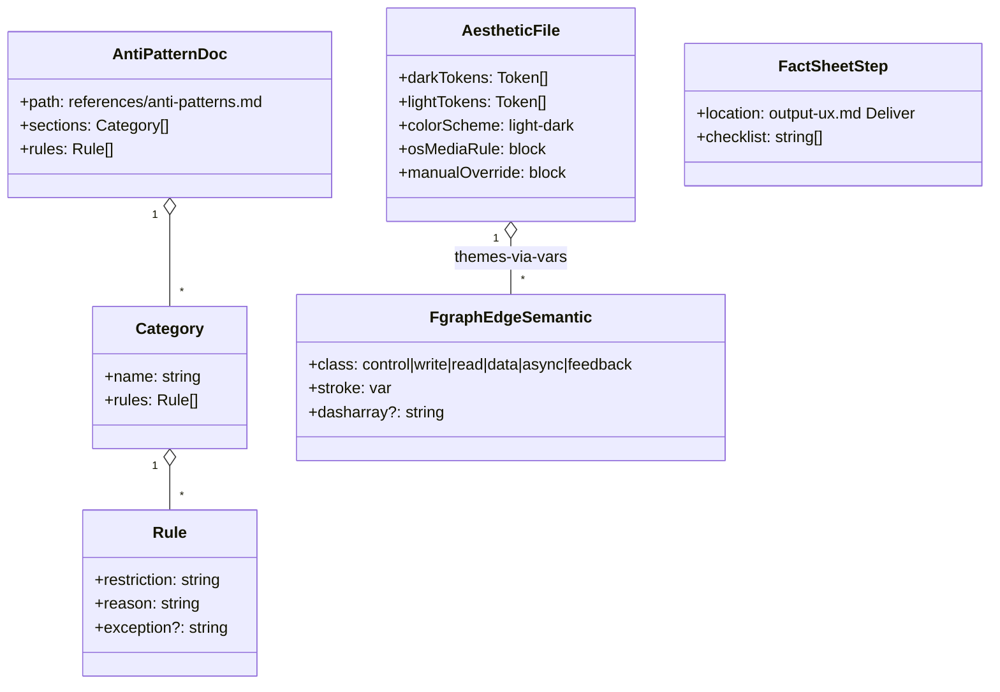

## Context

Promoted from `artifacts/frames/5-tier-1-lift-frame.mdx`. Source analysis: `artifacts/analyses/2026-04-12-competitor-skills-analysis.md`. Four bundled, additive improvements to `plugins/forge/references/` — no skill logic or template changes.

Two findings shaped this spec over the raw issue body:

- All 6 aesthetics already ship `[data-theme="light"]` token overrides. Gap is the **switching mechanism**, not the tokens — no aesthetic follows `prefers-color-scheme`.
- `fgraph-base.css` already has tone classes (`amber`/`cyan`/`purple`/`green`/`red`/`dim`) and modifiers (`dashed`/`thick`/`animated`). The missing layer is **semantic intent** (`control`/`write`/`read`/`data`/`async`/`feedback`).

## Goal

Forge outputs feel OS-native, communicate flow semantics at a glance, resist visual slop, and land factually correct on the first render — without breaking existing templates.

## Users

- **Primary:** Mickael — maintainer + daily consumer of forge skills.
- **Secondary:** Forge sub-agents (forge-epic, forge-guide, forge-chart, forge-gallery) — consume references at Deliver.
- **Tertiary:** Downstream readers of forge HTML — benefit from OS-correct theme + semantic arrows.

## Expected Behavior

1. **Anti-slop:** A sub-agent at Deliver phase opens `references/anti-patterns.md` once. The doc enumerates every forbidden rule (shadows, gradients, fonts, colors, animation) with one-line justifications. Each SKILL.md Deliver checklist links to it in a single line.
2. **Semantic edges:** An fgraph author writes `<path class="fg-edge control">`. Output is accent-toned via `var(--edge-control, var(--accent))`. Each aesthetic MAY declare `--edge-control: var(--cyan)` (etc.) to remap semantic meaning to its own palette; absent that, the fallback tone from `fgraph-base.css` is used.
3. **Fact-sheet:** Before emitting HTML, a sub-agent enumerates factual claims (file paths, counts, component names, version numbers) as a checklist. Each item is verified against source. `output-ux.md` Deliver checklist grows by one step referencing the fact-sheet ritual.
4. **Light mode:** A reader opens any forge artifact on a light-mode OS. Tokens auto-flip via `@media (prefers-color-scheme: light)`. `[data-theme="dark"]` on `<html>` still forces dark. `color-scheme: light dark` hints the browser for scrollbars/form controls.

## Data Model & Consumers



```mermaid
flowchart LR
    AP[anti-patterns.md] -->|linked from Deliver| SE[forge-epic SKILL]
    AP --> SG[forge-guide SKILL]
    AP --> SC[forge-chart SKILL]
    AP --> SGa[forge-gallery SKILL]
    AP --> SI[forge-init SKILL]
    FS[fact-sheet step in output-ux.md] -->|referenced at Deliver| SE
    FS --> SG
    FS --> SC
    FS --> SGa
    FE[fgraph-base.css semantic classes] -->|consumed by| GT[graph-templates/*.html]
    FE -->|documented in| GR[graph-templates/README.md]
    LM[@media prefers-color-scheme in aesthetics/*.css] -->|cascades to| ALL[every forge artifact using aesthetic]
```

| Consumer | Consumes | When | Status |
|---|---|---|---|
| `forge-epic/SKILL.md` | anti-patterns.md, fact-sheet step | Deliver phase | this issue (link added) |
| `forge-guide/SKILL.md` | anti-patterns.md, fact-sheet step | Deliver phase | this issue |
| `forge-chart/SKILL.md` | anti-patterns.md, fact-sheet step | Deliver phase | this issue |
| `forge-gallery/SKILL.md` | anti-patterns.md | Deliver phase | this issue |
| `forge-init/SKILL.md` | anti-patterns.md | Deliver phase | this issue |
| graph-templates/*.html | semantic edge classes | author-time | future (existing templates untouched) |
| Any forge HTML output | `@media prefers-color-scheme` | runtime | this issue (cascades from aesthetic import) |

## Breadboard

### Affordances — Anti-slop doc

| ID | Affordance | Wiring |
|---|---|---|
| N1 | `references/anti-patterns.md` created | Consolidates rules currently scattered across aesthetic CSS comments + SKILL.md snippets. |
| N2 | Categories: shadows, text effects, backgrounds, radii, decorative glyphs, animation, fonts, colors | One section per category, each row: rule + why. |
| N3 | "Deliver checkpoint" one-line reference | Each SKILL.md's Deliver checklist gains: `- Review [anti-patterns.md](../../references/anti-patterns.md) before emitting output.` |

### Affordances — Semantic fgraph edges

| ID | Affordance | Wiring |
|---|---|---|
| N4 | 6 new CSS rules in `fgraph-base.css`, **appended after the `.fg-edge.dim` block and before the arrow modifiers** (current lines 151 / 154 of the file) so they win the specificity tie against legacy color classes by cascade order | Each rule: `var(--edge-{name}, var(--fallback-tone))` where fallback tones are: control→`var(--accent)`, write→`var(--green)`, read→`var(--cyan)`, data→`var(--purple)`, async→`var(--text-muted)`, feedback→`var(--amber)`. `.fg-edge.write` and `.fg-edge.async` also set `stroke-dasharray` per issue body. |
| N5 | Decision table in `graph-templates/README.md` | Row per semantic class: intent, default color, when to use, example. |
| N6 | "Legacy" note on color classes in `graph-templates/README.md` | README.md notes `.amber`/`.cyan`/etc. remain supported; new work uses semantic classes. |

### Affordances — Fact-sheet Deliver step

| ID | Affordance | Wiring |
|---|---|---|
| N7 | New `## Fact-sheet` section in `output-ux.md` | 3–5 lines: enumerate factual claims before writing HTML, verify each against source. |
| N8 | Deliver checklist row | `- Fact-sheet compiled and verified (see Fact-sheet section).` |

### Affordances — OS-native light mode

| ID | Affordance | Wiring |
|---|---|---|
| N9 | `color-scheme: light dark;` on `:root` in all 6 aesthetics | Browser hint for scrollbars + form controls. |
| N10 | `@media (prefers-color-scheme: light)` block in all 6 aesthetics, selector `:root:not([data-theme="dark"])` | **Mechanic:** re-declare the same 8 (or more) token values currently in the `[data-theme="light"]` block — copy-paste the token assignments, not an alias. Rationale: attribute selectors do not activate from an `@media` match; token values must physically live in both places. For `caveman.css` specifically (lines 136–230) and any other aesthetic with class-specific overrides under `[data-theme="light"]` (e.g., `.caveman-grid`, `.glass-card`, `.glass-terminal`), those class-specific rules must **also** be duplicated inside the `@media` block (wrapped in the same `:root:not([data-theme="dark"])` scope) so OS-light mode reaches them. |
| N11 | `[data-theme="dark"]` block where missing | Ensures manual dark override works regardless of OS preference. |

## Slices

| # | Slice | Affordances | Demo |
|---|---|---|---|
| 1 | anti-patterns.md + SKILL Deliver links | N1, N2, N3 | Open anti-patterns.md; grep SKILL.md files for link — 5 hits. |
| 2 | Semantic fgraph edges + README decision table | N4, N5, N6 | Inline test HTML with one `.fg-edge.control` path renders in accent tone; terminal shell override re-tints. |
| 3 | Fact-sheet Deliver step in output-ux.md | N7, N8 | `output-ux.md` grows one section + one checklist row. |
| 4 | OS-native light-mode switching (6 aesthetics) | N9, N10, N11 | DevTools → emulate light: every aesthetic flips. Manual `[data-theme="dark"]` overrides OS light. |

Slices are independent — any single one could ship alone. Bundled per frame constraint.

## Success Criteria

- [ ] `plugins/forge/references/anti-patterns.md` exists with ≥8 rule categories and every rule has a one-line reason.
- [ ] All 5 SKILL.md files (`forge-init`, `forge-guide`, `forge-epic`, `forge-chart`, `forge-gallery`) link to `anti-patterns.md` from their Deliver checklist.
- [ ] `fgraph-base.css` defines 6 semantic classes (`control`, `write`, `read`, `data`, `async`, `feedback`) via `var(--edge-{name}, fallback-tone)`, appended after the `.fg-edge.dim` rule and before the arrow modifiers block.
- [ ] `graph-templates/README.md` contains a decision table mapping each semantic class to its intent + default color + when-to-use row.
- [ ] `graph-templates/README.md` contains a "legacy" note declaring color-tone classes (`.amber`, `.cyan`, `.purple`, `.green`, `.red`, `.dim`) remain supported and instructing new work to prefer semantic classes.
- [ ] `output-ux.md` has a `## Fact-sheet` section and a Deliver checklist row referencing it.
- [ ] All 6 aesthetic CSS files include `color-scheme: light dark;` on `:root`.
- [ ] All 6 aesthetic CSS files include an OS-preference `@media` block scoped with a `[data-theme]`-guarded selector. Dark-default aesthetics (lyra, roxabi, editorial, terminal, caveman) use `@media (prefers-color-scheme: light) { :root:not([data-theme="dark"]) { ... } }`. Light-default aesthetics (blueprint) invert to `@media (prefers-color-scheme: dark) { :root:not([data-theme="light"]) { ... } }`.
- [ ] Manual `[data-theme="dark"]` attribute overrides OS light preference in all 6 aesthetics, verified via a single standalone HTML file per aesthetic that imports only `base/reset.css` + the aesthetic file (minimal harness, no existing artifact required).
- [ ] No existing fgraph template HTML file is modified (backwards-compat proof).
- [ ] `sync-plugins.sh --local` runs clean after the change.

## Edge Cases

| Case | Handling |
|---|---|
| Aesthetic used standalone without a forge artifact shell | `color-scheme` declaration is self-contained; still works. |
| Author uses both color and semantic class (e.g. `fg-edge control amber`) | Specificity identical — last declared wins per CSS cascade (semantic rule listed after color rule → semantic wins). Document in README. |
| Reader's OS theme changes mid-session | `@media` re-evaluates live; CSS custom props cascade; no JS needed. |
| SKILL.md Deliver checklist already mentions anti-slop informally | Replace informal mention with canonical link to `anti-patterns.md`. |
| Fact-sheet step duplicates info already in SKILL.md | `output-ux.md` is the canonical source; SKILL.md links to it, no duplication. |
| `caveman.css` (550 lines) has class-specific `[data-theme="light"]` rules (`.caveman-grid`, `.glass-card`, `.glass-terminal`) | Token re-assignments **and** those class-specific rules must be duplicated inside the new `@media (prefers-color-scheme: light)` block, scoped via `:root:not([data-theme="dark"])`. Attribute selectors do not fire from `@media` matches — the rules must physically live in both blocks. Same applies to any other aesthetic with class-specific light overrides. |
| `terminal.css` uses a different root structure | Spot-check the `:root` / `[data-theme]` selector shape before slice 4 — confirm `color-scheme` declaration lands on the correct selector. |
