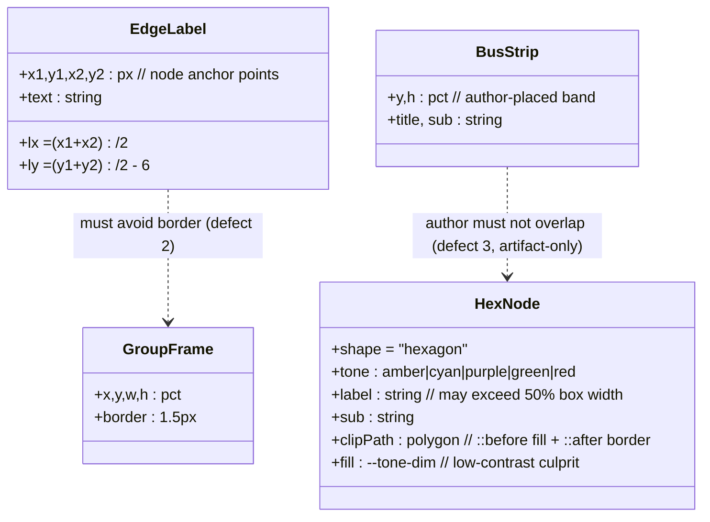
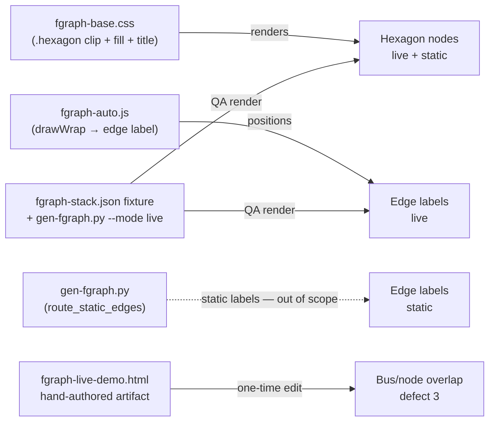

## Context

Source: frame #52 (closed). Follow-up to #50.
Three render defects surfaced comparing `fgraph-live-demo.html` to the bespoke `roxabi-stack.html`.

**Source-of-truth findings (verified against HEAD — engine shifted 3× since filing):**

| Defect | Root cause @ HEAD | Fix surface | Committable? |
|---|---|---|---|
| 1. Hexagon clip + low-contrast | `fgraph-base.css:529` clip `polygon(25% 0,75% 0,…)` + `::before` fill `--{tone}-dim` (lines 638–642) | `fgraph-base.css` (shared primitive — live + static) | ✓ yes |
| 2. Edge label on group-frame border | `fgraph-auto.js:134–146` places label at anchor-midpoint `((x1+x2)/2, (y1+y2)/2 − 6)` with zero `.fgraph-group` awareness | `fgraph-auto.js` (live runtime) | ✓ yes |
| 3. Node overlaps `.fg-bus-strip` | Hand-authored `fgraph-live-demo.html` places `.fg-bus-strip` `--y:43 --h:6` + a `nats` pill `--y:49` → overlap + NATS drawn twice | runtime artifact only (`~/.roxabi/forge/_shared/diagrams/`) | ✗ no (untracked) |

**Why defect 3 is not an engine bug:** `gen-fgraph.py` has no bus-strip concept, and live mode positions nodes by author `--x/--y` (no auto-placement to guard). The overlap is an authoring mistake in a hand-edited demo. The committed fixture `fgraph-stack.json` → `gen-fgraph.py` produces a demo with `nats` as a normal auto-placed pill node and **no** overlap. Therefore the "optional engine guard" (3b) is **dropped** — it has nothing to guard without first building bus-strip support into the generator (out of appetite for F-lite).

**Reproduction / test surface (per defect — they differ):**

- **Defect 1** → committed fixture `plugins/forge/skills/forge-chart/fixtures/fgraph-stack.json` contains the exact hexagon nodes (`voicecli-stt` "Whisper · STT", `voicecli-tts` "Chatterbox · TTS", bot hexagons). Regenerate via `gen-fgraph.py --mode live` AND `--mode static` → screenshot-QA anchor for live + static parity, no dependence on the hand-authored artifact.
- **Defect 2** → `gen-fgraph.py` emits only a `data-group` *attribute* (line 441), **not** `.fgraph-group` frame elements, so the fixture render has no frame to collide with. The defect-2 surface must be a **live doc containing a `.fgraph-group` frame** with an edge label crossing it. Use the existing repro `fgraph-live-demo.html` (6 `.fgraph-group` elements; "lyra.llm.generate.request" lands on a cluster border) and/or add a minimal committed `graph-templates/examples/` live fixture for a durable regression surface.
- **Defect 3** → the hand-authored `fgraph-live-demo.html` only.

## Goal

Make hexagon node labels fully legible (live + static) and keep auto-routed edge labels off group-frame borders, with zero regression to the 15 golden examples — verified by headless screenshot QA against the `fgraph-stack.json` fixture.

## Users

- **Primary:** Forge users generating fgraph diagrams (any diagram with hexagon nodes or auto-routed edge labels inherits defects 1–2).
- **Secondary:** Maintainers of golden examples / the bespoke showcase.

## Expected Behavior

1. **Hexagon nodes** — a hexagon with a wide label ("Whisper · STT", "Chatterbox · TTS") shows the full label, horizontally contained within the opaque shape fill, at readable contrast (no glyphs spilling onto the page background; no clipping at the slanted left/right tips).
2. **Edge labels** — an auto-routed edge whose midpoint falls on a `.fgraph-group` frame border has its label nudged clear of the border (offset along the edge normal or toward the edge interior) so the text never sits on the 1px frame line.
3. **Showcase** — `fgraph-live-demo.html` shows NATS once (the bus-strip), with no node overlapping the strip band.

## Data Model & Consumers

### Render primitives (what gets positioned/styled)

### Consumer map

### Consumer summary

| Consumer | Fields touched | When | Status |
|---|---|---|---|
| `fgraph-base.css` `.hexagon` rules | clip-path, `::before` fill, `.fgraph-title` color/width | defect 1 | this issue |
| `fgraph-auto.js` `drawWrap` label block | `lx`, `ly` + new group-frame avoidance | defect 2 | this issue |
| `fgraph-live-demo.html` | remove redundant `nats` pill node | defect 3 | this issue (artifact edit) |
| `gen-fgraph.py` `route_static_edges` static labels | static-mode label collision | parallel defect-2 case | **future / out of scope** |
| `gen-fgraph.py` `auto_place` bus-band guard | reserve band for bus-strip | 3b | **dropped** (no bus-strip support) |

## Breadboard

**Defect-1 fix ladder — apply least-invasive first; only escalate if a screenshot still shows clipping.** Rationale: the clip-path is a shared primitive; changing geometry risks the 15 goldens, so prefer non-geometry levers.

| ID | Affordance | Handler | Data in → out |
|---|---|---|---|
| C1 (primary) | `.fgraph-node.hexagon .fgraph-title` (`fgraph-base.css:581`) | `max-width` to the safe inner band (≈50% at current slant) + `color: var(--text)` + weight; allow wrap if needed | title → contained + legible, **no shared-geometry change** |
| C2 (primary) | hexagon fill `.fgraph-node.hexagon::before` (`:638–642`) | give text an opaque/contrasting backing — scope to `.hexagon::before` (the `:638` selector is **shared with `.diamond`/`.folded`** — split it out, or apply intentionally to all three and note it) | bare `--tone-dim` → readable backing |
| C3 (fallback) | `.fgraph-node.hexagon::before/::after` clip-path (`:527–530`) | **only if C1+C2 insufficient** — flatten slants (25%→~14%) to widen the band; re-screenshot all 15 goldens for regression | polygon pts → wider inner band |
| J1 | `fgraph-auto.js` label placement (`:134–146`) | **two-pass** (`getBBox()` is invalid before DOM insert): pass 1 append all `<text>` labels; pass 2 collect `.fgraph-group` rects + each label's `getBBox()`, and if a label intersects a frame-border line, nudge it clear (along edge normal / toward edge interior) | (lx,ly) → (lx',ly') off-border |
| A1 | `fgraph-live-demo.html` `nats` pill node | delete the redundant node (bus-strip already represents NATS) | 2 NATS elems → 1 (strip) |

## Slices

| # | Slice | Affordances | Independently demo-able |
|---|---|---|---|
| S1 | **Hexagon legibility** (CSS) — title width + contrast (clip-geometry only as fallback) | C1, C2, (C3 fallback) | render `fgraph-stack.json` `--mode live` AND `--mode static` → screenshot: hexagon labels full + readable, both modes |
| S2 | **Edge-label frame avoidance** (JS) — two-pass nudge off `.fgraph-group` borders | J1 | render a live doc **with a `.fgraph-group` frame** (`fgraph-live-demo.html`, or a new committed `examples/` fixture) whose edge label crosses it → screenshot: no label on border |
| S3 | **Showcase overlap correction** (artifact) — drop duplicate NATS node | A1 | open `fgraph-live-demo.html` → screenshot: one NATS, no overlap |

Ordering: S1 (CSS) → S2 (JS) independent — different files, no shared state; S3 trivial, last. Each verified by its own screenshot before merge. S1 must re-screenshot the 15 goldens (shared primitive) before it counts as done.

## Success Criteria

- [ ] **Defect 1 (clip):** rendering `fgraph-stack.json` live, every hexagon label ("Whisper · STT", "Chatterbox · TTS", bot labels) is fully visible — no glyph clipped at the slanted left/right tips (screenshot evidence).
- [ ] **Defect 1 (contrast):** hexagon label text is legible against its fill — text sits on an opaque/sufficiently-contrasting backing, not bare `--{tone}-dim` (screenshot evidence).
- [ ] **Defect 1 (static parity):** the same hexagon fix holds in a static-mode render and in ≥1 static golden example using hexagon nodes.
- [ ] **Defect 2:** in a live render with a `.fgraph-group` frame, no edge label sits on a group-frame border line (screenshot evidence).
- [ ] **Defect 3:** `fgraph-live-demo.html` shows NATS once (bus-strip), no node overlapping the `.fg-bus-strip` band (screenshot evidence).
- [ ] **No regression:** all 15 golden examples render with no new clip/overlap/contrast defect (screenshot spot-check of the gallery).
- [ ] **file://-safe:** live demo still renders correctly opened directly via `file://` (inlined JS, no console errors).

## Out of Scope

- Engine-level bus-band placement guard (3b) — dropped (no bus-strip support in `gen-fgraph.py`; no runtime node auto-placement to guard).
- Static-mode edge-label collision (`gen-fgraph.py route_static_edges`) — future; defect 2 scoped to live per the issue.
- Any redesign beyond the 3 cited defects; non-fgraph chart families.
