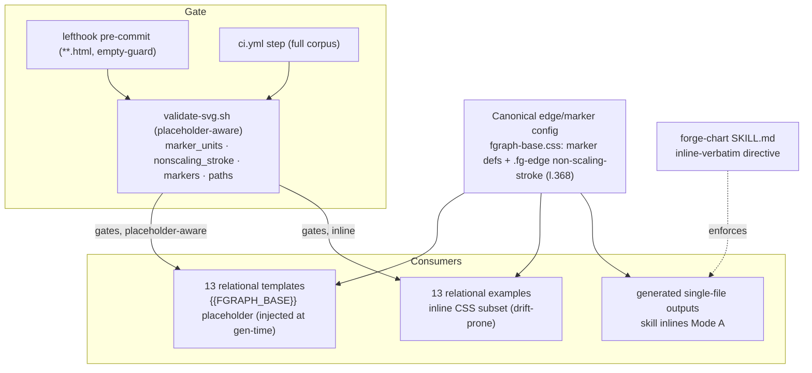

## Context

Source: [frame #57](../frames/57-uniform-aspect-frame.mdx). Validator path throughout this spec: **`plugins/forge/scripts/validate-svg.sh`**.

**Premise correction #1 (Shape-phase).** The frame proposed "switch relational templates `preserveAspectRatio="none"` → `xMidYMid meet`." Investigation **invalidated** it: relational templates render **HTML `
` nodes** in % space (`left: calc(var(--x)*1%)`) + a **separate SVG edge overlay** (`viewBox="0 0 100 100" preserveAspectRatio="none"`). The `none` stretch maps SVG `(x,y)` onto the HTML node at `left:x%; top:y%` — **the stretch is the load-bearing node↔edge alignment mechanism**; `meet` would detach edges on non-square containers. The #20 data-charts use `meet` only because they are 100 % SVG. **Re-diagnosis: with the correct config (`vector-effect: non-scaling-stroke` + default `markerUnits` + `markerWidth=6`), markers render undistorted even under the stretch. Giant-arrowhead incidents were config DRIFT, not the stretch.** Chosen direction = **Option A: make the correct config impossible to drift from**; geometric purity (pure-SVG `meet`, JS-routed edges) is deferred to sibling **#58** (blocked-by this).

**Premise correction #2 (expert review — verified).** The first spec assumed `validate-svg.sh` could be pointed at the raw templates and exit 0 after "fixing drift." **It cannot.** Templates carry a `{{FGRAPH_BASE}}` placeholder (`/* {{FGRAPH_BASE}} — inline fgraph-base.css here */`) instead of inline edge CSS — the `non-scaling-stroke` rule is injected at generation time. Run today, the validator **fails on all 13 relational templates** (`check_nonscaling_stroke`: placeholder ≠ literal text) plus **`er.html` `check_paths`** (`d="{{REL_1_PATH}}"` has 0 coords). The examples (inline CSS) pass; `fgraph-base.css` itself carries `non-scaling-stroke` (line 368). **Therefore the validator must become placeholder-aware** — this is now the core code change, not just CI wiring.

**Scope honesty.** Option A does **not** satisfy the frame's 6-month success criterion ("arrowheads correct-by-construction, workarounds removed") — that is **#58**'s goal. Option A **closes the regression path** (drift can't merge) while keeping the load-bearing stretch + its workarounds. This is the intended, narrowed scope.

**Current state (audited, this branch):**
- Canonical config centralized in `plugins/forge/references/graph-templates/fgraph-base.css` (marker `<defs>` + `.fgraph-edges .fg-edge { vector-effect: non-scaling-stroke }`, line 368).
- `validate-svg.sh` guards exist (`check_marker_units`, `check_nonscaling_stroke`, `check_markers`, `check_paths`) **but** (a) are **placeholder-blind** → false-fail templates, and (b) are wired into **neither CI nor lefthook**.
- Corpus: **13 relational templates + 13 relational examples** are the edge-bearing `none` set (= 26; + `fgraph-base.css` + `README.md` = the 28 the frame counted). The directory also holds data-chart + live-mode HTML where the guards are no-ops.

## Goal

Drift away from the canonical fgraph edge/marker config becomes **structurally impossible to merge**: a placeholder-aware `validate-svg.sh` runs over the whole `graph-templates/` corpus at **pre-commit + CI**, exits 0 on the correct corpus, and fails on any genuine drift — and the gate is designed so **#58 can relax it** rather than tear it out.

## Users

- **Primary:** Claude Code filling fgraph templates via `forge-chart` — its outputs inherit the locked config; it can no longer ship a trimmed subset dropping `non-scaling-stroke`, nor drop the `{{FGRAPH_BASE}}` injection contract.
- **Secondary:** Maintainers stop hand-policing the giant-arrowhead class; end users see consistently correct arrowheads.

## Expected Behavior

1. Contributor edits a relational template/example and drops `non-scaling-stroke` (inline) **and** the `{{FGRAPH_BASE}}` placeholder, or sets `markerUnits="userSpaceOnUse"`, or leaves a dangling `url(#…)` on an edge-bearing `none` SVG.
2. **Pre-commit:** lefthook `validate-svg` hook (defensive empty-arg guard, `**.html` glob) runs over staged `graph-templates/` files → fails → commit blocked with the actionable message.
3. **CI:** the same validator runs over the full corpus on the PR → red → merge blocked (staging requires `ci`).
4. A correct template (placeholder present) **passes** — the placeholder satisfies the non-scaling-stroke contract; `{{…}}` path placeholders are skipped by `check_paths`.
5. `fgraph-base.css` carries an explicit **SSoT banner** naming the three locked properties; `forge-chart/SKILL.md` states outputs must inline the canonical block verbatim.
6. When **#58** later rewrites templates to `meet` (removing `none` + `non-scaling-stroke`), the `none`-keyed guards become **automatic no-ops** — no hook surgery required.

## Data Model & Consumers

**Consumer summary**

| Consumer | Relies on | Validator mode | Status |
|---|---|---|---|
| 13 relational templates | `{{FGRAPH_BASE}}` placeholder (gen-time injection of fgraph-base.css) | placeholder-aware: placeholder satisfies non-scaling-stroke; `{{…}}` paths skipped | gated (this issue) |
| 13 relational examples | inline CSS subset | inline: full check as today | gated (this issue) |
| generated single-file outputs | skill inlining the canonical block verbatim (Mode A) | not CI-gated (ephemeral, out of repo) | enforced by SKILL directive |
| `fgraph-base.css` | being the SSoT | self-guard: must itself contain `non-scaling-stroke` | gated (this issue) |

## Breadboard

| ID | Affordance | Handler | Effect |
|---|---|---|---|
| A1 | placeholder-aware `check_nonscaling_stroke` | `validate-svg.sh`: pass when edge-bearing `none` SVG has inline `non-scaling-stroke` **OR** a `{{FGRAPH_BASE}}` placeholder; fail when it has **neither** | templates pass by contract; dropping both fails |
| A2 | placeholder-aware `check_paths` | `validate-svg.sh`: skip `d="{{…}}"` placeholder values | no false-fail on template path placeholders |
| A3 | SSoT self-guard | `validate-svg.sh`: `fgraph-base.css` must contain `non-scaling-stroke` (else the placeholder promise is void) | the contract anchor can't silently rot |
| A4 | lefthook `validate-svg` hook | `lefthook.yml`: glob `plugins/forge/references/graph-templates/**.html`, brand-drift-style empty-`$staged` guard → `plugins/forge/scripts/validate-svg.sh` | block drift at commit |
| A5 | CI `validate-svg` step | new step in existing `ci:` job (`.github/workflows/ci.yml`) over the full corpus | block drift at merge (no new required check) |
| A6 | SSoT banner | comment in `fgraph-base.css` above marker defs / `.fg-edge` naming the 3 locked props + "do not hand-trim" | author + skill guidance |
| A7 | skill inline-verbatim directive | `forge-chart/SKILL.md` anti-drift line | ephemeral outputs keep the block |
| A8 | corpus green | after A1–A3, run validator over the corpus; fix any genuine drift surfaced | passing baseline |
| A9 | docs | `graph-templates/README.md` documents SSoT + the two gates + the `{{FGRAPH_BASE}}` contract | discoverability |

Wiring: A1–A3 (validator placeholder-awareness) gate **before** A4/A5 wiring so the corpus is green (A8) before the gate goes live. A6/A7 document the SSoT the gate enforces. A9 records it.

## Slices

| Slice | Increment | Affordances | Demo |
|---|---|---|---|
| V1 | **Validator placeholder-aware + corpus green** | A1, A2, A3, A8 | `validate-svg.sh` over all 13 templates + 13 examples + `fgraph-base.css` exits 0; a template with the placeholder passes, `er.html` `{{REL_1_PATH}}` no longer false-fails |
| V2 | **Gates wired** | A4, A5 | deliberate drift fixture (drop placeholder + inline css) → pre-commit blocks it; drift PR → CI red; clean commit/PR green |
| V3 | **SSoT marked + docs** | A6, A7, A9 | `fgraph-base.css` banner present; SKILL.md inline-verbatim directive; README documents SSoT + gates + placeholder contract |

## Success Criteria

- [ ] After placeholder-awareness (A1–A3), `plugins/forge/scripts/validate-svg.sh` run over the 13 relational templates + 13 relational examples + `fgraph-base.css` exits 0. *(binary: exit code)*
- [ ] A correct template (with `{{FGRAPH_BASE}}` placeholder) **passes** `check_nonscaling_stroke`; `er.html` with `d="{{REL_1_PATH}}"` **passes** `check_paths`. *(binary: both formerly-failing files now pass)*
- [ ] `validate-svg.sh` fails when `fgraph-base.css` lacks `non-scaling-stroke` (SSoT self-guard A3). *(binary: deleting the rule → non-zero; revert → zero)*
- [ ] A lefthook pre-commit hook runs `validate-svg.sh` on staged `graph-templates/**.html`, **and does not error on commits that stage no such files** (empty-arg guard). *(binary: drift commit blocked; unrelated commit unaffected)*
- [ ] A CI step in the existing `ci:` job runs `validate-svg.sh` over the corpus and fails on a drift fixture; **no new required status check is introduced** (the step rides the existing `ci` check). *(binary: drift PR → red `ci`)*
- [ ] Negative test — each of these makes the validator exit non-zero, and reverting restores 0: (a) drop `non-scaling-stroke` **and** the `{{FGRAPH_BASE}}` placeholder from a template; (b) set `markerUnits="userSpaceOnUse"` on an edge layer; (c) introduce a dangling `marker-end="url(#missing)"`. *(binary: all three fire)*
- [ ] `fgraph-base.css` carries an SSoT banner naming `vector-effect: non-scaling-stroke`, default `markerUnits`, `markerWidth/Height=6` (arrow family) and "do not hand-trim". *(binary: banner present)*
- [ ] `forge-chart/SKILL.md` states generated single-file outputs MUST inline the canonical edge/marker block verbatim. *(binary: directive present)*
- [ ] `graph-templates/README.md` documents the SSoT block, the lefthook + CI gates, and the `{{FGRAPH_BASE}}` placeholder contract. *(binary: section present)*

## Edge Cases

| Case | Handling |
|---|---|
| Templates carry `{{FGRAPH_BASE}}` placeholder, not inline CSS | **Core of V1.** `check_nonscaling_stroke` passes when the placeholder is present (base CSS provably supplies the rule, A3 anchors that promise). Without placeholder-awareness, all 13 templates false-fail. |
| `er.html` `d="{{REL_1_PATH}}"` template path placeholder | `check_paths` skips `d` values matching `{{…}}` (A2). |
| `er.html` crow's-foot markers use `markerWidth=10` | Intentional ER cardinality family; guards key on `userSpaceOnUse`/missing `non-scaling-stroke`, not width. SSoT banner scopes `markerWidth=6` to the arrow family. |
| `lane-swim` has no edge SVG | No marker edges → guards no-op; passes. |
| Commit stages no `graph-templates` files | Lefthook glob skips the hook; the hook body still guards `[ -n "$staged" ]` (brand-drift pattern, `lefthook.yml`) so an empty arg can't trip `file not found`. |
| Data-chart / live-mode HTML in the directory (pie, scatter, …, edge-label-group-live) | Not `none` + no arrow markers → guards no-op; the full-directory glob is safe. |
| `xmllint`/`rsvg` absent on CI runner | Validator degrades (skips tag-balance/rsvg with a note); the grep-based marker/non-scaling-stroke/path guards still run. `perl` absent → `check_markers` falls back to `cat` (won't strip comments) — pre-existing, not a regression. |
| **#58 boundary** | The gate MUST be designed so #58 can **relax** it, not tear it out. The `none`-keyed guards become automatic no-ops once #58 removes `preserveAspectRatio="none"` from a template — so no hook surgery is forced. The placeholder-OR-inline logic (A1) also already accepts a `meet` template that drops `non-scaling-stroke`, provided it no longer uses `none`. |
| Generated outputs live outside the repo | Not CI-gated (ephemeral); covered by the SKILL inline-verbatim directive (A7). |
