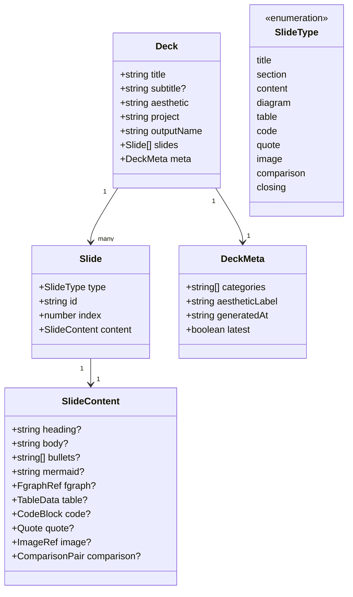
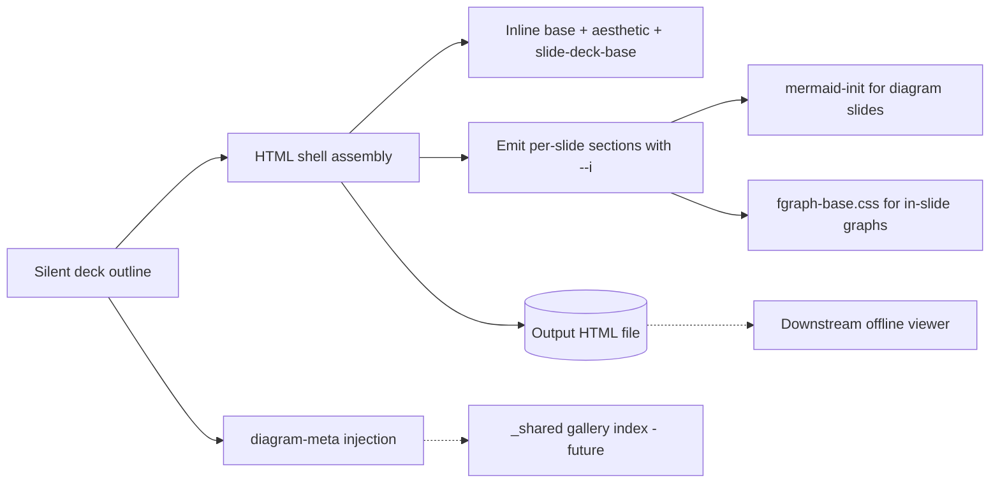

## Context

Promoted from `artifacts/frames/6-forge-slides-skill-frame.mdx` (analysis step skipped — F-lite).

Forge ships 5 skills today (`forge-init`, `forge-guide`, `forge-epic`, `forge-chart`, `forge-gallery`). The 2026-04-12 competitor analysis (`artifacts/analyses/2026-04-12-competitor-skills-analysis.md`) identified a gap: only Visual Explainer offers a presentation-deck primitive. This spec defines `forge-slides` as the 6th skill, lifting VE's `slide-patterns.md` (1,406 lines) into forge's 4-phase pipeline and aesthetic system.

## Goal

Ship `forge-slides`: a forge skill that generates a single-file, offline-playable, keyboard-navigable scroll-snap presentation deck in any of forge's 6 aesthetics from an issue number, a markdown file, or a free prompt.

## Users

- **Primary:** Mickael, authoring decks via the forge pipeline (brand pitches, epic walkthroughs, design reviews, project recaps).
- **Secondary:** downstream viewers opening the deck on any device over `file://` (Telegram/Discord/Drive handoff) — no server, no install.

## Expected Behavior

A user invokes the skill via trigger phrase or `/forge-slides` with one of three inputs:

1. `forge-slides #42` — reads the issue title + body, derives the deck outline.
2. `forge-slides path/to/brief.md` — parses a markdown file (H1 = deck title, H2s = sections/slides).
3. `forge-slides "brand pitch for Lyra — 8 slides, editorial aesthetic"` — free prompt.

Precedence matches `forge-epic`: explicit path > issue number > free prompt.

The skill runs the 4-phase Forge pipeline:

1. **Context** — load brand book (Track A/B), detect aesthetic, parse content source.
2. **Decision** — Frame (silent inference of *who reads it, what action they should take, the key takeaway, and tone* — same `forge-guide`/`forge-epic` convention), select slide types + count, write silent deck outline.
3. **Generation** — assemble single HTML shell: inline `base/reset.css`, `base/typography.css`, `aesthetics/<name>.css`, `slide-deck-base.css`, `slide-deck-base.js`; emit one `<section class="slide slide--{type}">` per slide with `--i` stagger variables.
4. **Deliver** — write to `~/.roxabi/forge/<project>/slides/{name}.html`, report path + preview URL, verify keyboard nav + offline-open checklist. Re-invocation for the same `<project>/<name>` overwrites silently (matches `forge-guide`/`forge-epic` — deterministic paths, no version suffix).

The deck opens as a `.deck` scroll-snap container (`scroll-snap-type: y mandatory`), each slide `100dvh`. Arrow keys / space / home / end navigate; touch swipe up/down works on mobile. A progress bar, slide counter, and dot indicator persist across slides. Transitions use fade + translateY + scale, staggered by `--i`, disabled when `prefers-reduced-motion: reduce`.

10 slide types are available: `title`, `section`, `content`, `diagram`, `table`, `code`, `quote`, `image`, `comparison`, `closing`.

**Runtime init sequence** (load-bearing — see `slide-patterns.md §Runtime Init Sequence`): `initSlideMermaid()` renders `.slide--diagram [data-mermaid]` blocks with unique `mermaid-slide-${i}` IDs → `autoFit()` patches SVG dims + KPI/quote scale (requires rendered SVGs to exist in DOM) → `new SlideEngine()` wires keyboard + touch + IntersectionObserver. The skill ships its own lean Mermaid init inside `slide-deck-base.js` — it does **not** reuse `base/mermaid-init.js` verbatim, because that file's `window.__postLoad` contract is tab-loader-specific. It reuses the import/config pattern but owns its own scoping and ID generation, and pins `securityLevel: 'strict'` explicitly. In-slide fgraph diagrams reuse `fgraph-base.css` primitives directly (no JS needed). Mermaid pan/zoom (`svg-pan-zoom`) is out of scope for v0.1.

All 6 aesthetics are tuned for slide mode (display/heading/body/caption scale, section-divider backgrounds, full-bleed contrast). Default aesthetic detection mirrors the other forge skills (brand book override → project-level aesthetic mapping → fallback).

## Data Model & Consumers

### Data structure — silent deck outline

The skill produces no on-disk intermediate — the outline lives only in the Generation phase context. But it has a clear shape:

### Consumer map

Solid = this issue. Dashed = consumers the output must remain compatible with but not built here.

### Consumer summary

| Consumer | Fields consumed | When | Status |
|---|---|---|---|
| HTML shell assembler | `Deck.title`, `aesthetic`, `slides[]`, `outputName`, `project` | Generation | this issue |
| Slide emitter | `Slide.type`, `id`, `index`, `content.*` | Generation | this issue |
| Mermaid init | `slides[].content.mermaid` | Runtime (in deck) | this issue |
| fgraph renderer | `slides[].content.fgraph` | Runtime (in deck) | this issue |
| diagram-meta tag | `DeckMeta.categories`, `aestheticLabel`, `latest` | Deliver | this issue |
| Forge gallery index | `DeckMeta.*`, file path | Future — must remain discoverable | future |
| PDF exporter | `Deck.*` | Future (v0.2+) | future |

## Breadboard

### Affordances (runtime surface inside the generated deck)

| ID | Element | Handler | Data |
|---|---|---|---|
| U1 | `.deck` scroll container | scroll-snap native | slide order from DOM |
| U2 | `ArrowDown` / `Space` / `PageDown` | `next()` → `scrollIntoView` | next `.slide` |
| U3 | `ArrowUp` / `PageUp` | `prev()` → `scrollIntoView` | prev `.slide` |
| U4 | `Home` / `End` | jump first / last | `.slide:first-child` / `:last-child` |
| U5 | Progress bar | `IntersectionObserver` on `.slide` | active index / total |
| U6 | Slide counter (e.g. `3 / 12`) | same observer | active index |
| U7 | Dot indicator row | click → jump to slide | slide ids |
| U8 | `prefers-reduced-motion` media query | disable transforms | CSS media |
| U9 | Mermaid diagram slide | `base/mermaid-init.js` | `.mermaid` block |
| U10 | fgraph slide | inline SVG + `fgraph-base.css` | fgraph template html |

### Skill-side affordances (authoring surface)

| ID | Element | Handler | Data |
|---|---|---|---|
| N1 | Trigger: `/forge-slides #N` | Context phase → `gh issue view N` | issue title + body |
| N2 | Trigger: `/forge-slides <path>` | Context phase → read markdown | headings + body |
| N3 | Trigger: `/forge-slides "<prompt>"` | Context phase → interpret prompt | free-form brief |
| N4 | Aesthetic override flag `--aesthetic <name>` | skip detection | enum of 6 |
| N5 | Slide count hint `~N slides` in prompt | Decision phase cap | integer |
| N6 | Frame signals (reader-action, takeaway, tone) | silent inference | prompt + source |
| N7 | Brand book (`brand/forge.yml`) | Track A override | aesthetic + palette |

### Shell-side scaffold surface

| ID | Element | Handler | Data |
|---|---|---|---|
| S1 | `references/slide-patterns.md` | read-before-generate | slide types + examples |
| S2 | `references/slide-templates/slide-deck-base.css` | inlined | scroll-snap + nav chrome |
| S3 | `references/slide-templates/slide-deck-base.js` | inlined | `autoFit()` + Mermaid init (scoped, unique IDs) + keyboard + touch swipe + IO + progress + `SlideEngine` |
| S4 | `references/slide-templates/deck-template.html` | read reference | slide shell examples |
| S5 | `aesthetics/*.css` (all 6, slide-tuned) | one inlined per deck | type scale, backgrounds |
| S6 | Demo deck `_shared/diagrams/slides-demo.html` | deliver sample | canonical example |

## Slices

| # | Slice | Demo-able outcome | Contains |
|---|---|---|---|
| 1 | **Base engine + reference doc** | A hand-filled HTML deck using the new base CSS/JS scrolls, keyboard-navigates + touch-swipes, shows progress, respects reduced-motion. 3 slide types live (title, content, closing). Editorial + roxabi aesthetics tuned. Temporary dev demo at `_shared/diagrams/slides-demo.html` is hand-authored to prove the engine in isolation — it is superseded (overwritten at the same path) by the skill-generated demo in S3. | `slide-deck-base.css`, `slide-deck-base.js` (incl. `autoFit()` + lean Mermaid init scaffold + touch swipe), `deck-template.html` (shell), `slide-patterns.md` (reference doc), editorial + roxabi slide-mode tuning, hand-authored demo. |
| 2 | **Full slide-type + aesthetic coverage** | Demo deck (still at `slides-demo.html`) now exercises all 10 slide types (section, diagram, table, code, quote, image, comparison). Remaining 4 aesthetics tuned (blueprint, caveman, lyra, terminal). Mermaid + fgraph render inside slides; no ID collision across multiple diagram slides. | 7 new slide-type CSS modules, 4 aesthetic slide-mode rulesets, in-slide Mermaid init wiring (unique IDs per slide), fgraph reuse, extended hand-authored demo. |
| 3 | **Skill wiring + pipeline integration** | `/forge-slides` triggers work for all 3 input modes (issue `#N`, markdown path, free prompt) plus `--aesthetic <name>` override. Frame phase runs. Brand detection runs. Output lands in the correct project path. diagram-meta injected. Skill regenerates `slides-demo.html` at the same path (overwriting the hand-authored S1/S2 version) and acceptance checklist passes end-to-end. | `plugins/forge/skills/forge-slides/SKILL.md`, trigger phrases, 3 input-mode handlers, `--aesthetic` override, frame wiring, brand-book-loader reuse, aesthetic detection reuse, deliver checklist, `make -C plugins/forge deploy` wiring, sync-plugins.sh coverage, skill-regenerated demo deck. |

Dependencies: S1 → S2 → S3. Each slice ships a visibly working artifact — S1 alone is enough for a hand-authored deck, S2 removes per-slide-type friction, S3 closes the skill loop.

## Success Criteria

- [ ] `plugins/forge/skills/forge-slides/SKILL.md` exists with frontmatter (name, description, version, allowed-tools), trigger phrases, 4-phase pipeline, frame guidance, deliver checklist.
- [ ] `plugins/forge/references/slide-patterns.md` exists, documents the 10 slide types and 6 aesthetic presets, derived from VE's slide-patterns.md and adapted to forge conventions.
- [ ] `plugins/forge/references/slide-templates/slide-deck-base.css` exports the scroll-snap engine + nav chrome + type scale tokens (display 48–120, heading 28–48, body 16–24, caption 10–14).
- [ ] `plugins/forge/references/slide-templates/slide-deck-base.js` provides bootstrap `initSlideMermaid()` → `autoFit()` → `new SlideEngine()` (in that order — SVGs must exist before autoFit patches them); `autoFit()` fixes Mermaid SVG fixed-size overflow, KPI overflow, blockquote scaling; keyboard navigation (`ArrowUp/Down`, `Space`, `PageUp/Down`, `Home`, `End`); touch swipe up/down; progress bar updates; slide counter; dot-indicator click-to-jump; all via `IntersectionObserver`. Mermaid init uses `securityLevel: 'strict'` explicitly.
- [ ] `plugins/forge/references/slide-templates/slide-deck-base.js` ships its own Mermaid init (scoped to `.slide--diagram [data-mermaid]`, IDs auto-generated as `mermaid-slide-${i}`) — does **not** reuse `base/mermaid-init.js` verbatim.
- [ ] `plugins/forge/references/slide-templates/deck-template.html` is a working reference shell with one example of each of the 10 slide types.
- [ ] **S1 aesthetic gate:** `editorial` + `roxabi` tuned for slide mode.
- [ ] **S2 aesthetic gate:** all 6 aesthetics (`blueprint`, `caveman`, `editorial`, `lyra`, `roxabi`, `terminal`) tuned for slide mode — verified by rendering the demo deck under each.
- [ ] A demo deck at `~/.roxabi/forge/_shared/diagrams/slides-demo.html` uses all 10 slide types, opens under `file://`, scrolls end-to-end with keyboard nav. S1/S2 ship a hand-authored version; S3 replaces it with a skill-generated version at the same path.
- [ ] Deck loads no external resources beyond these exact CDN origins: `fonts.googleapis.com`, `fonts.gstatic.com` (font subsets), `cdn.jsdelivr.net/npm/mermaid` (Mermaid). Verified by a browser Network tab capture listing all requests.
- [ ] `prefers-reduced-motion: reduce` disables all transforms/transitions (verified via browser devtools media-feature override).
- [ ] A Mermaid SVG inside a `diagram` slide fills the slide body without horizontal overflow at 1920×1080 and 1280×800 viewports (validates `autoFit()`).
- [ ] A deck with ≥ 2 `diagram` slides renders both Mermaid diagrams without error (no duplicate-ID collision in the DOM).
- [ ] Deck navigates via swipe gesture on a touch device (primary: arrow/space; touch is parity for mobile handoff).
- [ ] In-slide fgraph diagrams reuse `fgraph-base.css` primitives.
- [ ] `/forge-slides #N` produces a deck from a GitHub issue (tested with issue #6 itself).
- [ ] `/forge-slides <markdown-path>` produces a deck from a markdown file (H1 → title, H2 → section/content).
- [ ] `/forge-slides "<free prompt>"` produces a deck from a prompt.
- [ ] Aesthetic override flag `--aesthetic <name>` bypasses detection (tested against at least 2 non-default aesthetics).
- [ ] Output path follows `~/.roxabi/forge/<project>/slides/{name}.html` convention; diagram-meta tag injected with `categories`, `aestheticLabel`, `latest: true`.
- [ ] Re-invocation for the same `<project>/<name>` overwrites the existing deck silently (matches `forge-guide`/`forge-epic`).
- [ ] `make -C plugins/forge deploy` remains unchanged — `slide-templates/` follow the inline distribution rule (see CLAUDE.md § Distribution rule), no `_shared/` mirror required.
- [ ] `./sync-plugins.sh --local` picks up the new skill.
