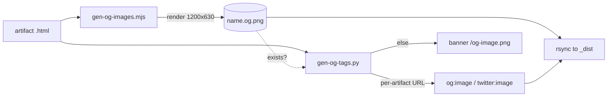

## Context

Promoted from [frame](../frames/83-per-artifact-open-graph-preview-images-frame.mdx).
Forge ships one generic `og-image.png` for every artifact. `scripts/gen-og-tags.py`
hardcodes `OG_IMAGE_URL` into every artifact's `og:image` / `twitter:image`. Screenshot
infra exists at `.claude/fc-loop/render.mjs` (Playwright chromium). Build flow:
`scripts/build.sh` → `gen-og-tags.py` → rsync `$FORGE_DIR/` → `_dist/`.

## Goal

Each forge artifact's social card shows a screenshot of that artifact, with graceful
fallback to the global banner when no screenshot exists.

## Users

- **Primary:** Mickael — shares forge artifact links on X/social.
- **Secondary:** link recipients — get a content-bearing preview.

## Expected Behavior

1. `build.sh` runs `node scripts/gen-og-images.mjs` before `gen-og-tags.py`.
2. `gen-og-images.mjs` uses its **own** Playwright setup (it does **not** invoke
   `render.mjs`, whose `fullPage:true` / height-900 defaults are incompatible): launch
   chromium once, `newContext({ viewport:{width:1200,height:630}, deviceScaleFactor:2 })`,
   per artifact `page.goto` + force-reveal (same settle logic as `render.mjs`) +
   `page.screenshot({ fullPage:false })`.
3. For each eligible artifact HTML under `$FORGE_DIR`, render a **1200×630** top-of-page
   screenshot → sibling `<name>.og.png`. Idempotent: render only when `<name>.og.png` is
   absent or older than its `<name>.html` (mtime). `--force` re-renders all.
4. **Error granularity:** chromium *launch* failure → `console.warn` + `process.exit(0)`
   (no images, build continues). A *single-artifact* render failure (nav timeout, page
   crash) → warn + skip that artifact + continue to the next. Write each PNG to a `.tmp`
   sibling then atomic-rename on success; on error delete the `.tmp` — never leave a
   partial/0-byte `.og.png` that mtime would treat as up-to-date.
5. `gen-og-tags.py`: `build_og_block` gains an `img_url` parameter (replacing the
   module-constant `OG_IMAGE_URL` inside the block). `process()` probes the sibling
   `filepath.with_suffix('.og.png')`; exists → `img_url = {BASE_URL}/{rel without .html}.og.png`;
   else → `img_url = OG_IMAGE_URL` (banner). `OG_IMAGE_URL` stays the fallback default.
6. `build.sh` rsync ships `.og.png` into `_dist/` (PNG not excluded; ~0.2–0.8 MB each, far
   under the 25 MiB cap). `plugins/forge/Makefile` `deploy` target gains a `cp` line so
   `gen-og-images.mjs` reaches `$FORGE_DIR/scripts/` on the runtime host.
7. Result: sharing an artifact URL shows a preview of that artifact; untouched artifacts
   keep the banner — no broken cards.

### Resolved open questions

| Question | Decision | Rationale |
|---|---|---|
| Capture mode | **Top-of-page clip, 1200×630** (own Playwright setup: viewport 1200×630, `fullPage:false`, dSF 2 → crisp output). Not reusing `render.mjs` (its `fullPage:true`/h-900 defaults differ) | Above-the-fold hero is the strongest signal; matches OG-screenshot services; robust across artifact types |
| Regeneration trigger | **mtime** (`.og.png` older than `.html` → re-render), `--force` override | Matches `gen-og-tags.py` idempotency style; `$FORGE_DIR` is generated (not git-checkout) so mtimes are stable |
| Playwright availability | **CI does not run `build.sh`** (verified: `ci.yml` = lint/py_compile/mermaid/SVG only). Build runs on M₂ via `make -C ~/.roxabi/forge deploy` (browsers cached at `~/.cache/ms-playwright`). Graceful chromium-launch skip covers any deploy host without browsers | Build/deploy never hard-fails on a browserless host; cards degrade to banner. CI is unaffected |
| Multi-tab / gallery view | **Capture the main `<name>.html` landing view** (first tab / grid top) | Single uniform rule; reuse `render.mjs`'s force-reveal of reveal-animations |
| Render concurrency | **Serial** (one page reused per artifact, one browser). Low risk at current artifact count; revisit if `$FORGE_DIR` exceeds ~100 artifacts | Simplicity; mtime no-op keeps repeat builds cheap |

## Data Model & Consumers

```mermaid
classDiagram
    class Artifact {
        +string htmlPath
        +string relPath
        +int htmlMtime
    }
    class OgImage {
        +string pngPath
        +int pngMtime
        +bool stale
    }
    class OgTags {
        +string ogImageUrl
        +string twitterImageUrl
        +bool perArtifact
    }
    Artifact "1" --> "0..1" OgImage : sibling .og.png
    Artifact "1" --> "1" OgTags : injected meta
    OgImage ..> OgTags : present? use it : fallback banner
```



| Consumer | Fields consumed | When | Status |
|---|---|---|---|
| `gen-og-images.mjs` | htmlPath, htmlMtime, pngMtime | build, before tags | this issue |
| `gen-og-tags.py` | sibling `.og.png` existence, relPath | build, after images | this issue |
| `build.sh` rsync | `.og.png` files | build, after tags | this issue |
| social crawler (X/Discord) | resolved `og:image`/`twitter:image` URL | on share | this issue |

## Breadboard

| ID | Affordance | Handler | Data |
|---|---|---|---|
| S1 | `node scripts/gen-og-images.mjs` | own Playwright setup (viewport 1200×630, `fullPage:false`, dSF 2); walk `$FORGE_DIR/**/*.html` (gen-og-tags exclusions) → render stale → write `<name>.og.png.tmp` → atomic rename | htmlPath, mtimes |
| S2 | `--force` flag | bypass mtime check, re-render all | argv |
| S3 | error granularity | chromium launch fail → `console.warn`+`exit(0)`; per-artifact render fail → warn + delete `.tmp` + continue | error |
| S4 | `gen-og-tags.py` per-artifact lookup | `build_og_block(…, img_url)`; `process()` probes `filepath.with_suffix('.og.png')` → exists ? per-artifact URL : `OG_IMAGE_URL` | rel, FORGE_DIR |
| S5 | `build.sh` ordering | run S1 before `gen-og-tags.py`; `.og.png` transfers in existing rsync | — |
| S6 | `plugins/forge/Makefile` deploy | add `cp -v $(REPO_ROOT)/scripts/gen-og-images.mjs $(FORGE_DIR)/scripts/gen-og-images.mjs` | — |

Exclusions (shared with `gen-og-tags.py`): site `index.html`, `tabs/`, `_dist/`. A
`<name>.og.png` is itself not an artifact (skip `.og.png` and non-`.html`).

## Slices

| # | Slice | Demo |
|---|---|---|
| 1 | `gen-og-images.mjs` renders one artifact → 1200×630 `.og.png` (own Playwright setup; mtime-idempotent; tmp+rename; graceful chromium-fail + per-artifact skip) | run on one artifact, inspect PNG dims + re-run no-op + simulate fail leaves no partial |
| 2 | `gen-og-tags.py` `build_og_block(img_url)` prefers sibling `.og.png`, else banner | run on dir with/without `.og.png`, diff injected meta |
| 3 | `build.sh` wires S1 before tags; `plugins/forge/Makefile` deploys the script; `.og.png` reaches `_dist/` | full `build.sh`, verify `_dist/**/*.og.png` + meta URLs; `make deploy` copies the mjs |

## Success Criteria

- [ ] `gen-og-images.mjs` produces a 1200×630 PNG sibling for a given artifact HTML (own Playwright setup, `fullPage:false`).
- [ ] Re-running with an up-to-date `.og.png` performs no render (mtime no-op); `--force` re-renders.
- [ ] chromium launch failure → warning + exit 0 (build continues); a per-artifact render failure skips that artifact and continues; no partial/`.tmp`/0-byte PNG left behind.
- [ ] `gen-og-tags.py` `build_og_block` emits per-artifact `og:image`+`twitter:image` when a sibling `.og.png` exists.
- [ ] `gen-og-tags.py` falls back to `/og-image.png` when no `.og.png` exists (no broken cards).
- [ ] After `build.sh`, `_dist/` contains the `.og.png` files and meta URLs resolve to them.
- [ ] `plugins/forge/Makefile` `deploy` copies `gen-og-images.mjs` to `$FORGE_DIR/scripts/`.
- [ ] Site `index.html`, `tabs/`, `_dist/`, and `.og.png`/non-`.html` files are excluded (no spurious screenshots).
